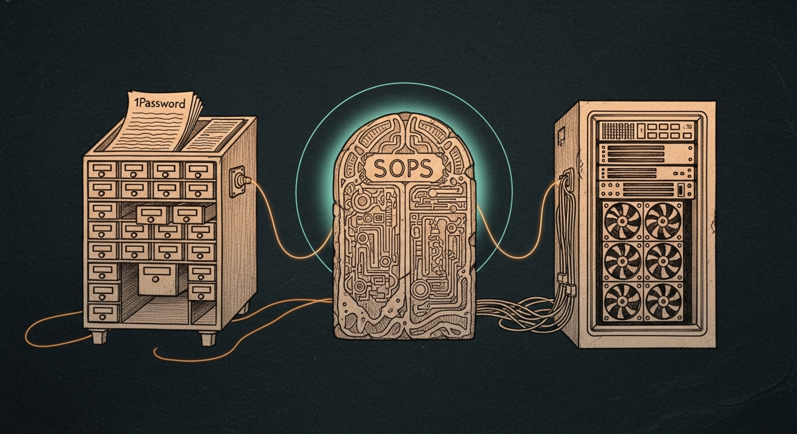

import { Aside, Card, CardGrid } from '@astrojs/starlight/components';



On 2026-04-29 the agents on the VM stopped working. The signs were subtle — `claude-code` claiming the API key was invalid, the Firewalla bridge returning 401 every fourth request — and the silence had been compounding for twenty-four hours. The cause was a `git merge` from the day before that left literal `<<<<<<< HEAD` markers inside the SOPS-encrypted secrets file. Every agent had been failing to load secrets at startup. None of them had a way to say so.

That afternoon we built the Secrets Trifecta. Not a new architecture — a *named* one, with clean rules, a status indicator, and a small set of automated processes meant to make that failure mode impossible to repeat.

## Two Stores Plus One Cache

The trifecta has three layers. Calling them three stores is a useful approximation that turns out to be wrong.

<CardGrid>
  <Card title="1Password Sanctum vault — Source of Truth" icon="seti:lock">
    The human's daily driver. Touch ID, audit log, search, multi-device. When a provider rotates a key, the new value lands here first. Every other layer is derived from this one. The items live in `triptyq.1password.com / Sanctum` — moved there from the personal Private vault on 2026-05-16 so a 1Password Service Account could authenticate headlessly. Item titles are still `Manoir - <Service>`, so the catalog stays grep-able no matter which vault holds it.
  </Card>
  <Card title="VM SOPS — Agent-Authoritative Copy" icon="document">
    `~/.openclaw/secrets.enc.yaml` on the airgapped VM. Agents read it once at startup via `sops-start.sh`. They cannot reach 1Password from inside the airgap, so SOPS is not optional for them — it is the runtime surface. Encrypted at rest with an age key whose master copy lives in the Mini's keychain and the 1Password vault.
  </Card>
  <Card title="Mini Keychain — Hot Cache" icon="rocket">
    `~/Library/Keychains/login.keychain-db`, account `sanctum`. Mini-side tools (the openrouter CLI, the domain-ops handler, the Force Flow daemon) read it for speed: a keychain lookup is around forty milliseconds; an `op read` is closer to one second. The Keychain is not a store — it is a derivative cache that auto-rebuilds from 1Password on demand.
  </Card>
</CardGrid>

The reframe matters. Before this pass, the Mini Keychain felt like a third independent store, and the mental load was real: which copy wins on conflict? Once you accept the keychain as a cache, the answer is routine. 1Password wins. The cache rebuilds. The architecture stops humming with anxiety.

## The Daily Flow

```
                ┌─────────────────────┐
                │ 1Password / Sanctum │ ← rotations happen here
                │ (Touch ID + audit)  │   SOURCE OF TRUTH
                └──────────┬──────────┘
                           │ sync.py auto-mirrors
              ┌────────────┴────────────┐
              ▼                         ▼
      ┌──────────────┐          ┌──────────────────┐
      │  VM SOPS     │          │  Mini Keychain   │
      │  (agents)    │          │  (Mini-tool      │
      │              │          │   hot cache)     │
      └──────────────┘          └──────────────────┘
        STORE                     CACHE
```

Two LaunchAgents keep this honest. Both plists live in `~/.sanctum/scripts/secret-rotator/` and load under an `Aqua` session — both now bootstrapped and running (`launchctl list | grep secrets-` no longer comes back empty):

| Agent | Cadence | Purpose |
|---|---|---|
| `com.sanctum.secrets-sync-drift-check` | Daily 09:30 | Runs `sync.py apply --yes --notify`. Reads 1Password for each cross-tier secret, compares against SOPS and Keychain, writes any drift, posts a Force Flow alert if changes were made or any write failed. The intent is auto-heal, not just auto-detect — but the keychain-write leg only succeeds with an unlocked login keychain, and under a headless session it does not. See [Seventeen Days of Silent Failure](/operations/2026-05-16-seventeen-days-of-silent-failure/) for the run that lied about this. |
| `com.sanctum.secrets-doctor` | Every 4h | Runs `doctor.py --notify`. Probes the operational dependencies — Tailscale reach to the Mini, the Aqua-context keychain bridge, VM SOPS readability, 1Password CLI integration — and is meant to alert BEFORE the next sync hits the same wall. Catches operational rot ahead of data drift. |

A SwiftBar plugin (`~/.sanctum/scripts/secret-rotator/swiftbar/sanctum-sync.5m.py`) surfaces live status in the menu bar: green when all nine manifest entries are in sync, yellow when a check found drift mid-flux, red when something errored, white when the daily check is more than thirty hours stale. One click reveals the last check timestamp, today's writes, and four actions: run the check now, force a resync, open the audit log, open this handbook. SwiftBar is installed and running now, the plugin linked into its plugin folder — the glyph is present, not potential, reading its counts straight from the audit log with no further wiring.

The goal is that the user does not need to remember the system exists. The code is most of the way there, and the install finally is too — what remains is a scheduled run that finishes.

## The Manifest

Nine entries, declared in `~/.sanctum/scripts/secret-rotator/providers.yaml` under `sync_mirrors`:

| Tier | Count | Examples |
|---|---|---|
| Cross-tier (all three layers) | 9 | anthropic, gemini, openrouter, xai, gateway, apify_api_key, exa_api_key, affinity_api_key, msgraph_client_secret |
| SOPS-only (no keychain mirror) | 3 | firewalla_bridge_token, ionos_api_prefix, ionos_api_secret |
| Keychain-only (computed) | 1 | ionos_api_key_combined — concatenated `prefix.secret` for tools that consume IONOS_API_KEY as one env var |

The newly integrated JCRM/Dealflow daemons (PortCo sync, Microsoft Graph email search, and Affinity pipeline) strictly adhere to this pattern. They extract their credentials headlessly from the local macOS Keychain at runtime without any Touch ID prompting, completely mitigating background timeout failures.

Each entry has a `name`, an `op` field naming the 1Password item, an optional `sops` key, an optional `kc` keychain service, and an optional `combine` format string for values computed from multiple items. Adding a new cross-tier secret is a YAML edit, not a code change.

Two credentials deliberately left this manifest. `firewalla_bridge_token` dropped its keychain leg on 2026-05-31; `cloudflare_tunnel_token` left `sync_mirrors` entirely on 2026-05-16. Both have an operational source of truth that is *not* 1Password — the [bridge token](/architecture/sanctum-firewalla/) reads from a mode-600 file (a system LaunchDaemon can't reach the keychain at all), the tunnel token auto-rotates straight into the keychain. Pushing 1Password into those slots too just made two healers fight over one value. The manifest holds the secrets where 1Password genuinely wins, and declines the ones where it doesn't.

## Failure Modes — and Why They Are Routine Now

<CardGrid>
  <Card title="Lost Mini Keychain" icon="warning">
    Severity: low. The cache rebuilds itself on the next sync.py apply. The wrapper at `~/.sanctum/scripts/sanctum-secret` falls back to `op read` if a tool requests a value that is not yet warmed.
  </Card>
  <Card title="Lost SOPS file or age key" icon="warning">
    Severity: high but recoverable. SOPS backups exist as `.bak-sync-*` next to the live file (sync.py writes one before every change). The age key has two backup locations: Mini keychain entry `age-openclaw-key`, and 1Password item `SanctumBridge — age private key (master)`.
  </Card>
  <Card title="Lost 1Password access" icon="warning">
    Severity: high. The runtime keeps working — agents have SOPS, Mini tools have Keychain — until rotations are needed. Recover via 1Password's emergency kit. Do not wipe the vault: its values are still authoritative even when locked out.
  </Card>
  <Card title="Lost Mini hardware entirely" icon="warning">
    Severity: medium. Time Machine restores the keychain. New Mini installs sanctum-secret + age key; sync.py apply rebuilds the keychain from 1Password. The runbook lives in `docs/secrets-handbook.md` for the line-by-line steps.
  </Card>
</CardGrid>

Six scenarios are documented in full in the handbook — the recovery drills Windu, our security seat, insists we rehearse before he calls any of this safe. The worst — losing 1Password and the age key at once — is the only one that forces re-minting every provider credential, and it takes losing both the Mac's secure-enclave biometric chain and the printed emergency kit simultaneously. The design stops short of impossible. It stops well short of casual.

## The Doctrine

Four rules that earn the trifecta its name:

1. **Rotate in 1Password. Always.** No exceptions. Other layers are derived. If you find yourself editing SOPS by hand, stop and rotate in 1Password instead — sync.py will propagate.
2. **Auto-apply silently from the source of truth.** The cron path skips the human prompt. Asking the human to be in a loop they don't need to be in is fear shaped as friction. Interactive `apply` still confirms; the daily plist does not.
3. **Vigilance against the silence of failure.** The doctor probe runs more often than the data sync because operational rot kills before data drift does. The Tailscale auth that quietly expires at 3am should wake someone with a Force Flow alert by 7, not surface as a sync failure at 9:30.
4. **P0 secrets must be filesystem-readable, not Keychain-only.** Added 2026-05-08 as doctrine §1.1.H, the morning after a reboot drill caught a `firewalla-bridge-token` that lived only in the locked login Keychain and put the bridge in a fatal-restart loop ([the full nine-hour audit](/operations/2026-05-07-the-reboot-reveals/)). The three tiers are not interchangeable: 1Password is unreachable from any service runtime; SOPS needs the VM, the sops binary, and the age key; Keychain is gated on a user session that may not exist. Filesystem (`~/.sanctum/secrets/<name>`, mode 600) is the only tier with no ambient prerequisites. So: if a service is P0, its secret writes through to filesystem on rotation, or it isn't allowed to be P0.

The trifecta is small on purpose. Every secret that passes through it passes through this discipline. Every secret that does not is a secret we have decided is rare enough to handle by hand — and a future cleanup pass will probably absorb most of those into the manifest too.

## Where the Work Continues

The architecture and code are written, council-reviewed, and unit-tested. The install gap has closed: both scheduled agents are bootstrapped and firing, and the SwiftBar glyph is live in the menu bar. Hands-off is not yet earned — the daily `apply` starts on schedule and dies mid-run, timing out on the VM SOPS read before it ever writes; the same quiet-failure species dissected in [Seventeen Days of Silent Failure](/operations/2026-05-16-seventeen-days-of-silent-failure/). Interactive works; unattended is the open work. Three improvements are documented but not yet built:

- **Finish the unattended run** — the audit log shows `apply_started` every morning at 09:30 with no completion. Until one scheduled run finishes end-to-end, the heal is scheduled, not proven.

- **Phase 6: extend the manifest to all Mini-only secrets** — the deepgram keys, the SanctumBridge integrations, the Cloudflare account tokens. They're in 1Password and the Keychain today, but synchronized by hand. Cilghal voted for this on 2026-04-29, and Mundi priced it plainly: the cost is mostly tedium, not invention.
- **Phase 7: phased migration toward eliminating the Keychain layer** — Mini tools could read 1Password directly via `op read`. The wrapper at `~/.sanctum/scripts/sanctum-secret` already implements this fallback path. The path is mechanical; the trigger is the moment the Keychain's speed advantage stops outweighing its conceptual cost.

## Which Way the Arrow Points

SOPS is the source of truth; the Keychain is a derived cache. Values flow one way — rotator into SOPS, SOPS into the Keychain and the bare file — never back.

On 2026-07-28 a derived copy wrote back over its own source, and an auto-rotated key silently reverted to a deleted one on every sync while every status line read `ok`: [The Cache That Overwrote the Source](/operations/2026-07-28-the-cache-that-overwrote-the-source/).

Neither phase is urgent. The trifecta as built moves toward the bar set on 2026-04-29 — the same bar [Tommy's dawn patrols](/agents/tommy/) clear without trying: run in the background, twice a day, until nobody thinks to check. The doctrine, the manifest, and the recovery story already reach it; the unattended daemon is the last mile. That is the only test that matters, and it is the one still being earned.
