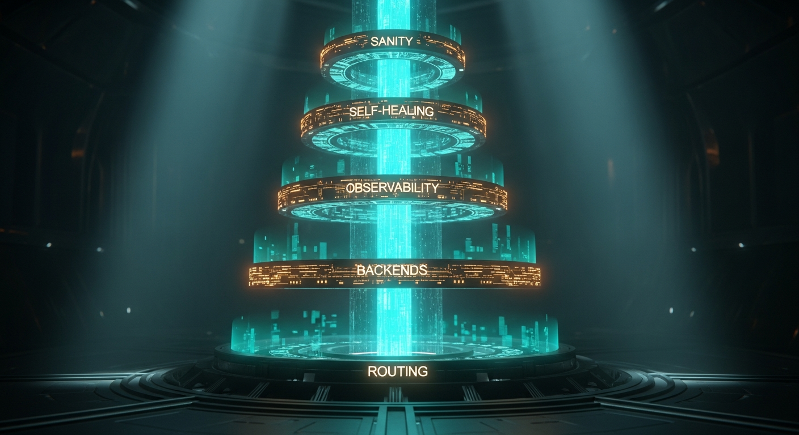

import { Aside } from '@astrojs/starlight/components';



The Smart Router started as a glorified `match` statement — model field in, backend out. It ended as a cathedral. Five tiers of defense between a client request and a model response, each tier addressing a specific failure mode the system used to quietly absorb.

This page is the canonical reference. If you want a five-minute tour instead of a first-principles read, skip to the matrix at the end.

## Tier 0 — Routing Correctness

The `model` field the caller sends is a nickname. The upstream needs an ID. LM Studio doesn't accept `coder`; Google AI Studio doesn't accept `spatial`; Anthropic doesn't accept `cloud`. Tier 0 added `default_model` per backend in `instance.yaml` so every outbound request carries the canonical upstream ID:

```yaml
coder:
  url: http://127.0.0.1:1234/v1
  default_model: qwen2.5-coder-14b-instruct
cloud:
  url: http://100.0.0.55:3456/v1
  default_model: claude-opus-4
spatial:
  url: https://generativelanguage.googleapis.com/v1beta/openai/v1
  default_model: gemini-3.1-pro-preview
```

Without this, every non-council backend 404'd. With it, routing is actually correct.

## Tier 1 — Four Backends, End to End

Four production backends wired through `sanctum-server` on `127.0.0.1:8900`:

| Backend | Upstream | Route patterns | Auth |
|---|---|---|---|
| `council-secure` | Qwen3.6-35B-A3B on `:1337` mTLS | yoda, mothma, windu, cilghal, mundi, jocasta, quigon | per-client cert |
| `coder` | Qwen2.5-Coder-14B via LM Studio `:1234` | coder, code-\*, \*coder\*, ahsoka | none (loopback) |
| `cloud` | Claude Opus 4.7 via `claude-max-api-proxy` on `100.0.0.55:3456` | opus, claude-\*, escalation | Max OAuth (proxy-mediated) |
| `spatial` | Gemini 3.1 Pro via Google AI Studio | gemini, windu-spatial, spatial | API key in plist env |

Each backend declares HA `fallback_urls`. `cloud` falls over from the Max proxy to OpenRouter; `council-secure` falls over from Mini mTLS to MBP shadow.

<Aside type="note">
Ahsoka lives on a 16 GB M1 at the chalet — she routes to `coder` rather than `council-secure` because the 35B doesn't fit in 16 GB. The router is size-aware via config, not convention.
</Aside>

## Tier 2 — Observability

`/metrics` serves Prometheus text at `:8900/metrics`. Every request, every decision, every backend call is a counter or histogram:

- `sanctum_server_http_requests_total{route,method,status}` — RED at the edge
- `sanctum_server_backend_requests_total{backend,outcome}` — RED per backend, `outcome` in `ok / client_error / server_error / connect_error / parse_error / breaker_open / budget_exhausted / quality_issue`
- `sanctum_server_routing_decisions_total{from_model,to_backend,rule}` — which Jedi went where, via which tier
- `sanctum_server_backend_duration_seconds` — latency histogram for p50/p95/p99 PromQL
- `sanctum_server_backend_tokens_in_total` / `_out_total` — what flowed
- `sanctum_server_backend_fallback_total` — when HA kicked in

Structured JSON logs (`SANCTUM_LOG_FORMAT=json`) carry a per-request `request_id` via axum middleware. Inbound `X-Request-ID` is honoured; otherwise a UUIDv4 is minted and echoed on the response. `jq '.span.request_id=="…"'` pulls a whole request's trace.

The Holocron [RouterPanel](../guides/dashboard) scrapes `/api/router/status` every 10 s and renders the backend and decision tables live.

## Tier 3 — Self-Healing via State

Three mechanisms that watch for known-broken states and route around them:

**Circuit breaker.** Per backend. Closed → Open after 5 consecutive failures → HalfOpen after 30 s → Closed on canary success or Open again on canary failure. Lock-free on the hot path (atomic u32 failure counter); mutex only on state transitions. Complementary to HA fallback: HA handles per-URL failures within a request, the breaker handles sustained per-backend outages across requests.

**Breaker-aware routing.** `Router::select` skips backends whose breaker is Open at every tier (direct, pattern, intent). Default backend is always returned as a last resort so callers get a deterministic error instead of hanging.

**Token budget.** Per backend, per day. `daily_cap_completion_tokens` in `instance.yaml` caps billable output; when exhausted, `budget_ok()` returns false and the router skips the backend exactly the way it skips Open breakers. Resets at UTC midnight; not persisted across process restarts.

## Tier 4 — Self-Healing via Speed

Backends that answer every request correctly but in 45 s instead of 3 s are degraded, not broken. Tier 4 detects and trips on them.

**Latency EMA.** Exponential moving average (α = 0.2, ~5-sample half-life) of completed-request seconds per backend. AtomicU64-packed f64 bits for lock-free reads. Exposed as `sanctum_server_backend_latency_ema_seconds{backend}` gauge and rendered in the Router panel's EMA column.

**Slow-backend trip.** When the EMA crosses a configurable `slow_threshold_s` for `slow_trip_count` consecutive successful requests (default 3), the backend's breaker gets a synthetic failure. The standard Open → HalfOpen → Closed cycle handles the rest.

```yaml
cloud:
  url: http://100.0.0.55:3456/v1
  slow_threshold_s: 15.0   # Opus 4.7 p95 normal ~3s; 15s = broken
  slow_trip_count: 3
```

## Tier 5 — Self-Healing via Quality

The final tier handles a failure mode that HTTP can't see: the backend returned 200 OK with a response that's garbage. Three detectors, one each for pathologies we actually saw in production:

| Detector | Verdict | Trips breaker | Example |
|---|---|---|---|
| `empty_content` | Broken | yes | Google AI Studio at low max_tokens — "done" with zero tokens emitted |
| `pure_repetition` | Broken | yes | Qwen3.5 conv_state bug — "190/ 190/ 190/" for 80 tokens |
| `think_tag_leak` | Suspicious | no | Reasoning model leaked `<think>` past the stream filter |
| `truncated_tiny` | Suspicious | no | finish_reason=length and content < 4 bytes |

Every successful response accumulates its content across the stream and runs the detectors at completion. Broken verdicts call `breaker.record_failure()` and flip the metric outcome to `quality_issue`. The current caller still sees whatever was streamed; the next two after them get routed away. The second user is the guarantee; the first user is the canary.

<Aside type="tip">
Sophisticated scoring — LLM-as-judge, logprobs, semantic similarity — is Tier 6 R&D territory. Tier 5 is the cheap stuff that catches 80% of real-world degeneracy with one regex and a byte-window scan.
</Aside>

## The five-tier matrix

| Tier | Watches for | Signal | Action |
|---|---|---|---|
| 0 | wrong model ID | config | pin `default_model` |
| 1 | backend dead | HA `fallback_urls` | try next URL |
| 2 | — | /metrics + JSON logs | observe |
| 3 | sustained backend failure | error rate / budget cap | trip breaker → route around |
| 4 | degraded backend (slow) | latency EMA > threshold | trip breaker → route around |
| 5 | garbage output | sanity verdict = Broken | trip breaker → route around |

Thirteen stones across five tiers. 48 tests. The cathedral routes, observes, recovers, and reroutes on its own. The caller just sends `{"model":"yoda"}` and gets an answer — from wherever the answer is currently cheapest, fastest, and least likely to be nonsense.
