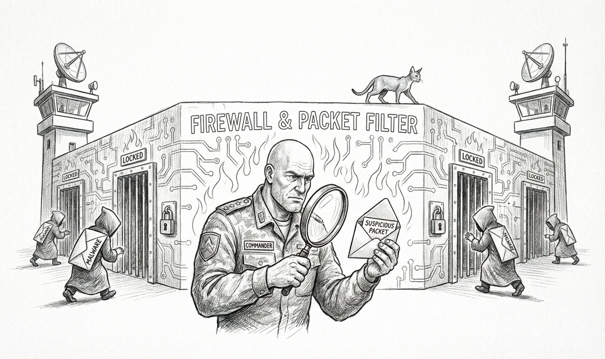

import { Aside } from '@astrojs/starlight/components';



macOS TCC (Transparency, Consent, and Control) keys permission grants to **a (binary, category)** tuple. The binary's identity is what TCC anchors to. If the binary is unsigned, TCC keys to its absolute path — which makes grants brittle (any rename, any reinstall, any version churn orphans the grant). If the binary is signed, TCC keys to the **Team ID** of the signing certificate — which gives years of stability across upgrades.

Sanctum has two such anchors, each chosen for a specific class of work. They are NOT federated under a single umbrella bundle, by deliberate council decision (2026-05-22 — vault topic `federate-vs-two-anchors-decision`).

## Anchor A — Node.js Foundation `.pkg`

```
Apple Root CA
 └─ Developer ID Certification Authority
     └─ Developer ID Application: Node.js Foundation (HX7739G8FX)
          └─ /usr/local/bin/node     ← Sanctum's canonical node binary
```

Installed from the official `nodejs.org` `.pkg`. Notarized by Apple, trusted timestamp, self-contained (statically links or bundles all its dylibs — no brew Cellar dependency chain). Path is stable because Apple's Installer pkg layout doesn't churn.

**Used by**: 9 of 10 sanctum node services — `dench-proxy.js`, `ha-gateway.js`, `firewalla-bridge.js`, `claude-max-api-tailscale.js`, `command-center`, `jocasta-message-sync`, and three `jocasta-mcp` stdio instances.

**Grants**: 13 TCC categories applied via `~/.sanctum/scripts/sanctum-grant-tcc.sh` — Full Disk Access, all SystemPolicy* folders, MediaLibrary, Photos, Reminders, Calendar, AddressBook, FileProviderDomain.

**Maintenance**: when Node.js Foundation ships a new release and Sanctum wants to upgrade, re-run the `.pkg` installer (same signing identity, same Team ID — grants persist). brew node is irrelevant to this anchor; it can be unpinned and allowed to upgrade freely.

## Anchor B — SanctumBridge.app

```
Apple Root CA
 └─ Developer ID Certification Authority
     └─ Developer ID Application: Bertrand Nepveu (GJ994MN2YF)
          └─ /Users/neo/Applications/SanctumBridge.app
               ├─ Bundle ID: ai.openclaw.denchclaw  (stable)
               ├─ Mach-O C launcher (Contents/MacOS/SanctumBridge)
               └─ spawns /usr/local/bin/node as a child
```

A signed `.app` bundle that proxies SQLite reads for iMessage, WhatsApp, Calendar, and Contacts. The 50-line C launcher embedded at `Contents/MacOS/SanctumBridge` is what holds the bundle-level TCC identity — TCC keys to the bundle ID `ai.openclaw.denchclaw` because that's the executable launchd spawns. The launcher then `posix_spawn`s `/usr/local/bin/node` as a child, which runs `Resources/bridge/server.js`.

**Used by**: one service — the FDA-privileged SQLite bridge.

**Grants**: bundle-level Full Disk Access, Automation grants to the target apps (Messages.app, Calendar.app, Mail.app, Contacts.app).

**Maintenance**: only requires re-signing when the launcher source changes (`launcher/main.c` in `Ogilthorp3/sanctum-bridge`). The bundle's `Makefile` produces `build/SanctumBridge.app`; `make install` copies it to `~/Applications`; a single `codesign --force --sign "Developer ID Application: Bertrand Nepveu (GJ994MN2YF)"` re-anchors the bundle.

## Why two anchors, not one

The temptation, after standing up the maximum-effort migration to Anchor A, was to federate every sanctum node service under a single umbrella bundle (call it `SanctumLauncher.app`). One Developer ID for the whole haus. Tempting.

The council voted against it. The technically dispositive argument came from **council-brain (Claude Opus via Max bridge)**:

> "Launchd-spawned daemons don't cleanly inherit a wrapper app's TCC responsible-process identity anyway, so don't rebuild a system you just stabilized."

macOS's TCC "responsible process" mechanism — which is what attributes a child's permission requests to its parent — only flows cleanly for **interactive** parent apps. When you double-click an `.app` in Finder and that app spawns child processes, TCC attributes the children to the parent's identity. When **launchd** spawns the process directly (which is how sanctum's 9 vanilla node services run), each child is its own top-level process for TCC purposes. There is no interactive parent to attribute up to.

Federating those 9 services under an umbrella bundle would have produced a parent bundle whose identity TCC would never actually use for the daemons' protected accesses. Federation cost (rebuild on every node-service change, more complex plists, notarization gating) for zero TCC benefit.

SanctumBridge.app is the right shape because its launcher is the interactive (well, launchd-launched-but-bundled) parent that *does* hold the responsible-process identity for its specific child. The other 9 services don't have that shape; they're naked node scripts whose anchor is the node binary itself.

<Aside type="note">
"Apple-grade" doesn't mean "one identity for everything." It means every identity is stable, signed, and notarized. Microsoft, Slack, and Discord all run multiple separately-signed processes on macOS without prompting users on each cold start. What kills the user experience is *unstable* identities (brew Cellar path churn, ad-hoc-signed binaries with rotating SHAs). What protects it is *stable* identities — however many there are. Sanctum has two. Both are years-stable. Both are upstream of TCC's complaint surface.
</Aside>

## The third-anchor question

A third anchor would be the right shape if Sanctum starts shipping native interactive `.app` surfaces that need their own bundle-level TCC (e.g. a Swift dashboard app, a menu-bar widget that touches Photos, a system extension). Those would each be their own anchor under Bertrand's Developer ID — different bundle IDs, same Team ID, separate TCC grants.

What would NOT be a good third anchor: a wrapper bundle around launchd-spawned daemons. That's the case the council just decided against. The launchd→child attribution gap is structural; no amount of wrapper engineering closes it on macOS as currently shipped.

## Operator surface

- `~/.sanctum/scripts/sanctum-grant-tcc.sh` — grants the canonical 13 TCC categories to the `.pkg` node binary. `--verify` for read-only checks; `--uninstall` for clean removal; `--client <path>` for targeting other binaries.
- `~/Projects/sanctum-bridge/` — source repo for the SanctumBridge launcher. `make build && make install` produces an updated bundle; one `codesign --force --sign "Developer ID Application: Bertrand Nepveu (GJ994MN2YF)"` re-anchors it.
- `~/Projects/sanctum-runtime/docs/doctrine/runbooks/node-tcc-stop-the-prompts.md` — runbook for diagnosing TCC prompt loops, with the FDA + Automation + bundle-wrapper trade-off explained.

The two-anchor design is recorded here so future operators (or future Claude sessions) don't try to consolidate without understanding why the consolidation wouldn't actually help.
