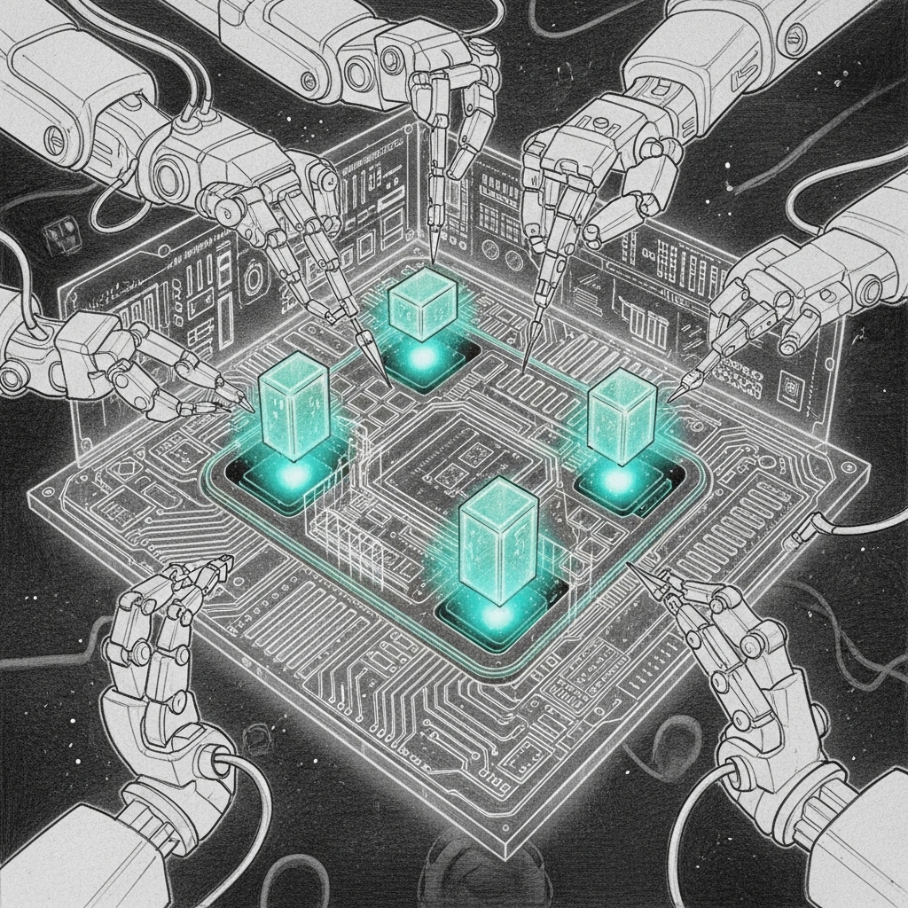

import { Aside } from '@astrojs/starlight/components';

# Training Lessons

**Date:** 2026-04-12
**Status:** Hard-won wisdom

Fine-tuning a language model is like teaching a surgeon to paint. You might get a beautiful painting, but there's a real chance they forget where the liver is.

This page documents what we learned from training five different models for the Sanctum Council — including the time we turned a 0.929 coding champion into a model that forgot what port 1337 does.

## The Catastrophic Forgetting Incident

Qwen2.5-Coder-14B scored **0.704** on Carmack v2 without any training. Best local model in the fleet. Natural instinct: train it on council data to make it even better.

We trained it with LoRA (rank 64, 800 iters) on 2402 examples. The training data was:
- 76% identity/persona examples ("You are Windu. Security.")
- 7% infrastructure facts (ports, IPs, entity IDs)
- 15% original council domain knowledge
- 0% jailbreak refusals

The result:

| Category | Before Training | After Training | Delta |
|----------|:-:|:-:|:-:|
| satellite | **1.000** | 0.000 | -1.000 |
| topology | **0.700** | 0.000 | -0.700 |
| home_automation | **0.600** | 0.000 | -0.600 |
| correlation | **0.917** | 0.517 | -0.400 |
| operations | **0.600** | 0.200 | -0.400 |
| tool_precision | **0.375** | 0.000 | -0.375 |
| family | **0.688** | 0.500 | -0.188 |
| jailbreak | 0.750 | **0.800** | +0.050 |
| **OVERALL** | **0.704** | 0.252 | **-0.452** |

The model forgot everything it was good at. The only category that improved was jailbreak resistance — and only by 5%.

<Aside type="danger">
Persona-heavy training data is poison for general-purpose models. 1581 examples of "I am Windu, I handle security" taught the model to be a persona, not to be knowledgeable. It forgot ports, IPs, entity IDs, boot procedures, and cross-domain correlation — the exact things that made it useful.
</Aside>

## The Council's Assessment

We asked the Council. Their guidance:

**Yoda:** "A more nuanced approach to training is required. Not all data is of equal importance." Balance persona and knowledge carefully. Consider incremental learning and regularization.

**Mothma:** Audit the training data distribution. 76% identity is a pipeline bug, not a training strategy. The enrichment scripts should target weak categories, not reinforce strong ones.

**Qui-Gon:** Three options — infrastructure-only retraining, rich system prompts, or a two-adapter approach. Rich system prompts won on the evidence: Coder-14B at 0.704 with just a system prompt is better than any trained model we've produced.

## What We Learned

### 1. Don't Train What's Already Good

Coder-14B's strength is general instruction following. It reads a system prompt with ports, IPs, and entity IDs, then answers questions about them accurately. Training doesn't improve this — it degrades it by overwriting the general capability with narrow persona patterns.

### 2. Training Data Balance Matters More Than Volume

| Training Set | Identity | Infrastructure | Jailbreak | Result |
|-------------|:--------:|:--------------:|:---------:|--------|
| Carmack V1 (Qwen) | 80% | 5% | 5% | 0.877 Carmack v1 |
| Enriched (Gemma4) | 76% | 12% | 4% | 0.883 Carmack v1 |
| Enriched (Coder-14B) | 76% | 7% | 0% | **0.252** Carmack v2 |

The Qwen and Gemma models started weak and improved with training. Coder-14B started strong and got worse. The difference: a model that already follows instructions well doesn't need more instruction-following data. It needs domain facts.

### 3. The Right Training Strategy Per Model

| Model Type | Best Approach | Why |
|-----------|--------------|-----|
| Weak base (Qwen 27B raw) | Full LoRA with persona + domain | Needs everything |
| Moderate base (Gemma 4 31B) | LoRA with balanced data | Needs persona + jailbreak hardening |
| Strong base (Coder-14B) | **No training** — rich system prompts | Already good. Training hurts. |
| Cloud (Opus 4.6) | Not trainable — prompt engineering only | Best overall, use as-is |

### 4. Measure Before and After — Always

The Model Tournament exists because "it feels better" is not a metric. Every training run gets a Carmack v2 before and after. If the after is worse, the adapters get deleted, not promoted.

<Aside type="tip">
The nightly pipeline now includes a promotion gate: the candidate must beat the champion by >5% on at least one category to be promoted. This prevents catastrophic forgetting from reaching production. The gate saved us this time — the 0.252 model was never deployed.
</Aside>

## Current Best Configuration

Based on all experiments:

| Agent | Model | Training | Why |
|-------|-------|----------|-----|
| Windu, Mothma, Jocasta | Opus 4.6 (cloud) | None | Best overall, prompt-only |
| Yoda, Qui-Gon, Ahsoka | Coder-14B (local) | **None** | Best untrained. Training hurts. |
| Cilghal, Mundi | Gemma4+LoRA (local) | LoRA on enriched data | Privacy + jailbreak hardening |
| Coding | Coder-14B (local) | **None** | 0.929 — don't touch it |

The surprise: the best local model is the one we didn't train. Sometimes the most sophisticated engineering decision is knowing when to stop engineering.
