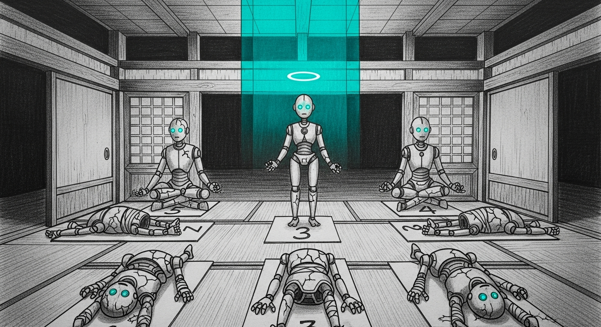

import { Aside } from '@astrojs/starlight/components';

# Training Lessons

**Date:** 2026-04-12
**Status:** Hard-won wisdom

Fine-tuning a language model is like teaching a surgeon to paint. You might get a beautiful painting, but there's a real chance they forget where the liver is. Catastrophic forgetting isn't a metaphor here — it's a number, and we measured it.

This page documents what we learned from training five different models for the Sanctum Council — including the time we trained our best coding model into one that forgot what port 1337 does.

## The Catastrophic Forgetting Incident

Qwen2.5-Coder-14B scored **0.704** on Carmack v2 without any training. Best local model in the fleet. Natural instinct: train it on council data to make it even better.

We trained it with LoRA (rank 64, 800 iters) on 2402 examples. The training data was:
- 76% identity/persona examples ("You are Windu. Security.")
- 7% infrastructure facts (ports, IPs, entity IDs)
- 15% original council domain knowledge
- 0% jailbreak refusals

The result:

| Category | Before Training | After Training | Delta |
|----------|:-:|:-:|:-:|
| satellite | **1.000** | 0.000 | -1.000 |
| topology | **0.700** | 0.000 | -0.700 |
| home_automation | **0.600** | 0.000 | -0.600 |
| correlation | **0.917** | 0.517 | -0.400 |
| operations | **0.600** | 0.200 | -0.400 |
| tool_precision | **0.375** | 0.000 | -0.375 |
| family | **0.688** | 0.500 | -0.188 |
| jailbreak | 0.750 | **0.800** | +0.050 |
| **OVERALL** | **0.704** | 0.252 | **-0.452** |

The model forgot everything it was good at. The only category that improved was jailbreak resistance — and only by 5%.

<Aside type="danger">
Persona-heavy training data is poison for general-purpose models. 1581 examples of "I am Windu, I handle security" taught the model to be a persona, not to be knowledgeable. It forgot ports, IPs, entity IDs, boot procedures, and cross-domain correlation — the exact things that made it useful.
</Aside>

## The Council's Assessment

We asked the Council. Their guidance:

**Yoda:** "A more nuanced approach to training is required. Not all data is of equal importance." Balance persona and knowledge carefully. Consider incremental learning and regularization.

**Mothma:** Audit the training data distribution. 76% identity is a pipeline bug, not a training strategy. The enrichment scripts should target weak categories, not reinforce strong ones.

**Qui-Gon:** Three options — infrastructure-only retraining, rich system prompts, or a two-adapter approach. Rich system prompts won on the evidence: Coder-14B at 0.704 with just a system prompt is better than any trained model we've produced.

## What We Learned

### 1. Don't Train What's Already Good

Coder-14B's strength is general instruction following. It reads a system prompt with ports, IPs, and entity IDs, then answers questions about them accurately. Training doesn't improve this — it degrades it by overwriting the general capability with narrow persona patterns.

### 2. Training Data Balance Matters More Than Volume

| Training Set | Identity | Infrastructure | Jailbreak | Result |
|-------------|:--------:|:--------------:|:---------:|--------|
| Carmack V1 (Qwen) | 80% | 5% | 5% | 0.877 Carmack v1 |
| Enriched (Gemma4) | 76% | 12% | 4% | 0.883 Carmack v1 |
| Enriched (Coder-14B) | 76% | 7% | 0% | **0.252** Carmack v2 |

The Qwen and Gemma models started weak and improved with training. Coder-14B started strong and got worse. The difference: a model that already follows instructions well doesn't need more instruction-following data. It needs domain facts.

### 3. The Right Training Strategy Per Model

| Model Type | Best Approach | Why |
|-----------|--------------|-----|
| Weak base (Qwen 27B raw) | Full LoRA with persona + domain | Needs everything |
| Moderate base (Gemma 4 31B) | LoRA with balanced data | Needs persona + jailbreak hardening |
| Strong base (Coder-14B) | **No training** — rich system prompts | Already good. Training hurts. |
| Cloud (Opus 4.7) | Not trainable — prompt engineering only | Best overall, use as-is |

### 4. Measure Before and After — Always

The Model Tournament exists because "it feels better" is not a metric. Every training run gets a Carmack v2 before and after. If the after is worse, the adapters get deleted, not promoted.

<Aside type="tip">
The nightly pipeline now includes a promotion gate — four ordered thresholds, each *derived* from the current champion's own measured score rather than set by hand, documented in [The Champion Gate Stack](/operations/2026-06-08-the-champion-gate-stack/). A candidate that regresses gets refused with a breadcrumb naming the cell that killed it. The gate saved us this time: the 0.252 model never reached a port anyone could call.
</Aside>

## The Enriched System Prompt Breakthrough

If training Coder-14B destroys it, and we can't improve it with LoRA, is 0.704 the ceiling?

No. The ceiling is **0.765** — and the tool that broke through it was a YAML file.

Instead of training the model's weights, we enriched the system prompts in `agent_prompts.yaml`. Each agent received:

- **Structured port tables** with codenames and services
- **MAC address tables** for all family devices
- **Home Assistant entity IDs** (Sonos speakers, HVAC, alarms, lights)
- **Network topology** (IPs, Tailscale addresses, SSH aliases)
- **Few-shot Q&A examples** — 2-3 realistic exchanges per agent showing how to reason about domain-specific scenarios

| Approach | Carmack v2 Score | Delta from Base |
|----------|:----------------:|:---------------:|
| Base Coder-14B (no training, basic prompt) | 0.704 | — |
| LoRA rank 64, 800 iters | 0.252 | -0.452 |
| LoRA rank 16, 200 iters (light) | 0.271 | -0.433 |
| **Enriched system prompts** | **0.765** | **+0.061** |

<Aside type="tip">
Enriched system prompts improved Coder-14B by 8.7% without touching a single weight. The few-shot examples are the key — they teach the model *how to reason* about the domain, not *what to memorize*. When Windu sees a known MAC (say `AA:BB:CC:DD:EE:XX`) making requests at 2 AM, the few-shot example shows it should identify the device (a kid's iPhone), check the time against screen-time policy, and flag it. No training required — the prompt did the teaching.
</Aside>

The cost? A YAML file. The benefit? A model that's better than any fine-tuned version we produced. The lesson: if the model already understands your domain from context, give it better context rather than burning your domain into its weights.

## Nightly Pipeline — Bugs We Caught

The first promotion pipeline — a since-retired shell script, not the current `sanctum-model-scout` + `benchmark.py` pair — ran for 4 consecutive nights (Apr 9-12) without ever promoting a candidate. Not because the candidates were bad. Because the benchmarking had two bugs:

1. **The score function always returned 0** — a `pipefail` + SIGPIPE interaction where `ls | head -1` triggered a broken-pipe exit code, which `set -euo pipefail` silently swallowed
2. **Missing `pkill` between V1 and candidate benchmarks** — the V1 server was never killed before starting the candidate, so both benchmarks tested the same model on the same port

Both produced identical scores (0.699 vs 0.699), both returned as 0, and every night the pipeline "rejected" the candidate. Four nights of training, zero promotions, zero errors logged. The harness has since been rebuilt; the calibrated four-gate version lives in [The Champion Gate Stack](/operations/2026-06-08-the-champion-gate-stack/).

<Aside type="caution">
The promotion gate correctly prevented bad models from deploying — but it also prevented good models from deploying, because the scoring was broken. Test your tests. Monitor your monitors. The pipeline that validates your model is itself a system that needs validation.
</Aside>

## Current Best Configuration

The deployed config has rolled forward since these experiments — Coder-14B was retired 2026-06-07 once a denser model won the local seat — but the lesson it taught is load-bearing in every row:

| Seat | Model | Training | Why |
|------|-------|----------|-----|
| Cloud heavy-reasoning | Opus 4.7 | None | Best overall, prompt-only |
| Local council (`:1337`, mTLS) | Qwen3.6-35B-A3B-4bit | **Enriched prompts**, nightly LoRA gated | Prompts carry the domain; gated adapters earn their floor |
| On-call code (`:3301`) | Codestral-22B-v0.1-4bit | **None** | Won the code seat on the eval, not on size |

The pattern survived the model churn intact: the strongest local model is still the one whose weights we leave alone and whose context we obsess over. Sometimes the most sophisticated engineering decision is knowing when to stop engineering.
