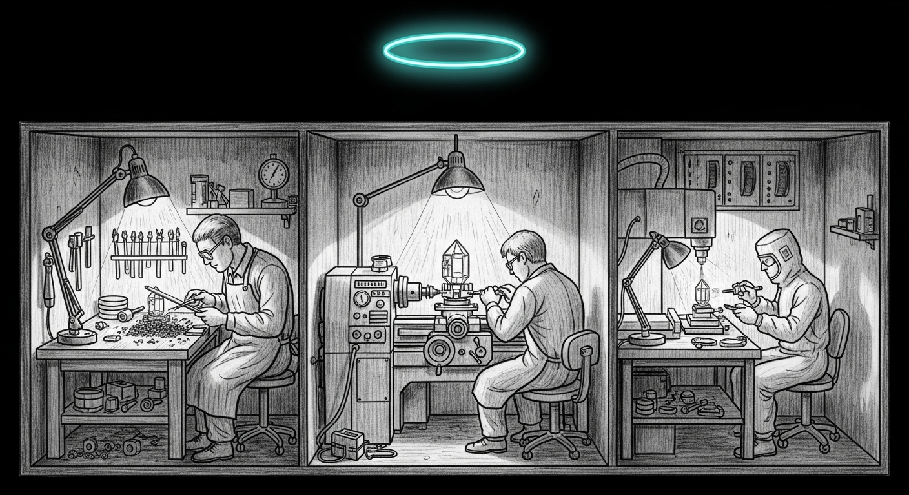

import { Aside, Card, CardGrid, Tabs, TabItem } from '@astrojs/starlight/components';



<Aside type="tip" title="4a landed — 2026-04-19, then got rebuilt from the ground up 2026-04-24">
The original 4a (Lloyd-Max key dequant ported to MLX ops, `21f230f` + `b469c52`) measured 9.4× per-fetch versus the CPU reference — but end-to-end on the production Qwen3.6-35B-A3B MoE the win didn't translate, eaten by per-step kernel-launch overhead and concat-grow cost. So we threw it away. The **2026-04-24 rebuild** flipped the premise: stop compressing keys entirely (~4 MB/layer of bf16 K at T=2048 is nothing on a 64 GB Mini) and hand-write a fused Metal kernel that dequantizes V inline during attention, so V never materializes. It ships as `sdpa_dequant_v` in `services/sanctum-mlx/src/turboquant/attention_kernel.rs`, and on the MBP M4 Max bench (vanilla MoE) lifts the dev-grade Slice-1 path from 62.38 to 75.64 tok/s (+21.2%), ~5% under the 79.42 no-TurboQuant baseline. The flag stayed **off** until a confirmed winner earned the flip — `--turboquant` now ships **on** in the production plist, per the [shipped-architecture page](/architecture/turboquant-kv-compression/). This page is the planning-time record; the architecture that shipped lives there.
</Aside>

Slices 1 through 1f got us from "TurboQuant doesn't compile" to "ships 21× better quality at 4× compression as an opt-in flag." The one thing between that flag and a **default** is performance: dequant lives on the CPU — fine for correctness validation, unshippable for production. This page scopes Slice 4 — the fix.

## The current bottleneck

Every call to `CompressedKVCache::update_and_fetch`, inside the decode loop:

```
step t: quantize new K,V  → push to Vec<CompressedHeadKV>
step t: rebuild_f32       → dequantize ALL T stored tokens,
                            build flat Vec<f32>, ship to Metal
step t: Array::from_slice → fp32→bf16 cast on GPU
```

Three problems, in priority order:

1. **O(T²) CPU work across a generation.** Each step rebuilds every prior token — at T=1000, 500,000 per-vector CPU dequants.
2. **CPU↔GPU bounce every step.** The f32 Vec lives in host memory; `Array::from_slice` ships it back to the GPU. Full round-trip per decode step.
3. **No kernel fusion.** Even with GPU dequant, the path is dequant → cast → SDPA: two Metal dispatches where one fused kernel could do dequant + Q·Kᵀ + softmax + ·V in a single shot.

At realistic context lengths (1k–4k), CPU dequant dominates — which is why `--turboquant` ships a "dev-grade CPU dequant, expect throughput regression" warning at startup.

## The three tiers

<Tabs>
<TabItem label="4a — MLX ops (no Metal)">

**The practical production unlock.** Replace every CPU-side dequant with MLX ops, which run as Metal kernels automatically. `CompressedKVCache` stores **mlx_rs::Array** instead of `Vec<u8>` / `Vec<half::f16>`: quantize produces Arrays, concatenate with `mx.concatenate`, dequantize with `mx.astype` + `mx.multiply` + `mx.add` (all Metal-backed).

**Key path (rotation + per-vector affine):**

```
on write:
  normalize_and_rotate :: Array → Array      # matmul against H_d, O(d²) on GPU
  find scale/zero      :: Array → (Array,Array) # mx.min, mx.max
  quantize             :: Array → Array      # (x - zero) / scale, round, clamp

on read:
  dequantize + unrotate :: Array → Array     # reverse of the above
```

No per-token CPU loops, no Vec allocation, no host round-trip. **Value path:** `mlx_quantize` / `mlx_dequantize` already exist as C FFI → Metal kernels doing exactly our per-group affine scheme — a drop-in for `quantize_value_group` / `dequantize_value_group`.

**Effort:** 200–400 LOC net. **Risk:** Medium-low — algebra unchanged; watch Array layout quirks (the `flatten` stride bug from Slice 1) and dtype drift vs the CPU path; re-run the 3-arm A/B first. **Wins:** O(T)→O(1) amortized; zero round-trips; 3–6× the current path at 2k, within spitting distance of fp16.

</TabItem>

<TabItem label="4b — mx.compile fusion">

**The mid-tier polish.** Once 4a lands, wrap dequant + SDPA in `mx.compile`, which traces a function of MLX ops into a graph and emits one fused Metal kernel — no shader-authoring:

```rust
mx.compile(|cache_state, q| {
    let k = dequant_keys(cache_state);
    let v = dequant_values(cache_state);
    fast::scaled_dot_product_attention(q, k, v, scale, mask)
})
```

One kernel call — dequant + SDPA, no full-K/V materialization.

**Effort:** 50–150 LOC on top of 4a. **Risk:** Medium — `mx.compile` has footguns around shape variation (decode increments T every step) and may re-trace at new sizes; if 4a is already &lt;2× fp16, 4b is polish. **Wins:** single dispatch per step; potentially 20–40% faster than 4a at small T.

</TabItem>

<TabItem label="4c — custom Metal kernel">

**The maximum-effort play.** A Metal shader takes quantized K/V buffers + rotation metadata + scales + zeros and computes the full SDPA inline: read quantized bytes, dequantize lane-local, multiply by Q, softmax, write the output — dequantized tensors never leave registers. Kills **both** the O(T²) compute AND the bandwidth of moving dequantized K/V through GPU memory.

**Effort:** 800–2000 LOC: `.metal` source inside mlx-sys, build glue to compile a `.metallib`, host-side Rust dispatch, correctness tests against 4a, benchmarks.

**Risk:** High. Metal shader authoring is a whole new skill layer; Apple's debugging tooling is Xcode-bound and UI-heavy; subtle bugs hide for weeks. Don't start 4c until 4a ships and profiling gives a concrete reason the MLX path isn't enough.

**Wins:** Single dispatch; zero bandwidth on dequantized tensors; plausibly 1.1–1.3× the fp16 reference, because quantized K/V is smaller in DRAM — so memory-bound attention gets *faster* with good compression. Against its own "don't start this until profiling forces it" hedge, this is the tier we shipped.

</TabItem>
</Tabs>

## Recommended ordering

1. **Ship 4a first.** Real production throughput, removes the "dev-grade" warning, measurable on a wikitext decode loop.
2. **Measure before 4b or 4c.** Profile at 2k and 4k. Within 2× of fp16 → 4b/4c are nice-to-haves; still 5× slower → 4b is next.
3. **4c only if 4b hits a wall.** `mx.compile` is Apple's own fusion answer; hand-rolling Metal to beat their compiler is a long bet.

The ordering was right; the world wasn't. 4a-as-ported didn't clear the bar, 4b never happened, and we went straight to a 4c-shaped rebuild (see the Aside). And even at ~5% under baseline, the flag *still* didn't flip right away: a passing throughput bar is necessary, not sufficient — the default waited on a confirmed quality winner across architectures, a slower clock that has since run out.

## Contracts we DON'T want to break

- **Quality is already paid for.** Slices 1a–1f landed at Δppl ≤ 0.01 on Qwen3.5, ≤ 0.17 on Qwen2. Any perf change that moves those past measurement noise is a bug, not a win.
- **The `KeyValueCache` trait is a load-bearing boundary.** Slice 4 changes `CompressedKVCache` internals only — never `update_and_fetch`'s signature or the `KeyValueCache + Default` bound the model impls depend on.
- **Bypass modes stay.** `BypassMode::{IdentityPassthrough, BridgeOnly}` caught a stride bug on day one and a mislabeled A/B on day two. The short-circuits keep working through any refactor.

## Rough timeline (planning-time)

- **4a implementation**: 1 focused day — rewrite `cache.rs` storage from Vec-based to Array-based, both pipeline halves speaking `mlx_rs::Array` end to end.
- **4a validation**: 2–3 hours — re-run `turboquant_ppl`; any Δppl change > 0.01 is a port bug.
- **4a profiling + doc**: half a day — before/after latency + memory, write the GPU-dequant section into `turboquant-kv-compression.mdx`.

We pencilled in **~2 days** to GPU-port the existing math. What shipped was a from-scratch rebuild on the opposite premise. The estimate wasn't wrong about the port; the port just wasn't the answer.

## Where the work lives

- `services/sanctum-mlx/src/turboquant/cache.rs` — the main target.
- `services/sanctum-mlx/src/turboquant/quantizer.rs` — migrate `quantize_value_group` to an Array-based signature *(planning-time this also listed a key-side `quantize_key_affine`; the rebuild deleted the legacy key path in `37853d8`, so only the value side survived)*
- `vendor/mlx-rs/mlx-rs/src/ops/` — expose mlx_quantize / mlx_dequantize in the Rust wrapper. The planning-time `grep 'pub fn quantize'` came up empty, and still does: what landed is `quantize_device`, not a bare `quantize`, so a thin safe wrapper is still the first step.
- Validation lives in `tests/turboquant_ppl.rs` plus the `turboquant_truncate_test` / `drift_probe` bins — no `bench/` dir was ever created.

## References

- [MLX fast.scaled_dot_product_attention](https://ml-explore.github.io/mlx/build/html/python/_autosummary/mlx.core.fast.scaled_dot_product_attention.html) — the optimized kernel we're feeding
- [MLX quantize](https://ml-explore.github.io/mlx/build/html/python/_autosummary/mlx.core.quantize.html) — the GPU primitive Slice 4a leans on
- [mx.compile](https://ml-explore.github.io/mlx/build/html/usage/compile.html) — Apple's kernel fusion path for 4b
- [TurboQuant KV Compression](/architecture/turboquant-kv-compression/) — the full pivot writeup, plus the Slice 1a–1f validation discipline
