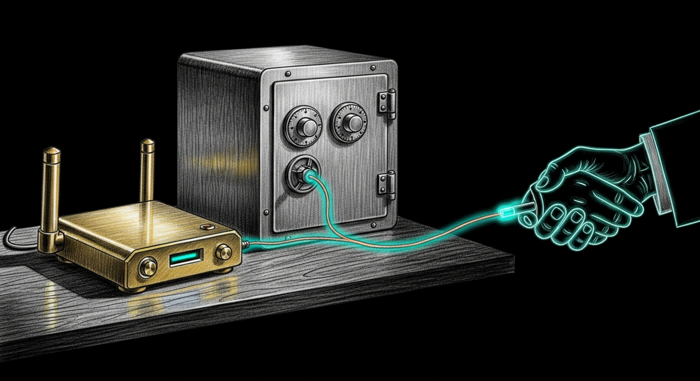

import { Aside, Steps } from '@astrojs/starlight/components';




Sanctum drives MAC-level enforcement through the **node-firewalla SDK**, not the MSP REST API. The bridge running on your Mac talks to your Firewalla over the SDK's encrypted P2P protocol. The MSP HTTP API is the loud, well-documented front door — and it lies about which devices it knows. We use the side door, which tells the truth.

You need to do three things: mint a token, drop in the FWGroup credentials, and restart the bridge.

## Pair

<Steps>

1. **Generate a strong bridge token.**

   ```bash
   TOKEN=$(openssl rand -hex 24)
   security add-generic-password -s firewalla-bridge-token -a "$(whoami)" -w "$TOKEN"
   ```

   <Aside type="note">
     This token is what Sanctum's CLI presents to the bridge process. It is **not** a Firewalla-side credential. The bridge invented it; the bridge enforces it. Anything calling `localhost:1984` without it gets refused.
   </Aside>

2. **Locate your Firewalla's FWGroup credentials.**

   These are the SDK's actual authentication artifacts — the keys that let the bridge speak to your Firewalla device. They live at `~/.openclaw/firewalla/keys/` and the bridge expects four files:

   ```bash
   ls ~/.openclaw/firewalla/keys/
   # Expected: etp.private.pem  etp.public.pem  group.json  ssh_firewalla
   ```

   If you have already paired Firewalla using the Firewalla CLI or the official mobile app, copy that pairing's `keys/` directory into place. If you have never paired, follow Firewalla's first-pair instructions on their site, then copy the resulting `keys/` directory here.

3. **Point the bridge at your Firewalla.**

   Edit `~/.sanctum/sanctum.yaml` and set `firewalla.host` to your Firewalla's LAN IP. Defaults to `192.168.1.1`. If your Firewalla lives somewhere else on your LAN, set it accordingly.

4. **Restart the bridge.**

   ```bash
   launchctl kickstart -k gui/$(id -u)/com.sanctum.firewalla
   ```

5. **Verify.**

   ```bash
   sanctum doctor
   sanctum self-test
   ```

   Probe `02-firewalla-bridge-bearer-auth` must pass. That confirms the bridge accepts your token *and* returns real host data from your Firewalla. Either half failing is the same level of broken — the bridge being up while the SDK is mute is the worst-case silent-success Sanctum has historically shipped.

</Steps>

## Troubleshooting

- **Probe `02-firewalla-bridge-bearer-auth` fails with `no token`** — the `security add-generic-password` step did not take. Re-run it. Confirm with `security find-generic-password -s firewalla-bridge-token -w` — it should print your token. If it prints nothing, the keychain write was silently rejected (usually a stale entry). Add `-U` to update.

- **Bridge log shows `[error] GET /hosts: ECONNRESET`** — the FWGroup credentials in `~/.openclaw/firewalla/keys/` are stale, or two bridge processes are racing for the same Firewalla. Confirm only one is running: `pgrep -fl firewalla-bridge.js`. If two, `launchctl kickstart -k gui/$(id -u)/com.sanctum.firewalla` and let launchd settle the contest.

- **You see `60s without successful op` in the log** — this is the bridge's *discovery checker*, not a host-query failure signal. Discovery runs separately from your actual `/hosts` calls and complains about its own clock, not yours. Look for real `[error]` lines instead. See the May 12 bridge port collision operations note for the full story of why this message exists and why we kept it loud.

<Aside type="caution">
  The Firewalla MSP REST API on port 8833 is *not* what Sanctum uses for enforcement. Probes that pass on the MSP side and fail on the SDK side are not a contradiction — they are two different protocols looking at two different views of your network. Trust the SDK probe. The MSP probe exists for diagnostics.
</Aside>
