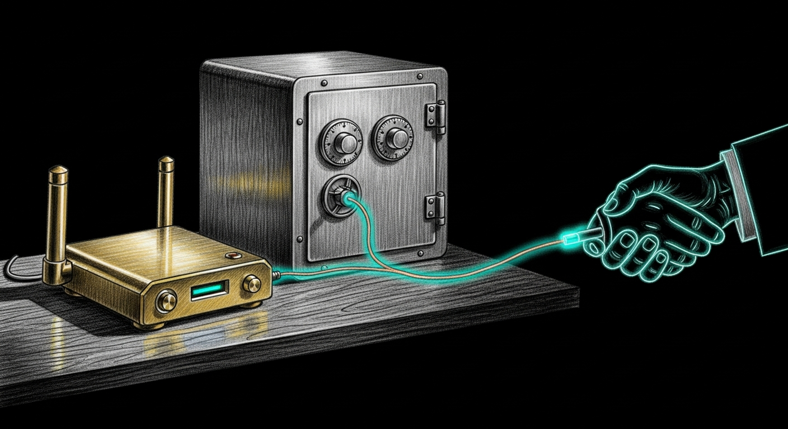

import { Aside, Steps } from '@astrojs/starlight/components';




Sanctum drives MAC-level enforcement through the **node-firewalla SDK**, not the MSP REST API. The bridge running on your Mac talks to your Firewalla over the SDK's encrypted P2P protocol. The MSP HTTP API is the loud, well-documented front door — and it lies about which devices it knows. We use the side door, which tells the truth.

You need to do three things: mint a token, drop in the FWGroup credentials, and restart the bridge.

## Pair

<Steps>

1. **Generate a strong bridge token.**

   ```bash
   TOKEN=$(openssl rand -hex 24)
   printf '%s' "$TOKEN" > ~/.sanctum/secrets/firewalla-bridge-token
   chmod 600 ~/.sanctum/secrets/firewalla-bridge-token
   ```

   The bridge launches as a system LaunchDaemon, and a daemon can't read your login Keychain — so the filesystem secret is the primary store. The wrapper at `~/.sanctum/scripts/firewalla-bridge.sh` reads this file first and only falls back to the Keychain item (`-a sanctum -s firewalla-bridge-token`) for legacy user-session setups.

   <Aside type="note">
     This token is what Sanctum's CLI presents to the bridge process. It is **not** a Firewalla-side credential. The bridge invented it; the bridge enforces it. Anything calling `localhost:1984` without it gets refused.
   </Aside>

2. **Locate your Firewalla's FWGroup credentials.**

   These are the SDK's actual authentication artifacts — the keys that let the bridge speak to your Firewalla device. They live at `~/.openclaw/firewalla/keys/` and the bridge expects four files:

   ```bash
   ls ~/.openclaw/firewalla/keys/
   # Expected: etp.private.pem  etp.public.pem  group.json  ssh_firewalla
   ```

   If you have already paired Firewalla using the Firewalla CLI or the official mobile app, copy that pairing's `keys/` directory into place. If you have never paired, follow Firewalla's first-pair instructions on their site, then copy the resulting `keys/` directory here.

3. **Let the bridge find your Firewalla.**

   You don't hand-configure an IP. The bridge discovers the box on its own — env override first (`FIREWALLA_LAN_IP`), then the last-known-good in `~/.openclaw/firewalla/keys/topology.json`, then mDNS (`firewalla.home`, `firewalla.local`, and the per-model names). It deliberately refuses to fall back to a hardcoded address: a stale literal would SSH whatever happens to sit at that IP on a re-numbered LAN.

   If you genuinely need to pin the box — a quiet mDNS network, a VLAN that swallows broadcasts — set `FIREWALLA_LAN_IP` in the wrapper's environment. That's the one escape hatch, and it's an env var, not a YAML field.

4. **Restart the bridge.**

   ```bash
   sudo launchctl kickstart -k system/com.sanctum.firewalla
   ```

   It's a system LaunchDaemon (`/Library/LaunchDaemons/com.sanctum.firewalla.plist`), so the kickstart needs `sudo` and the `system/` domain — `gui/$(id -u)/` will tell you it can't find the service.

5. **Verify.**

   ```bash
   curl -s http://127.0.0.1:1984/health | jq '{sdkReady, firewalla: .firewalla.ip, mode: .box.mode}'
   TOKEN=$(cat ~/.sanctum/secrets/firewalla-bridge-token)
   curl -s -H "Authorization: Bearer $TOKEN" http://127.0.0.1:1984/hosts | jq '.hosts | length'
   ```

   `/health` returns `200` to anyone and tells you whether the SDK linked up. `/hosts` is the real test: it demands the bearer token and returns the actual device roster from your Firewalla. A non-zero host count means both halves are honest — the token is accepted *and* the SDK is talking. The bridge being up while the SDK is mute is the worst-case silent-success Sanctum has historically shipped, and `/hosts` is the one call that catches it.

</Steps>

## Troubleshooting

- **`/hosts` returns `401`** — the bridge didn't get your token. Check the filesystem store first: `cat ~/.sanctum/secrets/firewalla-bridge-token` should print it. If the file is empty or missing, re-run the create step. If you're on a legacy Keychain setup, confirm the item is under the right account: `security find-generic-password -a sanctum -s firewalla-bridge-token -w`. Note the account is `sanctum`, not your login user — the wrapper reads `-a sanctum`, so a token filed under `$(whoami)` is invisible to it.

- **Bridge log shows `[error] GET /hosts: ECONNRESET`** — the FWGroup credentials in `~/.openclaw/firewalla/keys/` are stale, or two bridge processes are racing for the same Firewalla. Confirm only one is running: `pgrep -fl firewalla-bridge.js`. If two, `sudo launchctl kickstart -k system/com.sanctum.firewalla` and let launchd settle the contest.

- **You see `periodic check (60s without successful op)` in the log** — this is the bridge's *rediscovery checker*, not a host-query failure signal. It fires when 60s pass with no successful contact and quietly re-runs mDNS to recover a re-IP'd box. Discovery runs separately from your actual `/hosts` calls and complains about its own clock, not yours. Look for real `[error]` lines instead. See [the May 12 fortnight-in-one-night operations note](/operations/2026-05-12-the-fortnight-in-one-night/) for the full story: the actual May 3 culprit was a Lima port collision, not the bridge, and this message was a red herring we deliberately kept loud.

<Aside type="caution">
  The Firewalla MSP REST API on port 8833 is *not* what Sanctum uses for enforcement. Probes that pass on the MSP side and fail on the SDK side are not a contradiction — they are two different protocols looking at two different views of your network. Trust the SDK probe. The MSP probe exists for diagnostics.
</Aside>
