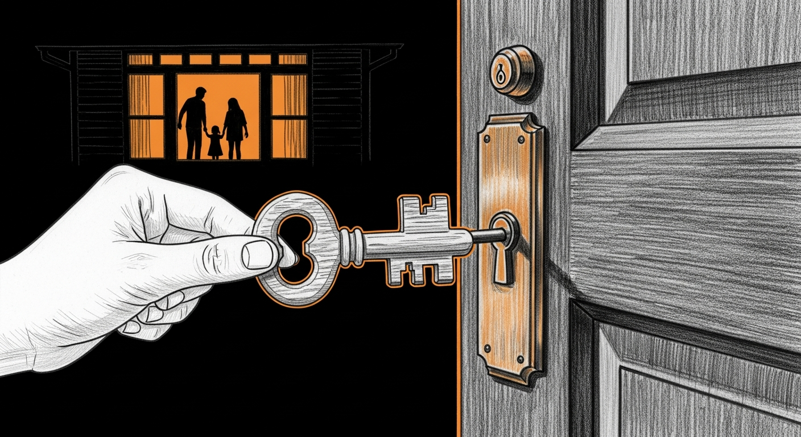

import { Steps, Aside } from '@astrojs/starlight/components';




This is the pilot installation flow. One curl pair, one hash check, one bash run. If you came expecting a thousand-line bootstrap script with a fugue-state config phase, you have the wrong era of Sanctum.

## Prerequisites

- Mac with Apple Silicon (M-series), macOS >=14
- >=16 GB RAM, >=80 GB free disk
- A free [Cloudflare account](https://dash.cloudflare.com/sign-up) for the R2 backup target (10 GB free tier covers most haushelds)
- An afternoon, tea, and a willingness to read a green-or-red panel

The installer installs everything else (Homebrew if missing, sanctum-cli, the Node.js Foundation signed `.pkg` for TCC stability). If something is genuinely outside its reach — Apple Command Line Tools, an Apple ID prompt for the `.pkg` install — it stops and tells you exactly what to do.

## Install

<Steps>

1. **Eyeball the installer before running it.**

   ```bash
   curl -fsSL https://sanctum.run/install.sh | less
   ```

   The script opens with a clearly-labeled plan: macOS Apple Silicon preflight, Homebrew bootstrap, Apple Command Line Tools check, `brew install ogilthorp3/sanctum/sanctum-cli`, Node.js Foundation `.pkg` install, hand-off to `sanctum onboard --recipe family`. Read the plan. Trust is earned, not curled.

   <Aside type="note">
     The script lives at `sanctum-docs/public/install.sh` in source, served from the Cloudflare-fronted [sanctum.run](https://sanctum.run/install.sh). Every commit to `main` re-publishes it after CI. The Apple-grade chain that protects the binaries it installs (Apple Root CA → Developer ID Application: Node.js Foundation `HX7739G8FX` → `/usr/local/bin/node`; Apple Root CA → Developer ID Application: Bertrand Nepveu `GJ994MN2YF` → SanctumBridge.app) is documented in [TCC Identity Anchors](/architecture/tcc-identity-anchors/).
   </Aside>

2. **Optional: verify the hash before running** *(trust-but-verify path)*.

   ```bash
   curl -fsSLO https://sanctum.run/install.sh
   curl -fsSLO https://sanctum.run/install.sh.sha256
   shasum -a 256 -c install.sh.sha256
   ```

   Expected output: `install.sh: OK`. The `.sha256` file is regenerated automatically on every commit to `main` that touches `install.sh`, so the hash always matches the served script. If the check fails, **stop** — the download is corrupt, mid-flight tampered, or pointed at the wrong file. Re-download both and try again.

   Then run the verified copy:

   ```bash
   bash install.sh
   ```

3. **Or just run it** *(faster path — same outcome)*.

   ```bash
   curl -fsSL https://sanctum.run/install.sh | bash
   ```

   The script is idempotent — every step checks whether the thing already exists before installing. You can run it twice and the second run will be a no-op. You will be asked for your Mac admin password once during the Homebrew install (Apple's installer needs it to create `/opt/homebrew/`).

4. **Onboard.**

   The installer ends by asking whether to immediately run `sanctum onboard --recipe family`. Say yes. The onboarding wizard walks you through:
   - estimating the backup scope (~5 GB after dedup for the family recipe)
   - Cloudflare R2 cloud-bucket setup if you don't have one yet (the wizard opens the right browser tabs)
   - a dry-run backup so you can see exactly what would happen
   - the first real backup
   - a restore-canary that round-trips a known file through the bucket and back to prove it works

   When it finishes you see a green panel: **"Your Sanctum is alive, &lt;your name&gt;."** That panel is the moment. Take a screenshot.

5. **Verify.**

   ```bash
   sanctum self-test
   ```

   Twelve probes run in about a second. Green panel = ready. If any probe is red, the line above the summary names which one — and [Troubleshooting](./troubleshooting/) has the copy-pastable fix per probe.

6. **Back up your credentials.**

   ```bash
   sanctum keys backup ~/Documents/sanctum-keys-$(date +%Y-%m-%d).tar.gz.enc
   ```

   Move the resulting file to a USB drive, an encrypted external disk, or your password manager's secure-files vault. AES-256-CBC + PBKDF2 with the passphrase you enter; mode 600 on disk. Without this bundle (and the passphrase), the encrypted Sanctum credentials in your Keychain are unrecoverable if you wipe the machine. We mean unrecoverable. There is no recovery email. There is no support line that will undo this for you. This is the price of running on hardware you actually own.

</Steps>

## After install

A short tour of the operator surface:

- `sanctum status` — daily green/red health glance.
- `sanctum doctor` — full diagnostic, prints what failed and a hint per failure.
- `sanctum logs <service>` — tail any subsystem (e.g. `sanctum logs firewalla-bridge`).
- `sanctum self-test` — re-run the post-install verification wall any time.

<Aside type="tip">
  `sanctum doctor` is the answer to most "why is X red?" questions. Run it before you ask. It will not be offended.
</Aside>

## Next step

Pair the Firewalla bridge so Sanctum can actually enforce schedules. See [Firewalla pairing](./firewalla-pairing).

## When something breaks

[`sanctum doctor`](/reference/sanctum-cli/#sanctum-doctor) is the first stop. [`sanctum self-test`](/reference/sanctum-cli/#sanctum-self-test) is the second. The [Troubleshooting page](/operations/troubleshooting/) is the third.

If those three don't help, [open an issue](https://github.com/Ogilthorp3/sanctum-cli/issues/new/choose) on `Ogilthorp3/sanctum-cli`. The bug-report template asks for `sanctum doctor` and `sanctum self-test` output — paste both. We read them.
