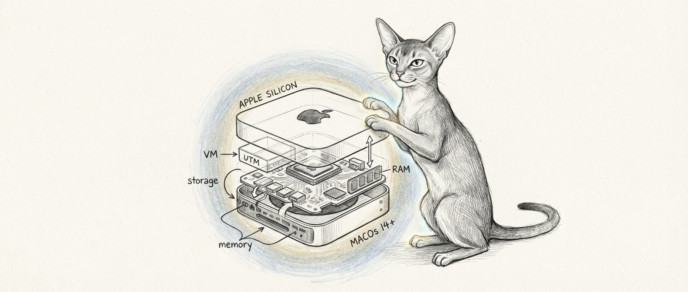

import { Aside, Tabs, TabItem } from '@astrojs/starlight/components';

Before installing Sanctum, make sure your environment meets the following requirements. The platform is designed for Apple Silicon Macs, with a Linux VM handling specific workloads. Yes, you are running an entire intelligence platform on a desktop computer the size of a sandwich. We will not apologize for this.



## Hardware

### Mac Mini (Required)

You will need a Mac Mini. The whole Mac Mini. Not an old one in a drawer — a current-generation Apple Silicon Mac Mini that you are prepared to leave running in a closet, silently orchestrating your domestic life like a very small, very expensive butler.

| Component | Minimum | Recommended |
|-----------|---------|-------------|
| Chip | M4 | M4 Pro |
| RAM | 16 GB | 32 GB+ |
| Storage | 256 GB internal | 512 GB+ internal |
| Network | Gigabit Ethernet | Gigabit Ethernet |

<Aside type="tip">
  The M4 Pro is recommended because local LLMs and XTTS voice synthesis benefit significantly from the additional GPU cores and memory bandwidth. A base M4 will work, but expect slower inference and reduced model sizes. Think of it as the difference between a sports car and a sedan — both get you there, but one of them lets you run a 35-billion-parameter model without the fan spinning up like a jet engine.
</Aside>

### External Storage (Optional)

An external drive is useful for offline knowledge bases (Kiwix), media libraries, and backups. Any USB-C or Thunderbolt drive will work. There is no strict performance requirement since these workloads are not latency-sensitive. Even your data gets to relax sometimes.

### Satellite Nodes (Optional)

For multi-site deployments, satellite nodes can run on any Apple Silicon Mac. An M1 Mac Mini with 16 GB is sufficient for a satellite. If you are the kind of person who has multiple homes and wants AI agents in all of them, congratulations on both your real estate portfolio and your commitment to unnecessary complexity.

## Software

### Required

Install the following before proceeding to the installation guide. This is the part where you open Terminal and pretend you are in a movie.

<Tabs>
  <TabItem label="macOS">
    | Software | Version | Install |
    |----------|---------|---------|
    | macOS | 15 (Sequoia) or later | System update |
    | Homebrew | Latest | [brew.sh](https://brew.sh) |
    | Python | 3.12+ | `brew install python` |
    | Node.js | 22+ | `brew install node` or via fnm |
    | Docker Desktop | Latest | [docker.com](https://www.docker.com/products/docker-desktop/) |
    | UTM | Latest | [mac.getutm.app](https://mac.getutm.app) or `brew install --cask utm` |
    | Git | Latest | `brew install git` (or Xcode CLI tools) |
  </TabItem>
  <TabItem label="Ubuntu VM">
    | Software | Version | Notes |
    |----------|---------|-------|
    | Ubuntu | 24.04 LTS | Installed via UTM |
    | Docker | Latest | `apt install docker.io` |
    | Node.js | 22+ | Via NodeSource or fnm |
    | SOPS | Latest | `apt install sops` or from GitHub releases |
    | age | Latest | `apt install age` (for SOPS encryption) |
    | SSH | OpenSSH 9+ | Included with Ubuntu |
  </TabItem>
</Tabs>

<Aside type="note">
  UTM is used to run the Ubuntu VM with QEMU and Apple Hypervisor. Apple Virtualization Framework is not used because it does not support Host Only networking, which Sanctum requires for the Mac-to-VM bridge. Apple's own virtualization framework cannot do the one thing we need it to do. This is fine. Everything is fine.
</Aside>

### VM Specifications

When creating the Ubuntu VM in UTM, use these settings:

| Setting | Value |
|---------|-------|
| Backend | QEMU with Apple Hypervisor |
| CPU cores | 4 (8 recommended) |
| Memory | 8 GB (12 GB recommended) |
| Disk | 64 GB+ |
| Network | Host Only (vmnet) |
| QEMU TSO | Enabled |

The VM will receive a static IP on the `10.10.10.0/24` subnet. The Mac acts as the bridge gateway at `10.10.10.1`, and the VM sits at `10.10.10.10`. Two machines, one private network, no internet access for the VM. It is a Linux box in solitary confinement, and it prefers it that way.

## Optional Components

These are not required for a basic installation but enable additional capabilities. Think of them as side quests.

### Firewalla Purple

A [Firewalla Purple](https://firewalla.com) in Router mode provides network-level security, DNS management, and device monitoring. Sanctum includes a bridge service that communicates with Firewalla over its P2P API on port 8833.

If you do not have a Firewalla, Sanctum will still function. Network management features will simply be unavailable, and you will have to monitor your network the old-fashioned way: by not monitoring it at all and hoping for the best.

### Tailscale

[Tailscale](https://tailscale.com) provides secure mesh networking between nodes. It is required for multi-node deployments (hub + satellite) and strongly recommended for remote access to your hub.

Install Tailscale on each node:

```bash
brew install --cask tailscale
```

### Cloudflare Domain

A domain managed through [Cloudflare](https://cloudflare.com) enables secure public access to specific services (such as the Home Assistant dashboard or health endpoints) via Cloudflare Tunnel. The free Zero Trust plan is sufficient.

### LM Studio

[LM Studio](https://lmstudio.ai) provides a local inference server for large language models. Sanctum uses it as a primary or fallback model provider. Install it as a standard macOS application and configure it to serve on port 1234.

### iPhone Apps

These iOS apps integrate with Sanctum services on the hub.

| App | Purpose | Required |
|-----|---------|----------|
| [Home Assistant Companion](https://apps.apple.com/app/home-assistant/id1099568401) | HA remote control, presence detection, notifications | Yes |
| [Health Auto Export](https://apps.apple.com/app/health-auto-export/id1115567461) | Push Apple Health data to health ingester | If health monitoring enabled |
| [Tailscale](https://apps.apple.com/app/tailscale/id1470499037) | VPN mesh access to hub from anywhere | Recommended |

<Aside type="note">
  The HA Companion app provides presence detection (used by automations to know who is haus), actionable notifications, and location tracking. Health Auto Export sends hourly health data to the Cilghal health agent via a REST API automation. Your phone becomes a sensor that reports on you to your own house. You volunteered for this.
</Aside>

## Network Architecture

Sanctum expects the following network layout:

```
Internet
  |
Modem / ONT
  |
Firewalla WAN (optional, Router mode)
  |
LAN (192.168.1.0/24)
  |-- Mac Mini (.10) -- Host Only bridge (10.10.10.0/24) -- Ubuntu VM (.10)
  |-- Orbi / Wi-Fi AP (.2, AP mode)
  \-- Smart devices, speakers, etc.
```

<Aside type="caution">
  The VM uses Host Only networking and has no direct internet access. All external connectivity is routed through the Mac. This is by design and provides an additional layer of network isolation for agent workloads. The VM is an air-gapped intelligence asset living inside your desktop computer. Read that sentence again and appreciate the era you live in.
</Aside>

## Verification

Before moving on, confirm you have the required tools installed:

```bash
# Check macOS version
sw_vers

# Check Homebrew
brew --version

# Check Python
python3 --version

# Check Node.js
node --version

# Check Docker
docker --version

# Check UTM is installed
ls /Applications/UTM.app
```

If all of those commands returned something other than an error, you are ready. If any of them failed, fix it now. The installation guide is patient, but it will not hold your hand through missing dependencies.

Once everything checks out, proceed to [Installation](/getting-started/installation/).
