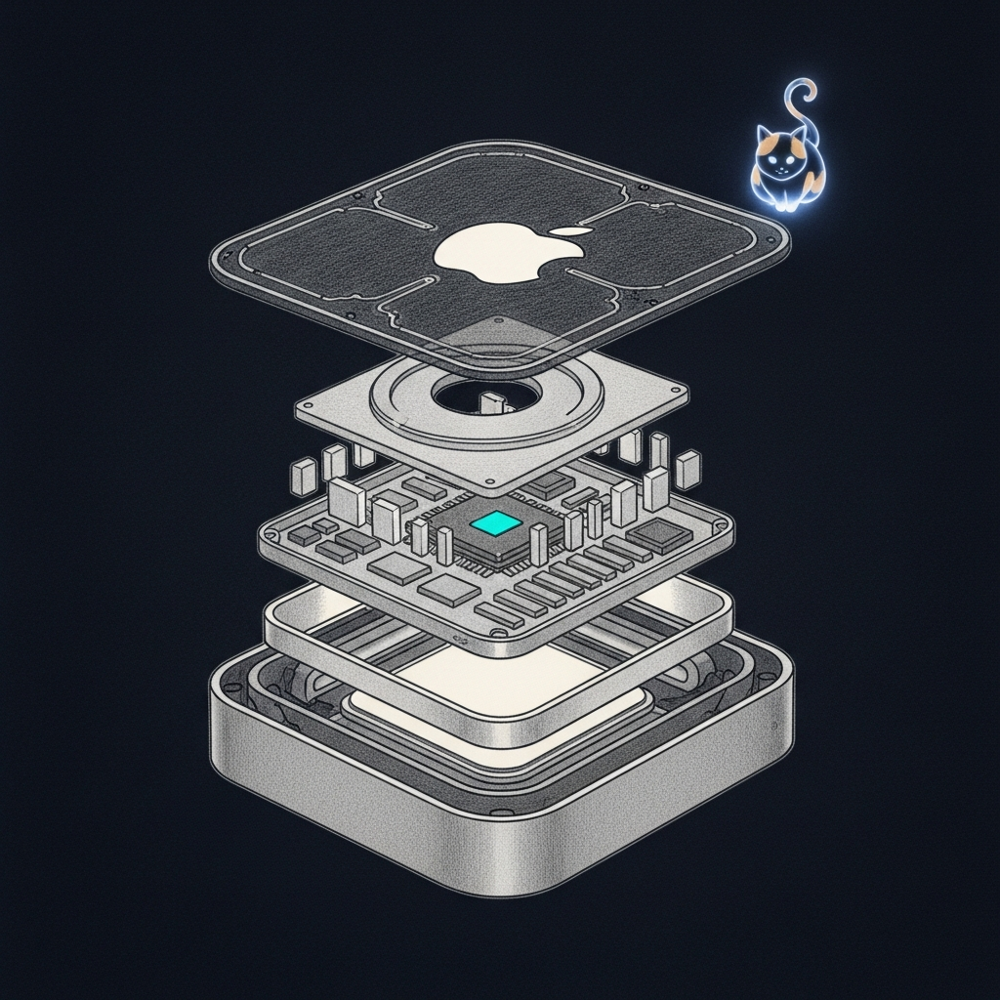

import { Aside, Tabs, TabItem } from '@astrojs/starlight/components';

It's the size of a grilled cheese and weighs about as much as a hardcover, and in twenty minutes you're going to shove it in a closet and never look at it again while it silently orchestrates your entire domestic life like a very small, very expensive butler. Sanctum runs on Apple Silicon Macs, with a Linux VM handling specific workloads — so yes, you are running an entire intelligence platform on a desktop computer the size of a sandwich, and no, we will not apologize for this. But the butler needs the right guts and the right software before it can do butler things. Skip a dependency here and you'll be hunting it down at 2 AM with the install half-finished, and haus automation has straight-up zero chill about timing. So let's get the shopping list right the first time.



## Hardware

### Mac Mini (Required)

You will need a Mac Mini. The whole Mac Mini. Not an old one in a drawer — a current-generation Apple Silicon Mac Mini that you are prepared to leave running in a closet, silently orchestrating your domestic life like a very small, very expensive butler.

| Component | Minimum | Recommended |
|-----------|---------|-------------|
| Chip | M4 | M4 Pro |
| RAM | 16 GB | 32 GB+ |
| Storage | 256 GB internal | 1 TB+ internal |
| Network | Gigabit Ethernet | Gigabit Ethernet |

<Aside type="tip">
  The M4 Pro is recommended because local LLMs and Chatterbox voice synthesis benefit significantly from the additional GPU cores and memory bandwidth. A base M4 will work, but expect slower inference and reduced model sizes. Think of it as the difference between a sports car and a sedan — both get you there, but one of them lets you run a 35-billion-parameter model without the fan spinning up like a jet engine.
</Aside>

### External Storage (Optional)

An external drive is useful for offline knowledge bases (Kiwix), media libraries, and backups. Any USB-C or Thunderbolt drive will work. There is no strict performance requirement since these workloads are not latency-sensitive. Even your data gets to relax sometimes.

### Satellite Nodes (Optional)

For multi-site deployments, satellite nodes can run on any Apple Silicon Mac. An M1 Mac Mini with 16 GB is sufficient for a satellite. If you are the kind of person who has multiple homes and wants AI agents in all of them, congratulations on both your real estate portfolio and your commitment to unnecessary complexity.

## Software

### Required

Install the following before proceeding to the installation guide. This is the part where you open Terminal and pretend you are in a movie.

<Tabs>
  <TabItem label="macOS">
    | Software | Version | Install |
    |----------|---------|---------|
    | macOS | macOS 15 Sequoia minimum (26 Tahoe recommended) | System update |
    | Homebrew | Latest | [brew.sh](https://brew.sh) |
    | Python | 3.12+ | `brew install python` |
    | Node.js | 22+ | `brew install node` or via fnm |
    | Docker Desktop | Latest | [docker.com](https://www.docker.com/products/docker-desktop/) |
    | Lima | Latest | `brew install lima` (runs the Ubuntu VM on Apple Virtualization) |
    | socket_vmnet | Latest | `brew install socket_vmnet` (host-only Mac↔VM bridge) |
    | Git | Latest | `brew install git` (or Xcode CLI tools) |
  </TabItem>
  <TabItem label="Ubuntu VM">
    | Software | Version | Notes |
    |----------|---------|-------|
    | Ubuntu | 24.04 LTS | Installed as a Lima `vz` VM |
    | Docker | Latest | `apt install docker.io` |
    | Node.js | 22+ | Via NodeSource or fnm |
    | SOPS | Latest | `apt install sops` or from GitHub releases |
    | age | Latest | `apt install age` (for SOPS encryption) |
    | SSH | OpenSSH 9+ | Included with Ubuntu |
  </TabItem>
</Tabs>

<Aside type="note">
  [Lima](https://lima-vm.io) runs the Ubuntu VM on Apple's Virtualization Framework (`vmType: vz`) — no UTM GUI, no QEMU process. The one thing `vz` does not give you natively is host-only networking, so Sanctum backs the bridge interface with `socket_vmnet` running as root. Two tools, one VM, and the host-only network Apple forgot to ship.
</Aside>

### VM Specifications

When creating the Ubuntu VM with Lima, use these settings:

| Setting | Value |
|---------|-------|
| Backend | Lima (`vmType: vz`, Apple Virtualization) |
| CPU cores | 4 |
| Memory | 8 GB |
| Disk | 100 GB |
| Bridge network | Host Only via `socket_vmnet` (vmnet host mode) |
| Internet | NAT interface, managed by Lima |

The VM carries two interfaces. A host-only bridge (`lima0`) puts the Mac at `10.0.0.1` and the VM at `10.0.0.10` — that private wire is how every agent on the VM reaches services on the hub. A second NAT interface gives the VM its own outbound path to the internet for `apt` and `git`. Not solitary confinement, then; more like a studio apartment with one locked door to the haus and one window to the outside world.

## Optional Components

These are not required for a basic installation but enable additional capabilities. Think of them as side quests.

### Firewalla

A [Firewalla](https://firewalla.com) in Router mode provides network-level security, DNS management, and device monitoring. The hub runs a Gold Pro, but any Router-mode Firewalla works. Sanctum includes a bridge service that talks to it over its P2P API on port 8833.

If you do not have a Firewalla, Sanctum will still function. Network management features will simply be unavailable, and you will have to monitor your network the old-fashioned way: by not monitoring it at all and hoping for the best.

### Tailscale

[Tailscale](https://tailscale.com) provides secure mesh networking between nodes. It is required for multi-node deployments (hub + satellite) and strongly recommended for remote access to your hub.

Install Tailscale on each node:

```bash
brew install --cask tailscale
```

### Cloudflare Domain

A domain managed through [Cloudflare](https://cloudflare.com) enables secure public access to specific services (such as the Home Assistant dashboard or health endpoints) via Cloudflare Tunnel. The free Zero Trust plan is sufficient.

### Local OpenAI-compatible inference (port 1234)

Sanctum expects a local OpenAI-compatible model server on port 1234, used as a primary or fallback provider. [LM Studio](https://lmstudio.ai) is the easy on-ramp — install the app (or its `lms` CLI) and point it at `:1234`. The running hub currently serves that port with `mlx_lm.server` instead; the provider behind the socket is interchangeable as long as it speaks the OpenAI API on 1234.

### iPhone Apps

These iOS apps integrate with Sanctum services on the hub.

| App | Purpose | Required |
|-----|---------|----------|
| [Home Assistant Companion](https://apps.apple.com/app/home-assistant/id1099568401) | HA remote control, presence detection, notifications | Yes |
| [Health Auto Export](https://apps.apple.com/app/health-auto-export/id1115567461) | Push Apple Health data to health ingester | If health monitoring enabled |
| [Tailscale](https://apps.apple.com/app/tailscale/id1470499037) | VPN mesh access to hub from anywhere | Recommended |

<Aside type="note">
  The HA Companion app provides presence detection (used by automations to know who is haus), actionable notifications, and location tracking. Health Auto Export sends hourly health data to the Cilghal health agent via a REST API automation. Your phone becomes a sensor that reports on you to your own haus. You volunteered for this.
</Aside>

## Network Architecture

Sanctum expects the following network layout:

```
Internet
  |
Modem / ONT
  |
Firewalla WAN (Router mode)
  |
LAN (192.0.2.0/24, gateway .1)
  |-- Mac Mini (.10) -- Host Only bridge (10.0.0.0/24) -- Ubuntu VM (.10)
  |-- Orbi / Wi-Fi AP (AP mode)
  \-- Smart devices, speakers, etc.
```

<Aside type="caution">
  The host-only bridge (`10.0.0.0/24`) is the only path between the VM and hub services — agent workloads on the VM talk to the Mac over that private wire and nowhere else. The VM does keep a separate NAT interface for outbound `apt` and `git`, so it is not air-gapped: it is firewalled by topology, not by amputation. If you want a true air-gap, drop the NAT NIC and proxy package installs through the Mac — but then you own the proxy, forever.
</Aside>

## Verification

Before moving on, confirm you have the required tools installed:

```bash
# Check macOS version
sw_vers

# Check Homebrew
brew --version

# Check Python
python3 --version

# Check Node.js
node --version

# Check Docker
docker --version

# Check Lima (runs the VM) and socket_vmnet (the host-only bridge)
limactl --version
which socket_vmnet
```

If all of those commands returned something other than an error, you are ready. If any of them failed, fix it now. The installation guide is patient, but it will not hold your hand through missing dependencies.

Once everything checks out, proceed to [Installation](/getting-started/installation/).
