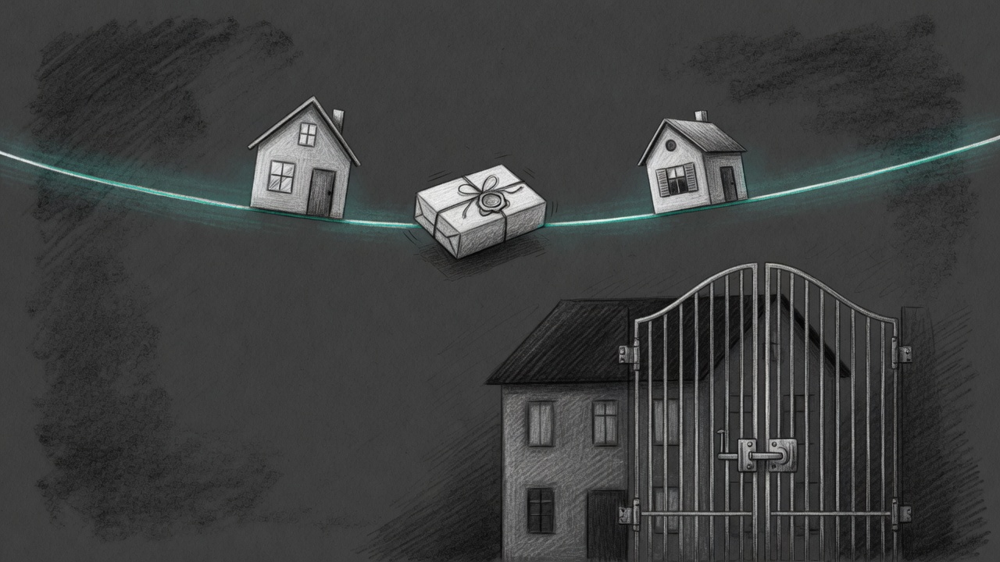

import { Steps, Aside } from '@astrojs/starlight/components';

A friend joins one tailnet with you, and the two of you can hand a file across it.



The [Quick Start](./quick-start/) installs Sanctum. The tribe is the step after that, when the friend should receive a package that does not belong on a public download. The mesh still refuses a model that has not passed the [champion gauntlet](/operations/2026-07-05-no-haus-is-an-island/). A file is a different thing. It is signed, hashed, saved, and not run.

## What the friend can reach

The friend gets the tag `tag:sanctum-tribe`. That tag can open port 8788 on the operator's admin machines and on other tribe machines. It cannot SSH. It cannot open the haus services. A machine that already wears an admin, host, or mobile tag will not take the tribe tag, so the operator's own Mac stays what it is.

<Steps>

1. **Install or upgrade the CLI.**

   ```bash
   brew install ogilthorp3/sanctum/sanctum-cli
   ```

   If Sanctum is already installed, `brew update` and then `brew upgrade sanctum-cli`. The first build takes a while.

2. **Join the tribe with the one-time key the operator sent.**

   ```bash
   sanctum mesh join --tribe 'tskey-auth-…'
   ```

   Tailscale comes up on the shared tailnet and advertises only the tribe tag. When the command prints that the tailnet is up, reply to the operator.

3. **Receive the file.**

   ```bash
   sanctum mesh receive 'the-ticket-the-operator-sends'
   ```

   The file is saved at `~/.sanctum/mesh/inbox/`. The command checks the signature and the sha256 before it keeps the bytes.

</Steps>

<Aside type="note">
The tribe key is a Tailscale device key. It works once. It is not a password for the haus.
</Aside>

The operator starts the send on their own Mac with `sanctum mesh send` and the path of the file, and leaves it running until the receive finishes. The ticket in that command's output is the line the friend pastes. Stop the send with Ctrl-C once the file has landed. Pour the tea. The parcel is on the friend's disk, and the haus door stayed shut.
