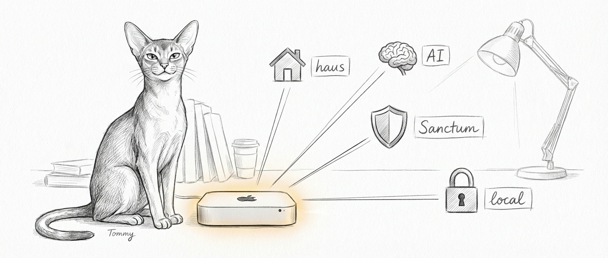
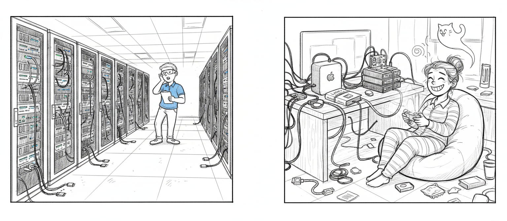

import { Card, CardGrid, Aside, Tabs, TabItem } from '@astrojs/starlight/components';

Sanctum is an intelligent haus platform that unifies haus automation, AI agents, network management, voice control, and family tools under a single, config-driven system. It runs on a Mac Mini in your closet, answering to no one's cloud, and it is built for the kind of haushold where "reboot the router" is not a punchline but a Tuesday.

## The Problem

You already know the problem. You are living it.

Your smart haus is a Frankenstein's monster stitched together from a dozen services that have never met. Home Assistant handles the lights. A separate NAS manages your photos. Network monitoring lives in an app you forgot the password to. Your AI assistant is a cloud-dependent black box that cheerfully sends your conversations to a data center in Virginia. Each tool has its own config format, its own authentication model, and its own creative interpretation of the word "reliable."

When something breaks at 2 AM — and it will break at 2 AM, because haus automation has a vampiric sense of timing — you are debugging five different systems in your underwear, wondering when exactly your hobby became your second job.

## The Platform

Sanctum brings these layers together into a single managed platform running on hardware you own. One config file. One dashboard. One thing to blame when it breaks.

<CardGrid>
  <Card title="Haus Automation" icon="laptop">
    Home Assistant runs as a Docker container on your Mac, with full LAN access to Sonos, HomeKit, and smart devices.
  </Card>
  <Card title="AI Agents" icon="star">
    Specialized agents handle security monitoring, energy efficiency, family health tracking, and financial oversight, each with dedicated models and skills.
  </Card>
  <Card title="Network Management" icon="setting">
    Firewalla integration provides firewall rules, DNS policy, and network topology from within the platform.
  </Card>
  <Card title="Voice Control" icon="signal">
    Yoda, the voice agent, uses Qwen3-TTS (via mlx-audio) for local text-to-speech on Apple Silicon GPU. No cloud dependency for voice. Your haus talks to you and only you.
  </Card>
</CardGrid>

## How It Works

At the core of Sanctum is a single YAML configuration file (`instance.yaml`) that describes your entire deployment: which services are enabled, what ports they bind to, which nodes exist, and how secrets are managed. Every script, LaunchAgent, and dashboard panel reads from this one source of truth.

One file to rule them all. One file to find them. One file to bring them all and in the darkness bind them. (We are not sorry.)

<Tabs>
  <TabItem label="Hub Node (Mac Mini)">
    The hub is the primary node. It runs on an Apple Silicon Mac Mini — a $600 aluminum rectangle shouldering the responsibilities of a small government — and hosts:
    - The Sanctum gateway and dashboard
    - Home Assistant (Docker)
    - AI agent gateway and specialized agents
    - Local LLMs via MLX and LM Studio
    - Qwen3-TTS voice synthesis server
    - Cloudflare tunnel for secure remote access
  </TabItem>
  <TabItem label="VM Workloads (Ubuntu)">
    A QEMU-managed Ubuntu VM handles workloads that benefit from a Linux environment:
    - Agent orchestration (multi-agent routing, skill execution)
    - Knowledge graph (Neo4j + Graphiti)
    - SOPS-encrypted secrets for service credentials
    - Network-isolated processing (host-only networking, no direct internet)

    The VM cannot reach the internet. This is not a bug. This is the VM living in a sensory deprivation tank for security reasons.
  </TabItem>
  <TabItem label="Satellite Nodes">
    Additional locations (vacation haus, office) run lightweight satellite nodes that connect back to the hub over Tailscale. Satellites get their own `node_id` and run a subset of services defined in `instance.yaml`.
  </TabItem>
</Tabs>

## Why "Sanctum"

The name means *sacred inner chamber* — and the mark literalizes it. A dark square holds an amber diamond at its center: the thing you care about most, inside the thing strong enough to protect it.

In a year when every major platform is racing to ingest personal data for model training, the idea of a private inner chamber has moved from metaphor to survival strategy. Sanctum runs on your hardware, in your haus, answering to no one's servers. The amber is deliberate — firelight, candlelight, the oldest color of *someone is haus*. Set against dark slate, it becomes a hearth inside architecture. Domesticity, not disruption.

Two shapes. Two colors. No gradients, no glowing orbs, no neural-network illustrations. In an era of AI-generated visual noise, restraint is the position statement.

## Key Differentiators

### Single Configuration File

Every service, port, path, and integration is declared in `~/.sanctum/instance.yaml`. There are no scattered `.env` files, no hardcoded usernames in scripts, no magic constants buried in a file you last edited in a fugue state at 3 AM. When you change a port number, you change it in one place.

### Multi-Node Architecture

Sanctum supports hub, satellite, mobile, and sensor node types. Your primary haus is the hub. A vacation haus runs a satellite. Your laptop is a mobile node. Each node knows its role and adjusts its services accordingly — which is more than can be said for most family members.

### Self-Healing Watchdog

A watchdog process monitors over 20 services every 10 minutes. When it detects a failure, it attempts automatic remediation using the service-doctor skill before alerting you. Most issues resolve without human intervention. The rest resolve after human intervention and a glass of something strong.

### Encrypted Secret Rotation

API tokens and credentials are stored in macOS Keychain (on the Mac) and SOPS-encrypted files (on the VM). A monthly rotation job generates new tokens, updates Keychain entries, re-encrypts SOPS files, and restarts affected services.

### Local-First AI

Large language models run locally via MLX (Apple Silicon optimized) and LM Studio. Cloud APIs are available as fallbacks with automatic failover, but the system is designed to operate entirely on-premises when needed. Your conversations with your haus stay in your haus.

<Aside type="note">
  Sanctum is the productized name for this platform. Under the hood, it builds on the OpenClaw agent framework and leverages standard open-source components (Home Assistant, Docker, Tailscale, Firewalla). You are not locked into a proprietary ecosystem. We are not building a walled garden — we are building a walled *fortress* out of other people's open-source bricks.
</Aside>

## Who Is Sanctum For?

Sanctum is designed for technically inclined hausholds that want:

- **Full ownership** of their haus intelligence stack, running on their own hardware.
- **Deep customization** through config files, shell scripts, and agent skills rather than drag-and-drop UIs.
- **Privacy by default**, with local LLMs, on-device voice, and no mandatory cloud services.
- **Multi-site support** for families with more than one haus.

If you are comfortable with a terminal, YAML files, and the occasional `launchctl` command, Sanctum will feel natural. If the phrase "Host Only networking" makes you break out in hives, this may not be your platform. We respect that. There are excellent consumer products that will happily send your thermostat data to the cloud.

## Next Steps

Ready to get started? Check the [Requirements](/getting-started/requirements/) to make sure your hardware and software are in order, then move on to [Installation](/getting-started/installation/).
