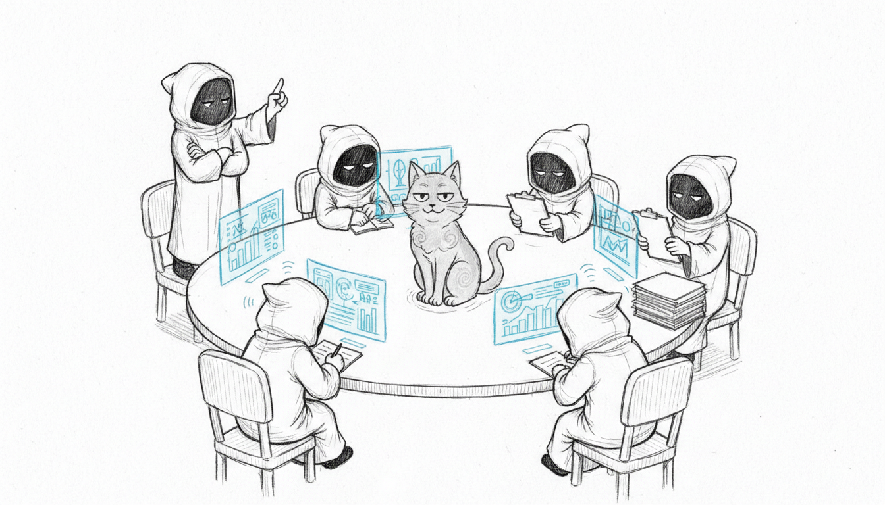

import { Aside, Steps, Tabs, TabItem, Card, CardGrid } from '@astrojs/starlight/components';

Somewhere around the third agent, this stopped being a haus automation project and started being a personnel management problem. Sanctum runs a multi-agent AI system split across two platforms — five specialized agents on the VM, one on the Mac — each with a defined role, shared skills, and the quiet confidence of software that doesn't know it's running on consumer hardware in a Quebec basement.



## Agent Roster

### VM Agents

The VM hosts five agents. Yes, five. Each named after a Star Wars Jedi, because if you're going to build a council of AI minds inside a Mac Mini, you might as well commit to the bit.

| Agent      | Role        | Responsibilities                                           |
|------------|-------------|------------------------------------------------------------|
| **Yoda**   | Main        | General intelligence, coordination, primary user interface  |
| **Windu**  | Security    | Network monitoring, threat assessment, security briefings   |
| **Qui-Gon**| Efficiency  | Resource optimization, automation suggestions, cost analysis|
| **Cilghal**| Health      | Genomic analysis, health monitoring, wellness insights      |
| **Mundi**  | Finance     | Financial tracking, budget analysis, investment monitoring  |

All VM agents run through the OpenClaw gateway as a systemd user service. The gateway manages agent lifecycle, message routing, and plugin access. It is, effectively, the Jedi Temple — if the Jedi Temple ran on 12 gigs of RAM and needed its secrets decrypted from a YAML file.

### Mac Agent

| Agent       | Role | Responsibilities                              |
|-------------|------|-----------------------------------------------|
| **Jocasta** | CRM  | Contact management, relationship intelligence |

Jocasta runs through the DenchClaw gateway on the Mac (port 18789) with its own configuration profile. She has direct access to Mac-native services and the Affinity CRM integration. Named after the Jedi archivist, because someone has to remember everyone's birthday.

## Model Configuration

Agents use a tiered model strategy with automatic fallback to maintain availability during outages or rate limits. The philosophy: if one brain goes dark, there's always a dumber one willing to try.

### Tiered Model Strategy

Each agent is assigned a **tier** that determines its primary model and fallback chain. All routing goes through the LiteLLM proxy (guardrail injector on port 4000 → LiteLLM on port 4001).

| Tier | Primary Model | Fallback Chain | Agents |
|------|--------------|----------------|--------|
| `council-brain` | Qwen 3.5 Plus (OpenRouter) | claude-opus-4-6 → qwen35-plus → LM Studio → council-27b | Yoda, Jocasta |
| `council-secure` | Qwen 3.5 Plus (OpenRouter) | qwen35-plus → LM Studio | Windu |
| `council-routine` | Qwen 3.5 Plus (OpenRouter) | qwen35-plus → council-27b | Qui-Gon, Cilghal, Mundi |
| `council-heartbeat` | Council 27B (local) | council-27b | All (heartbeat/status) |

Claude Code connects directly as `claude-opus-4-6` (not through a tier), with its own fallback chain to qwen35-plus → gemini-25-pro.

<Aside type="note">
  Requests to OpenRouter are automatically scrubbed of personally identifiable information via Presidio PII anonymization in the guardrail injector. De-anonymization is applied to responses. Your agents talk to the cloud. They just don't tell it who you are.
</Aside>

### Local Models

| Model | Port | Use Case |
|-------|------|----------|
| Qwen 3.5 35B (A3B) | 1234 (LM Studio) | General reasoning fallback |
| Qwen 3.5 27B 4-bit + LoRA | 8899 (MLX) | Agent-personalized local inference |

The Council-27B MLX server provides LoRA adapters fine-tuned for each of the six agents, enabling personalized responses at the local tier. Every agent gets its own voice. This is either sophisticated engineering or the early stages of a personality disorder. Possibly both.

### LiteLLM Proxy

The LiteLLM proxy is the **primary routing layer** for all agent model requests. It consists of two components:

- **Guardrail injector** (port 4000) — request sanitization, content-based routing, prompt caching, PII scrubbing, assistant prefill stripping
- **LiteLLM** (port 4001) — model resolution, fallback routing, analytics

See the [Services](/architecture/services/) page for the full 7-step request pipeline.

## Gateway Architecture

Each platform runs its own gateway instance:

| Platform | Gateway     | Port  | Bind     | Config Location     |
|----------|-------------|-------|----------|---------------------|
| Mac      | DenchClaw   | 18789 | LAN      | `~/.openclaw/`      |
| VM       | OpenClaw    | varies| LAN      | `~/.openclaw/`      |

The VM gateway runs as a systemd user service with linger enabled, starting automatically at boot. It uses a SOPS wrapper script to decrypt secrets before launch.

The Mac gateway runs as a LaunchAgent. Both gateways use the same OpenClaw codebase but with independent configurations. Two embassies, one language.

## Council Bridge

The Council Bridge enables communication between Jocasta (Mac) and Yoda (VM). Since gateways block plaintext WebSocket connections to non-loopback IPs, all cross-instance communication routes through SSH. Because nothing says "cutting-edge AI" like shelling out to a protocol from 1995.

### Mac to VM

```
Jocasta → SSH to ubuntu@10.10.10.10 →
  openclaw agent --agent main --message "..."
```

### VM to Mac

```
Yoda → SSH to bert@10.10.10.1 →
  PATH=<node path> openclaw agent --agent main --message "..."
```

<Aside type="caution">
  VM-to-Mac SSH requires an explicit PATH prefix because the fnm-managed Node.js installation is not in the default SSH PATH. The bridge handles this automatically, but if you're debugging manually, you'll need to know this or you'll stare at "command not found" wondering if the machines have finally turned on you.
</Aside>

The bridge skill maintains a heartbeat every 2 hours to confirm bidirectional connectivity. If the heartbeat fails, an alert is raised through the watchdog system.

## Plugins

Agents have access to shared plugins that extend their capabilities:

| Plugin         | Description                                          |
|----------------|------------------------------------------------------|
| **Supermemory**| Persistent memory across conversations               |
| **Neo4j KG**   | Knowledge graph via Graphiti (port 18093)            |

Plugins are configured at the gateway level and available to all agents on that gateway instance.

## Skills System

Agents access executable skills from the shared skills repository. Skills provide domain-specific tools that agents can invoke during conversations. See the [Skills Development](/guides/skills/) guide for details on the skill system architecture.

Skills are loaded from:
- The built-in skills directory in the OpenClaw installation
- Extra skills directories configured in `openclaw.json` (pointing to `~/Projects/openclaw-skills`)

## Holocron Chat Interface

The Holocron is the family-facing chat interface — the part of this system that doesn't require a terminal. It runs on the Mac at port 19001, using a separate DenchClaw profile (`~/.openclaw-dench/`) with token authentication and LAN binding.

| Setting    | Value                                    |
|------------|------------------------------------------|
| Port       | 19001                                    |
| Hostname   | `holocron` (Firewalla DNS), `holocron.local` (mDNS) |
| Auth       | Token-based                              |
| Access     | `http://holocron/` from LAN              |

The Holocron provides a simplified interface for household members to interact with the agent system without needing direct gateway access. Because explaining SSH to your family is a different kind of support ticket.
