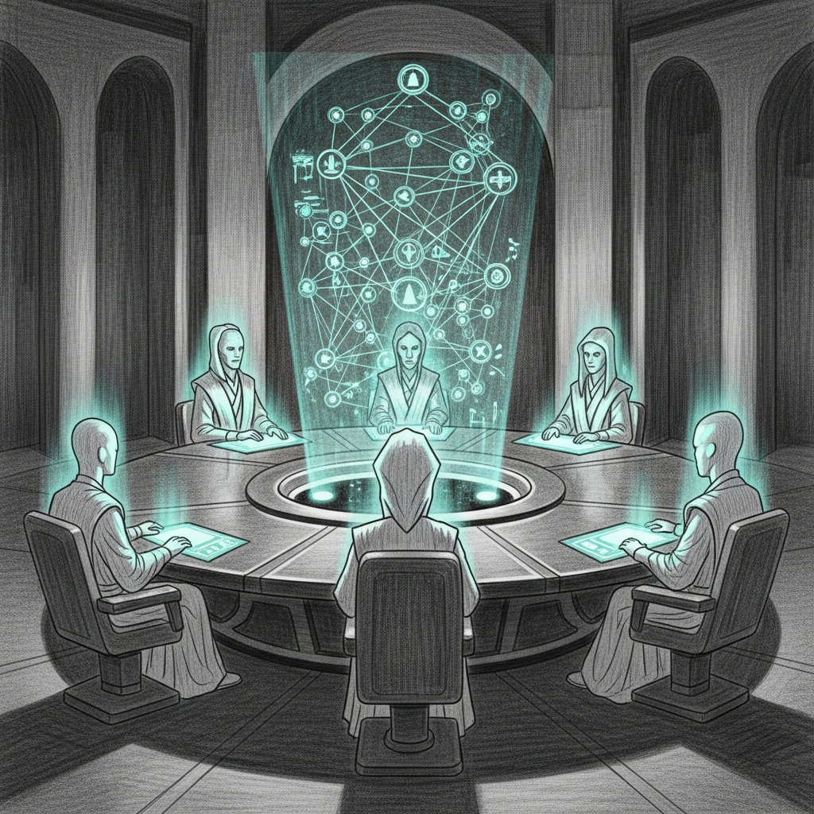

import { Aside, Steps, Tabs, TabItem, Card, CardGrid } from '@astrojs/starlight/components';
import CouncilRoster from '../../../components/CouncilRoster.astro';

Somewhere around the third agent, this stopped being a haus automation project and started being a personnel management problem. Sanctum runs a multi-agent AI system split across two platforms — five specialized agents on the VM, one on the Mac — each with a defined role, shared skills, and the quiet confidence of software that doesn't know it's running on consumer hardware in a basement.



## Agent Roster

### VM Agents

The VM hosts five agents. Yes, five. Each named after a Star Wars Jedi, because if you're going to build a council of AI minds inside a Mac Mini, you might as well commit to the bit.

| Agent      | Role        | Responsibilities                                           |
|------------|-------------|------------------------------------------------------------|
| **Yoda**   | Main        | General intelligence, coordination, primary user interface  |
| **Windu**  | Security    | Network monitoring, threat assessment, security briefings   |
| **Qui-Gon**| Efficiency  | Resource optimization, automation suggestions, cost analysis|
| **Cilghal**| Health      | Wearable and scale data, trend detection, daily health briefings |
| **Mundi**  | Finance     | Financial tracking, budget analysis, investment monitoring  |

All VM agents run through the OpenClaw gateway as a systemd user service. The gateway manages agent lifecycle, message routing, and plugin access. It is, effectively, the Jedi Temple — if the Jedi Temple ran on 12 gigs of RAM and needed its secrets decrypted from a YAML file.

### Mac Agent

| Agent       | Role | Responsibilities                              |
|-------------|------|-----------------------------------------------|
| **Jocasta** | CRM  | Contact management, relationship intelligence |

Jocasta runs through the DenchClaw gateway on the Mac (the `~/.openclaw-dench/` profile, gateway port `19001`, token auth, LAN-bound) with direct access to Mac-native services and the Affinity CRM integration. Named after the Jedi archivist, because someone has to remember everyone's birthday.

## Model Configuration

Agents use a tiered model strategy with automatic fallback to maintain availability during outages or rate limits. The philosophy: if one brain goes dark, there's always a dumber one willing to try.

### Tiered Model Strategy

Each agent is assigned a logical **tier** that resolves to a primary model and a fallback chain. All routing goes through the Sanctum Proxy on port 4040, which reads `~/.sanctum/sanctum-proxy/config.yaml` for the resolution.

The mapping below is generated from the live Mini config — not hand-maintained here, because champion models swap often enough that a typed table is wrong within the week. One JSON file owns the truth; every page that shows the roster reads from it.

<CouncilRoster variant="tiered" />

The constant across every row is the last fallback: when the cloud is rate-limited or dark, each Jedi cascades down to the local Qwen tier and keeps answering. The whole point of the chain is that the lights stay on even when OpenRouter is having a day.

<Aside type="caution">
  PII scrubbing for the OpenRouter path is **wired but not yet armed**. The proxy builds a Presidio client at startup (`presidio_client` in `proxy.rs`), but no call site analyzes-and-anonymizes the outbound content blocks yet, and the analyzer/anonymizer services on `:5002`/`:5001` aren't running. Until they are, outbound cloud requests carry whatever the agent said. The plumbing is there; the valve is closed. Don't document it as a guarantee until the valve opens.
</Aside>

### Local Models

| Model | Port | Use Case |
|-------|------|----------|
| Codestral-22B-v0.1-4bit | 3301 (sanctum-mlx) | Local coding tier (`council-code`) |
| Qwen 3.6 35B (A3B) 4-bit | 1337 (sanctum-mlx, mTLS) | Local council brain — primary and last-resort fallback |

Both are served by the `sanctum-mlx` cathedral binary (`sanctum-rs-cathedral`), not LM Studio. The council brain on `:1337` is mTLS-only; a pair of `socat` tunnels re-expose it as plaintext loopback `:1339` for the proxy and the vmnet bridge, so the config's `council-mlx`/`council-27b`/`council-heartbeat` lanes all point at `:1339` and land on the same Qwen3.6-35B.

`council-code` is intentionally not a prompt trick. The proxy owns that routing decision. When the request is clearly about code, tests, shell, or config surgery, the infrastructure routes it to Codestral on `:3301` and logs the handoff like any other policy decision.

The current local serving split, once you stop lying to yourself about it:
- `:3301` is Codestral-22B — the coding specialist (`council-code`).
- `:1337` (mTLS) / `:1339` (plaintext via `socat`) is Qwen3.6-35B — the local council brain and everyone's final fallback.

One model for code, one for everything else. LM Studio and the old `:1234` lane are retired; the only thing still answering on `:1234` is a `socat` tunnel pointed at a port that no longer serves. Fewer onions.

### Sanctum Proxy

The Sanctum Proxy is the **primary routing layer** for all agent model requests. It is a single Rust binary on port 4040 that handles request sanitization, content-based routing, prompt caching, assistant prefill stripping, model resolution, fallback routing, and analytics. (PII scrubbing has a slot in this pipeline but isn't armed yet — see the caution above.)

See the [Services](/architecture/services/) page for the full 7-step request pipeline.

## Gateway Architecture

Each platform runs its own gateway instance:

| Platform | Gateway     | Port  | Bind     | Config Location       |
|----------|-------------|-------|----------|-----------------------|
| Mac      | DenchClaw   | 19001 | LAN      | `~/.openclaw-dench/`  |
| VM       | OpenClaw    | 1977  | LAN      | `~/.openclaw/`        |

The VM gateway runs as a systemd user service with linger enabled, starting automatically at boot. It uses a SOPS wrapper script to decrypt secrets before launch. Its `1977` is forwarded to the Mac over the lima port-bridge, so a `curl` to `127.0.0.1:1977` on the Mac actually reaches the VM gateway — a detail that has fooled at least one incident investigation into thinking it was a Mac-native service.

Both gateways run the same OpenClaw codebase with independent configurations. Two embassies, one language.

## Council Bridge

The Council Bridge enables communication between Jocasta (Mac) and Yoda (VM). Since gateways block plaintext WebSocket connections to non-loopback IPs, all cross-instance communication routes through SSH. Because nothing says "cutting-edge AI" like shelling out to a protocol from 1995.

### Mac to VM

```
Jocasta → SSH to ubuntu@10.0.0.10 →
  openclaw agent --agent main --message "..."
```

### VM to Mac

```
Yoda → SSH to neo@10.0.0.1 →
  PATH=<node path> openclaw agent --agent main --message "..."
```

<Aside type="caution">
  VM-to-Mac SSH requires an explicit PATH prefix because the fnm-managed Node.js installation is not in the default SSH PATH. The bridge handles this automatically, but if you're debugging manually, you'll need to know this or you'll stare at "command not found" wondering if the machines have finally turned on you.
</Aside>

The bridge skill maintains a heartbeat every 2 hours to confirm bidirectional connectivity. If the heartbeat fails, an alert is raised through the watchdog system.

## Plugins

Agents have access to shared plugins that extend their capabilities:

| Plugin       | Status | Description                                          |
|--------------|--------|------------------------------------------------------|
| **Neo4j KG** | live   | Knowledge graph via Graphiti on `:31416` (VM-side python, backed by a Neo4j container) |
| **memory-core** | disabled | In-gateway persistent memory; currently `enabled: false` — cross-session state lives in the Memory Vault instead |

Plugins are configured at the gateway level and available to all agents on that gateway instance. The gateway's own `memory-core` is off; the persistence agents actually use is the markdown Memory Vault on the Mini, synced over SSH — which is a fancy way of saying the council leaves each other notes.

## Skills System

Agents access executable skills from the shared skills repository. Skills provide domain-specific tools that agents can invoke during conversations. See the [Skills Development](/guides/skills/) guide for details on the skill system architecture.

Skills are loaded from:
- The built-in skills directory in the OpenClaw installation
- Extra skills directories configured in `openclaw.json` (pointing to `~/Projects/openclaw-skills`)

## Holocron Interface

The Holocron is the family-facing surface — the part of this system that doesn't require a terminal. It is now a signed and notarized native macOS app (`The Holocron.app`, bundle ID `com.manoir.the-holocron`), not a web page. See [Holocron App](/guides/holocron-app/) for the build, signing, and renderer-hardening workflow.

The DenchClaw gateway also ships a browser chat profile at `~/.openclaw-dench/` (gateway `:19001`, token auth, LAN-bound, allowed origins `holocron` / `holocron.local`). It's the legacy web path: configured, but not the live interface and not currently listening. If you find yourself `curl`-ing `http://holocron/` and getting nothing, that's why — the family uses the app now.

The point of either surface is the same: let haushold members interact with the agent system without needing direct gateway access. Because explaining SSH to your family is a different kind of support ticket.
