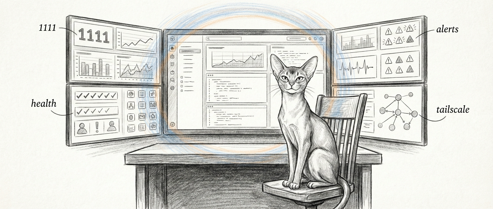

import { Aside, Steps, Tabs, TabItem, Card, CardGrid } from '@astrojs/starlight/components';

Every haus has a thermostat. This haus has a mission control. The command center dashboard is the primary interface for monitoring and managing a Sanctum instance — real-time visibility into service health, VM status, Docker containers, and network peers, all rendered in a browser window that your spouse will never voluntarily open.

The root shell at `http://localhost:1111/` serves the Command Center React app directly — the page title is `… Command Center`, not a chat window. The backend can swap in a Jocasta chat shell at `/` when a `jocasta.html` sits next to the running server, but the shipped build doesn't include one, so you get the dashboard. The operational data lives behind the same backend on `/api/*`.

If you want the same core surfaces in a native macOS shell instead of a browser tab, see the [Holocron App](/guides/holocron-app/). Same Sanctum, less tab sprawl, slightly higher expectations.



## Architecture

The dashboard runs a **Vite + React** frontend served by an **Express** backend on port 1111, bound on all interfaces. You reach it directly at `http://manoir.local:1111/` (or by IP). The number of layers involved in showing you a green dot is, frankly, unreasonable.

There's also a `:80` reverse proxy in the haus, but it does **not** front the command center. The `com.sanctum.dench-proxy` Node LaunchDaemon forwards port 80 to the Holocron renderer on `:19001`, with a hostname rule sending `force/flow.*` to Force Flow on `:4077`. The dashboard is not in that path.

```
Browser → http://manoir.local:1111  → Express backend (:1111) → Vite/React frontend

Browser → http://<host> (:80)        → com.sanctum.dench-proxy (Node) → :19001 (Holocron)
                                                                       → :4077 (Force Flow, if host starts force/flow)
```

<Aside type="tip">
  The only mDNS broadcaster installed (`com.sanctum.mdns-docs`) advertises `sanctum.local` for the docs site on `:4321` — not a dashboard hostname. There is no mDNS alias for the command center today, so reach it by IP or `manoir.local:1111` like an animal.
</Aside>

## Dashboard Panels

The dashboard polls each data source independently. It's like having a handful of tiny air traffic controllers, each watching one runway and none of them talking to each other.

### Service Health

Probes a fixed roster of services — Home Assistant (remote, on the HA Green box at `10.0.0.3`), Firewalla Bridge, sanctum-tts (`:8008`), Voice Agent, MLX Council, Devstral, Kiwix, Outline, and Docker Desktop — by opening a TCP socket on each port. The result is binary:

- **Up** — the port accepted a connection
- **Down** — connection refused, timed out, or the port is closed

No degraded-yellow or disabled-grey state lives in the backend yet; a port either answers or it doesn't. You will still develop a Pavlovian relationship with that one color.

### VM Status

Shows the Ubuntu VM state by SSHing into the guest (it's Lima-managed — `services.lima.instance: sanctum-vm`) and running `free -m`, `df -h /`, `uptime -p`, and `docker ps`. So: memory, disk, uptime, and the in-guest container list — reported by the guest itself, not by the hypervisor.

### Docker Containers

Lists the names of running Docker containers on the Mac (`docker ps --format '{{.Names}}'`). Names only — image, ports, and resource stats aren't surfaced yet.

### LaunchAgents

Reports the loaded/running state of a curated list of Sanctum-managed LaunchAgents (watchdog, Firewalla bridge, voice agent, MLX server, the dashboard itself, and friends) as a simple up/down per label.

### Tailscale Peers

Renders the Tailscale peer list — each device's name, IP, OS, and online status — straight from `tailscale status`.

### Alerts

Shows non-dismissed alerts with their severity (`info`, `warn`, `error`, `critical`), source, message, and timestamp. Alerts are **dismissed** directly from the panel — there's no separate acknowledged-but-still-showing state; dismiss removes it from the active list.

<Aside type="danger">
  Dismissing an alert does not fix the underlying problem. It just makes the dashboard stop yelling at you. These are different things, and confusing them is how outages happen at 2 AM.
</Aside>

## API Endpoints

The Express backend exposes several endpoints consumed by the frontend and available for external tooling.

### GET /api/health/status

Returns a single snapshot of everything the panels render — one object, six top-level keys.

```json
{
  "macServices": [{ "name": "Home Assistant", "status": "down", "port": 8123 }],
  "vm": {
    "reachable": true,
    "memory": "1895/7922MB (23%)",
    "disk": "15G/96G (16%)",
    "uptime": "up 1 day, 10 hours, 9 minutes",
    "containers": ["openclaw-sbx-agent-main", "neo4j"]
  },
  "dockerContainers": ["homeassistant"],
  "launchAgents": [{ "name": "Sanctum Watchdog", "status": "down" }],
  "lmstudioModels": [],
  "tailscale": [{ "name": "manoir", "ip": "100.0.0.5", "os": "macOS", "online": true }]
}
```

There is no top-level `status` or `timestamp` field — each panel reads its own slice and decides for itself how worried to be.

### GET /api/config

Serves the instance configuration from `instance.yaml` with secrets excluded. Used by the frontend to determine which panels to render and how to label the instance.

### GET /api/alerts

Returns all non-dismissed alerts as `{ "alerts": [...], "total": N }`, newest first. It takes no query parameters — no severity filter, no time range, no limit. (`GET /api/alerts/all` includes dismissed ones.) To clear one, `DELETE /api/alerts/:id` sets `dismissed: true`; `DELETE /api/alerts` clears them all.

### GET /api/health/tests

Runs the council-router test suite on demand (`run-suite.sh --suite all`) and returns the results. Think of it as pulling the fire alarm to see if the sprinklers work. Useful, but don't do it during dinner.

## Proxied Services

The dashboard backend proxies requests to services that are not directly accessible from the browser. This is the polite way of saying "some of these services were never designed to talk to a web browser, so we put a translator in the middle."

### Firewalla

Firewalla API calls are proxied by the backend to the Firewalla bridge on `localhost:18094` with a bearer token. The bridge — a separate service — owns the cloud authentication handshake and the box's local P2P connection on port 8833. The dashboard just talks to the bridge; the hard parts happen one hop further in.

### Home Assistant

HA API requests are forwarded to the HA Green box at `10.0.0.3:8123` through the backend, which injects a long-lived access token (`HA_TOKEN`, read from the backend environment) so the browser never sees it. The token lives in the backend's env, not the Keychain — a hardening gap we know about.

## Configuration

Dashboard behavior is driven by `instance.yaml`:

```yaml
services:
  dashboard:
    port: 3333         # Vite dev server
    backend_port: 1111 # Express backend (the one you actually hit)
```

The backend listens on `0.0.0.0:1111` — all interfaces, not LAN-only. If you want it firewalled to the LAN, that's the host firewall's job, not a config flag here.

## LaunchAgent

The dashboard runs as a persistent LaunchAgent:

| Property       | Value                          |
|----------------|--------------------------------|
| Label          | `com.sanctum.dashboard`        |
| RunAtLoad      | true                           |
| KeepAlive      | true                           |
| Port           | 1111                           |

<Aside type="note">
  The `:80` reverse proxy (`com.sanctum.dench-proxy`) runs as a **LaunchDaemon** because binding to port 80 requires root privileges. It fronts the Holocron renderer on `:19001`, not this dashboard — one of the few places in this system where we admit the operating system is still in charge.
</Aside>

For the packaged desktop shell that embeds this dashboard alongside command and health surfaces, see [Holocron App](/guides/holocron-app/).
