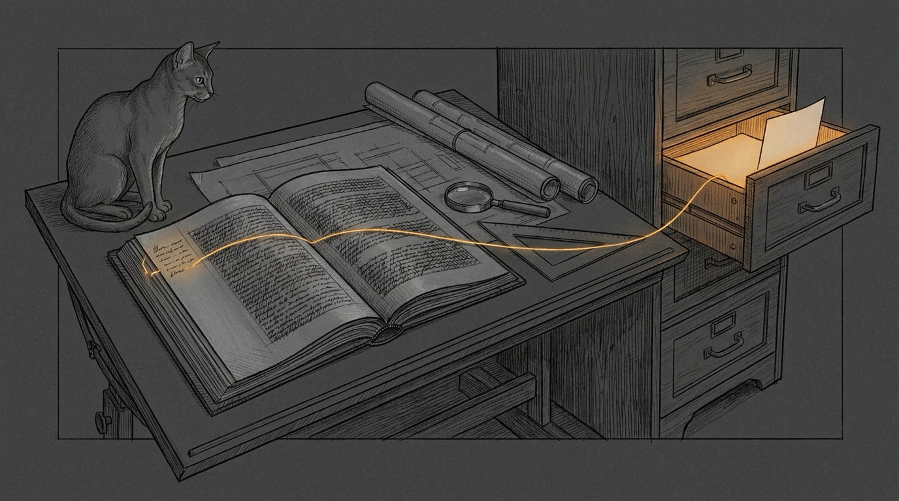

import { Aside, Steps } from '@astrojs/starlight/components';



The dataroom arrives as somebody else's shared folder: reports, quotes, plans, photos, and file names with accents in two encodings. You may read it. You may not write in it, not even a temp file.

At the other end waits a reader with a decision to make about a house: an architect, perhaps, or an engineer. They do not want a folder. They want a dossier: every claim tied to a page, every page one click away, and nothing in it that a model merely sounded sure about.

The engineering toolkit is the road from that folder to that reader. It turns the dataroom into an evidence base, the evidence into a memo, and the memo into an Art Deco PDF and a Word edition in which every citation label opens the document it cites. It was built for one dossier and then generalized, so the next engineering question starts from a pipeline instead of a session scratchpad.

## How a dossier runs

The method lives in `SKILL.md`, written as a [skill](/guides/skills/) for a session to load before it touches a dataroom. One rule holds every step together: every claim cites a reproducible observation, which means a document, a page and a quote. A model's confident sentence is not evidence. The page it points to is.

<Steps>
1. **Intake.** `etk intake` reads the dataroom and writes, outside it, the text, page renders and a manifest of every file. Scans and drawings become page images a reader can actually look at.
2. **Evidence packs.** Reading agents take the documents in groups and read every page, renders included. Each writes a JSON evidence pack: facts with their verbatim quote and page, numbers, recommendations, safety flags, contradictions and open questions. `etk packs` indexes them by chapter topic.
3. **Outside opinions.** Two external models, grok and agy, run headless: an independent opinion before the draft exists, then a critique of the draft. Every statement is a lead. Someone opens the cited page and marks it confirmed, contradicted or absent, and the memo presents the models as checked opinions, never as an engineer.
4. **Drafting.** The memo is written in Claude Docs, in the reader's language, one tab per annex. What a document establishes, what a contractor claims and what we infer are kept apart. Hazards to the occupants come first, each with who acts and when.
5. **Two reviews.** Separate agents, never the writer. One checks every figure, date and quote against its primary document; the other checks technique, sequencing and safety. Every "must" is fixed, then reviewed again.
6. **Publish, verify, deliver.** `etk assemble`, `etk build`, `etk check`, `etk deliver`. The last one stays a dry run until the operator says otherwise.
</Steps>

Two things happen before any of that. The lane is checked: the haus, the haushold and friends come here, and deal work never does. And nobody hands the documents to an outside model without the operator's consent, because a headless model reads whatever folder it runs in. The [privacy posture](/operations/privacy/) covers a dataroom exactly as it covers the haus.

## Driving `etk`

Every step the toolkit automates is one subcommand of `bin/etk`, a bash script that runs the Python in `lib/` with the sanctum cli-venv. A dossier goes through them in this order:

```bash
ETK=~/.sanctum/engineering-toolkit/bin/etk   # run as: bash $ETK ...
P=~/.sanctum/engineering-toolkit/projects/<name>/project.yaml
TO="<shared folder>"                         # where the dossier goes

bash $ETK intake "<dataroom>" ~/work/<name>   # 1. text, renders
bash $ETK packs ~/work/<name>/packs --project "$P"   # 2. index
bash $ETK assemble "$P"        # 3. Claude Docs export -> memo
bash $ETK build "$P"           # 4. PDF + Word, in projects/<name>/out/
bash $ETK check "$P"           # 5. N pass, N fail, N skip
bash $ETK deliver "$P" --to "$TO"         # 6. dry run
bash $ETK deliver "$P" --to "$TO" --yes   #    the copy
```

| Command | What it does | What it refuses |
|---|---|---|
| `intake` | Text, page renders and a manifest of every file, plus empty `packs/`, `external/` and `drafts/` folders | A work folder inside the dataroom |
| `packs` | Indexes the evidence packs: one file per chapter topic, plus safety, contradictions, open questions and numbers | An index inside the dataroom (given `--project`) |
| `assemble` | Rebuilds the memo markdown from the Claude Docs export: tabs, figure placeholders, byline | A figure placeholder with no file, or a figure count the config does not expect |
| `build` | HTML, source links, typography, a two-pass print, the link mechanism, then the Word edition | An `--out` inside the dataroom, the deliverable folder or a read-only root |
| `check` | One `PASS`, `FAIL` or `SKIP` line per check, then `N pass, N fail, N skip`; exit 1 on any failure | A build made from another project |
| `relink` | Rewrites the `file://` links of one PDF as relative URIs or GoToR actions | A PDF without Chrome's classic cross-reference table |
| `deliver` | Runs `etk check`, then prints `NEW` or `OVERWRITE` for the PDF and the Word file | Copying when `etk check` fails or without `--yes` (exit 2), a folder that does not exist |

The safety rules live in the code, not in a checklist. `check` changes nothing, and `deliver` is the only command that ever writes in a shared folder. It never creates one, and an output name with `{date}` in it adds a dated copy beside the previous one instead of replacing it.

Both editions come from one source. The PDF is Chrome's job, below. The Word edition starts from the same final HTML: `docx/build_docx.sh` turns it into a document model, renders it with Node and the `docx` library, and embeds the theme's static fonts. The file is written only once a validation passes: the package, the text word for word against the HTML, every link in document order, the fonts. LibreOffice then renders it as a check, and `etk check` reports its page count beside the PDF's. Word itself cannot be driven headless, so no build ever opens the file in Word: a person does, once, before it ships.

A new project starts as a copy of the synthetic demo in `tests/fixtures/demo/`. One `project.yaml` holds everything specific to a dossier, and the build stops on whatever is missing, saying what: a table without column widths, a heading without a chapter, a configured file that is no longer on disk.

```yaml
# tests/fixtures/demo/project.yaml, trimmed
theme: art-deco
deliverable_dir: dataroom    # where deliver is meant to copy
readonly_roots: [dataroom]   # build and packs never write here
chapters:
  - {prefix: Avertissement, id: avertissement, notice: true}
  - {prefix: Résumé, id: s1, num: "1"}
links:
  root: dataroom
  photos:
    IMG_0001: "Photos/IMG_0001.jpg"
  rules:
    - ['IMG_\d{4}', '{match}']   # the label is its own key
  pdf: absolute                  # link mechanism, PDF edition
  docx: relative                 # Word: relative to deliverable_dir
  unicode: nfc                   # accents in relative paths
```

## What Chrome taught us

Headless Chrome prints the PDF from HTML the toolkit writes. It is a better typesetter than its reputation, with a handful of habits nobody writes down. Each was found the expensive way, on a printed page, and each is now handled by the theme, the build or a check:

| Symptom | Cause | What the toolkit does |
|---|---|---|
| No gold frame | `@page` ignores `background-image` (a color works) | The frame is one full-page SVG, shown in slices by the eight `@page` margin boxes with negative `background-position` |
| Running head on the cover | A later `@page` rule's margin boxes beat the named cover page's `content: none` | The head is written into a marked slot of the theme stylesheet, never appended after it |
| Ink on the previous page | CSS `outline`, `transform` on pseudo-elements, and the accent of a capital that opens a page | Wrapper borders, `clip-path` diamonds, `padding-top` on headings |
| A 5 MB photo | A stale EXIF block, left over from an earlier rotation, makes Chrome re-encode the JPEG | `media.py` drops the EXIF segment byte by byte and keeps the pixels and the color profile; a photo still tagged to rotate is turned upright first |
| A re-encoded cover | `object-fit: cover` cropping hard: a 4:3 photo kept 64% of its width in the arch | Cut the cover photo near the arch's 0.858 width-to-height ratio; the build warns below 80% |

The contents page is the one thing CSS cannot know in advance. Chrome writes an uncompressed named destination for every `#id` link target, so `render/render_pdf.sh --two-pass` prints once and reads the page each chapter landed on. It writes the numbers into boxes of the same width, so nothing reflows, and prints again. `etk check` then compares the contents with the PDF's own destinations.

The same HTML and assets always draw the same pages. That is what lets the suite build twice and diff the drawings. It also lets a new version of a delivered dossier be checked against the old one with `--ref-pdf`, `--ref-html` and `--ref-docx`: same destinations, same link anchors, same Word parts, no run of text missing, every difference explained.

Launched through LaunchServices with `open -n -g -b`, headless Chrome prints, and then simply stays. The render script waits for a PDF that ends in `%%EOF` and holds its size, stops that one Chrome by its profile path, and deletes the profile. Each print gets a fresh profile under `$TMPDIR`, never beside the output, which may sit in a synced folder. The operator's own Chrome is never touched.

## The link that would not open

A citation link has one job: open the cited file on the reader's Mac. An absolute `file://` link does that only where the path exists, which is the Mac that built the PDF. The October 2026 click tests settled the rest. Preview opens absolute links only: relative ones, URI or GoToR, open nothing, even when PDFKit resolves them perfectly in a script. Its sandbox refuses targets in temporary folders, yet opens them in iCloud Drive, and through a symlink in `/Users/Shared`. Word opens relative links with no setup at all.

That gives the pattern for a folder shared between Macs. The PDF links through `links.href_root`, a folder of symlinks in `/Users/Shared` that points each Mac at its own copy of the share, created once per Mac by a few lines of shell. The Word edition links relative to the deliverable folder. Relative paths are always counted from a file's real place, never through the shortcut, and the suite proves it. The mechanism stays a parameter of each project, chosen after a click test on the reader's side, on the real shared paths:

| Where | Parameter | Values |
|---|---|---|
| HTML and PDF as printed | `links.root`, `links.href_root` | Absolute `file://` under the dataroom, or under another prefix that exists on the reader's Mac |
| PDF edition | `links.pdf` | `absolute` (the default), `relative[:<dir>]`, `gotor[:<dir>]`, `gotor-all[:<dir>]` |
| Word edition | `links.docx` | `absolute`, `relative[:<dir>]` (the default when there is a deliverable folder), `prefix:<old>=<new>` |
| Relative paths | `links.unicode` | `nfc` (the default), `nfd`, `keep` |

A relative link is counted from the deliverable folder by default, so it follows that folder to every Mac that syncs it. Those accents from the first paragraph come back here: macOS may store an accented file name decomposed, so `links.unicode` decides how a relative path spells it, and the link census always compares names in composed form.

Three tools bring evidence to the choice of mechanism instead of opinions. `etk relink` rewrites one PDF in any mode. `python3 -I lib/checks.py pdf-links` resolves every target the way that mode implies and counts the missing ones. And `lib/pdfkit_links.js`, run through `osascript`, asks PDFKit, the engine inside Preview, what it thinks each link points to.

<Aside type="caution">
`etk check` proves that every link has a file behind it. It cannot prove that the reader's Preview will agree to open one. A dossier whose links all resolve on the building Mac can still be a beautifully typeset set of dead ends on the reader's, so click one there before calling it delivered. And no cloud share link of the folder goes into a document for a third party without the operator's say-so.
</Aside>

## The suite, and where things live

Like every shipping component, the toolkit carries its own suite, in the spirit of [Engineering Discipline](/architecture/engineering-discipline/). It is registered in `~/.sanctum/tests/run-all.sh` as **Engineering Toolkit**, runs in about a minute, and ends on a single `N pass, N fail, N skip` line.

```bash
~/.sanctum/engineering-toolkit/tests/test-engineering-toolkit.sh
```

It is hermetic and synthetic. It copies the demo project into `tests/.work/`, gitignored and kept for inspection. There it generates a dataroom: two PDFs printed by Chrome, a JPEG with a stale EXIF block, a DOCX converted by `soffice`, and a file name with decomposed accents. Then it runs everything: assemble, media, intake, packs, build, every link, text parity, JPEG embedding, PDF text, two builds that must match page for page and part for part, relinking as URIs and as GoToR, the Word edition in every link mode, `deliver` from dry run to overwrite notice, and every refusal to write in the dataroom. Outside the logged-in Aqua session, where LaunchServices cannot start Chrome, everything after the static checks reports `SKIP` rather than failing.

| Path | What lives there |
|---|---|
| `bin/etk` | The command |
| `lib/` | Config, memo assembly, HTML, source links, French typography, contents, relink, checks, PDF scanning, photos, intake, and two PDFKit scripts |
| `render/render_pdf.sh` | The headless Chrome print: `--two-pass` for the contents page numbers, one throwaway profile per print |
| `themes/art-deco/` | `theme.yaml`, `deco.css`, the frame, rule, fan and cover-art SVGs (`ornaments.py` draws the last two), PNG renders of the ornaments for Word, and the fonts with `OFL.txt` and `FONTS.md` |
| `docx/` | The Word edition: `build_docx.sh`, the HTML-to-model step, a Node renderer on `docx` 9.6.1, font embedding, validation |
| `projects/<name>/` | One dossier's `project.yaml` and content |
| `tests/` | The suite and the synthetic demo project |
| `README.md`, `SKILL.md` | The reference, and the method |

All of it lives in `~/.sanctum/engineering-toolkit/`, inside the private sanctum-config repo, because project folders hold private material; changes land with [gitsync](/architecture/gitsync/), pathspec only. The three typefaces, Poiret One, Josefin Sans and Cormorant Garamond, ship under the SIL Open Font License, with the license text beside them. This page is the public half: the method and the machinery, never a dossier.

The dataroom is still somebody else's folder, and the only thing the toolkit will ever add to it is the dossier itself, when asked. What changed is the way back in. Every citation in the dossier is a door into that folder: the toolkit proves there is a room behind each one, and one click on the reader's Mac proves the door opens.
