import { Aside, Steps, Tabs, TabItem } from '@astrojs/starlight/components';



Your house already monitors itself. It seemed only fair to let it monitor you too. Sanctum includes a health data pipeline that ingests Apple Health metrics from your iPhone and feeds them into the Cilghal health agent for analysis. The pipeline uses the **Health Auto Export** iOS app to push data to a FastAPI service running on the VM — through a Cloudflare tunnel, because your resting heart rate deserves enterprise-grade security.

## Architecture

```
iPhone (Health Auto Export)
  │ HTTPS POST (hourly)
  ▼
Cloudflare Tunnel (health.nepveu.name)
  │ CF Access (OTP + Service Token)
  ▼
Mac Mini (SSH tunnel, port 10101)
  │
  ▼
Ubuntu VM (health-ingester.py, FastAPI)
  │
  ├── Rolling JSON files (~/.openclaw/health-data/)
  └── Graphiti knowledge graph (for Cilghal agent)
```

Five hops between your wrist and the knowledge graph. Each one encrypted. The Cold War had simpler supply chains.

## Prerequisites

- **Health Auto Export** app installed on iPhone ([App Store](https://apps.apple.com/app/health-auto-export/id1115567461))
- Health ingester running on VM (part of standard Sanctum setup)
- Cloudflare tunnel with CF Access configured for `health.nepveu.name`

## iPhone Setup

<Steps>
1. Install **Health Auto Export** from the App Store
2. Open the app and grant access to Apple Health data
3. Go to **Automations** tab
4. Tap **+** to create a new automation
5. Select **REST API** as the type
6. Configure the endpoint:

   | Field | Value |
   |-------|-------|
   | URL | `https://health.nepveu.name/ingest` |
   | Method | POST |

7. Add three headers:

   | Header | Value |
   |--------|-------|
   | `Authorization` | `Bearer <HEALTH_INGESTER_TOKEN>` |
   | `CF-Access-Client-Id` | `<from Keychain: cf-access-health-client-id>` |
   | `CF-Access-Client-Secret` | `<from Keychain: cf-access-health-client-secret>` |

8. Select metrics to export (recommended minimum):
   - Heart Rate
   - Resting Heart Rate
   - Steps
   - Active Energy
   - Sleep Analysis
   - Weight
   - Blood Pressure (if available)
   - Blood Oxygen (if available)

9. Set schedule to **every 1 hour**
10. Save and tap **Test** to verify
</Steps>

<Aside type="tip">
  The health ingester token is stored in SOPS on the VM under `health_ingester_token`. The CF Access service token credentials are in the Mac Keychain under `cf-access-health-client-id` and `cf-access-health-client-secret`. If you're wondering where to find the credentials, the answer is always "encrypted, somewhere else."
</Aside>

## Health Ingester Service

The ingester is a FastAPI service on the VM that receives health data, extracts key metrics, and stores them for the Cilghal agent.

| Setting | Value |
|---------|-------|
| Location | VM (`~/.openclaw/health-ingester.py`) |
| Port | 10101 (bound to 10.10.10.10) |
| Auth | Bearer token (from SOPS) |
| Max payload | 5 MB |
| Rate limit | 20 ingests/minute |
| Data storage | `~/.openclaw/health-data/` (rolling JSON) |

### Endpoints

| Endpoint | Method | Auth | Purpose |
|----------|--------|------|---------|
| `/health` | GET | None | Health check |
| `/ingest` | POST | Bearer | Receive health data from iOS |

<Aside type="note">
  Yes, the health monitoring system has its own health check endpoint. The recursion is noted but not regretted.
</Aside>

### Starting the Service

The ingester is started via the SOPS wrapper which injects secrets as environment variables:

```bash
SOPS_AGE_KEY_FILE=~/.config/sops/age/keys.txt \
  HEALTH_INGESTER_HOST=10.10.10.10 \
  ~/.openclaw/sops-start.sh health-ingester \
  ~/.openclaw/health-ingester-venv/bin/python3 \
  ~/.openclaw/health-ingester.py
```

### Verifying

Test the endpoint from the Mac:

```bash
curl -s -H "CF-Access-Client-Id: $(security find-generic-password -a sanctum -s cf-access-health-client-id -w)" \
     -H "CF-Access-Client-Secret: $(security find-generic-password -a sanctum -s cf-access-health-client-secret -w)" \
     https://health.nepveu.name/health
```

A successful response returns `{"status": "ok"}`.

## Cloudflare Access

The health endpoint is protected by Cloudflare Access with two authentication methods:

- **OTP (email)** for browser access by the owner
- **Service Token** for automated sync from Health Auto Export

The service token expires annually and credentials are stored in the Mac Keychain. Mark your calendar, or don't — the watchdog will let you know when it stops working.

## Cilghal Agent

The Cilghal agent on the VM reads ingested health data and maintains a knowledge graph of health trends. It provides daily health briefings and can answer questions about historical health metrics.

Data flows: Health Auto Export → ingester → JSON files + Graphiti KG → Cilghal agent queries.

An AI named after a Mon Calamari healer, running inside a virtual machine, inside a Mac Mini, analyzing your sleep patterns through a knowledge graph. If you find this normal, you've been reading these docs too long.
