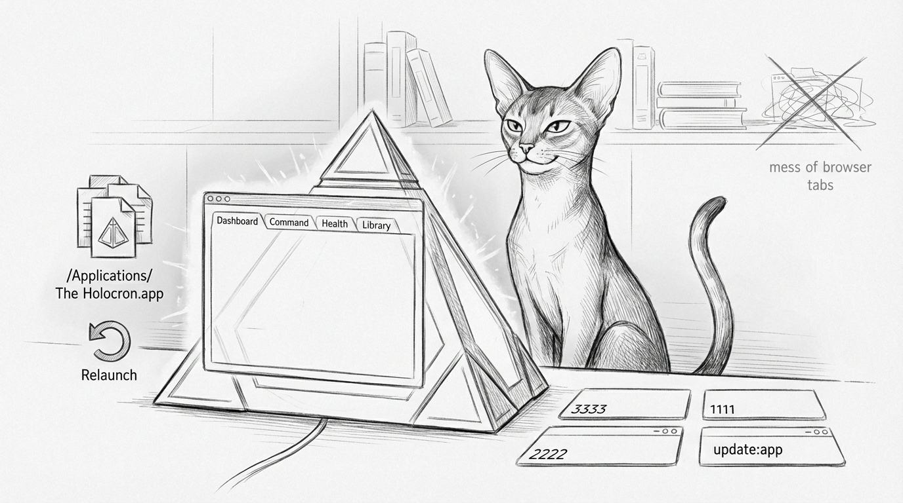

import { Aside, Steps } from '@astrojs/starlight/components';



The browser dashboard is useful. The Holocron exists because sometimes you want the whole Sanctum bridge in one native window instead of six tabs, three localhost ports, and the vague feeling that one of them is lying.

Holocron is the standalone Electron shell for Sanctum. It wraps the dashboard, command surfaces, health center, and embedded tools in a packaged macOS app installed at `/Applications/The Holocron.app`. The standard for success is not "it looked fine in Vite once." The standard is that the installed bundle launches, renders, survives service startup, and does not immediately murder its own renderer with an overbroad `pkill`.

If you want the browser-first view of the same surfaces, start with the [Command Center Dashboard](/guides/dashboard/). If you want the browser automation harness that now validates Holocron end-to-end, see [Agent Browser](/guides/agent-browser/).

## What It Is

The Holocron source lives here:

```sh
/Users/neo/Projects/the-holocron
```

The installed app lives here:

```sh
/Applications/The Holocron.app
```

At launch, Electron loads the built renderer from `dist-renderer` and then starts the local Sanctum stack through:

```sh
/Users/neo/Documents/Claude_Code/run_sanctum.sh --headless
```

That startup path brings up the services the window depends on:

```yaml
ui:
  port: 3333
command_center:
  port: 1111
health_center:
  port: 2222
archives:
  port: 3344
library:
  port: 8888
```

The renderer is intentionally thin. It owns the shell, navigation, theme state, and fallback panels. The actual work still lives in the local services. This is good. When the shell breaks, you debug a shell. When the shell also contains the whole backend, you debug a lifestyle.

## Why It Was Black

The black-screen failure turned out not to be a React bug. It was process cleanup performed with the accuracy of artillery.

The packaged app launched `run_sanctum.sh`, and that script previously contained:

```sh
pkill -f "the-holocron"
```

Electron helper processes included `the-holocron` in their command line via the app's user-data path, so the backend bootstrap script was killing the freshly launched renderer just after startup. The app was booting correctly and then quietly stepping on its own throat.

The fix was to narrow cleanup to actual Holocron dev processes instead of anything containing the string:

```sh
pkill -f "/Users/neo/Projects/the-holocron/.*vite" || true
pkill -f "vite --host 127.0.0.1 --port 3333" || true
```

We also hardened the renderer startup path:

- `KyberHealth` now uses Electron IPC for status instead of browser fetch on first paint.
- The library tab degrades to an intentional fallback panel when its embedded surface is unavailable.
- Remote font loading was removed from renderer startup because a desktop shell does not need to negotiate with a CDN before it earns the right to display pixels.

<Aside type="caution">
If you use `pkill -f` with a vague substring inside an Electron bootstrap path, you are not cleaning up. You are performing process selection by horoscope.
</Aside>

## Update The Installed App

The operational rule is simple: `/Applications/The Holocron.app` should always be the latest tested build.

That is now handled by one local updater command:

<Steps>
1. Move into the Holocron app repo with `cd /Users/neo/Projects/the-holocron`.
2. Run `npm run update:app`.
3. Let the updater rebuild, validate, package, install, and relaunch the app.
</Steps>

For reference, the npm script resolves to:

```sh
bash /Users/neo/Projects/the-holocron/scripts/install-latest-holocron.sh
```

The updater now runs the full release path:

```sh
npm run build
npm run test:e2e
bash scripts/sign-holocron-app.sh /Users/neo/Projects/the-holocron/dist/mac-arm64/The\ Holocron.app
bash scripts/notarize-holocron-app.sh /Users/neo/Projects/the-holocron/dist/mac-arm64/The\ Holocron.app
ditto /Users/neo/Projects/the-holocron/dist/mac-arm64/The\ Holocron.app /Applications/The\ Holocron.app
```

That means the app in `/Applications` is the app that just passed browser e2e, release signing, Apple notarization, and post-install validation. A surprisingly modern concept, especially for a bridge app that used to black-screen itself on principle.

## End-to-End Validation

The Holocron e2e suite lives here:

```sh
/Users/neo/Projects/the-holocron/tests/holocron-e2e.sh
```

Run it directly:

```sh
cd /Users/neo/Projects/the-holocron
npm run test:e2e
```

It validates:

- dashboard rendering
- theme switching
- chat rendering
- command tab
- health tab
- library tab or library fallback
- screenshot artifacts in `tests/artifacts/`
- installed notarized release launch, signature, and stapled ticket in release mode

The suite uses `agent-browser` instead of Playwright. This is not ideology. It is because the fastest way to debug the Holocron is to make the browser tell you what it sees, not to spend an afternoon constructing a browser abstraction layer so a test runner can lie more formally.

<Aside type="tip">
If the UI server is not already running, the e2e script starts Vite on `127.0.0.1:3333` automatically. The browser automation details live in [Agent Browser](/guides/agent-browser/), because once a tool becomes important enough, it earns the dignity of having its own page.
</Aside>

The suite now has three modes:

```sh
HOLOCRON_E2E_MODE=web bash tests/holocron-e2e.sh
HOLOCRON_E2E_MODE=native bash tests/holocron-e2e.sh
HOLOCRON_E2E_MODE=release HOLOCRON_E2E_EXPECT_STAPLED=1 bash tests/holocron-e2e.sh
```

- `web` drives the Vite surface on `127.0.0.1:3333`
- `native` attaches `agent-browser` to an installed debug-style Electron window through CDP
- `release` verifies the installed app the way macOS actually sees it: signed, stapled, launchable, and not immediately dead

That split exists because a hardened notarized release should be treated like a release artifact, not bullied into behaving like a debug target with a remote debugging port jammed into it at runtime. Apple gets touchy. In this case, correctly.

## Signing and Notarization

Holocron is now shipped as a real macOS app:

```sh
spctl -a -vv /Applications/The\ Holocron.app
```

Expected result:

```text
accepted
source=Notarized Developer ID
origin=Developer ID Application: Bertrand Nepveu (GJ994MN2YF)
```

The release pipeline uses:

- explicit recursive Developer ID signing with hardened runtime and secure timestamps
- explicit `notarytool` submission through the `holocron-notarization` keychain profile
- stapling before install
- staple validation after install

This is intentionally explicit. Electron Builder's auto-signing path was more magical than reliable, and magic is just a future incident with better branding.

## Known Limits

Holocron now has a reliable local update path, proper macOS signing, and notarization. It still does not have real in-app autoupdate.

That is deliberate. Proper macOS autoupdate should wait for stable release artifacts and a publish story that is slightly more mature than "we can do it by hand now, which is already a huge improvement."

The correct order is:

```text
1. keep signing and notarization boring
2. add electron-updater
3. publish a real update feed
4. stop thinking about Gatekeeper for a few blessed minutes
```

Until then, `npm run update:app` is the operational truth. It is not elegant. It is, however, signed, notarized, repeatable, and notably less dramatic than the previous version of events.

## Idle Behavior

The Holocron used to drop into an idle "screensaver" mode that grabbed fullscreen and always-on-top behavior after two minutes. That was thematically coherent and operationally irritating.

Idle screensaver behavior is currently disabled in the renderer. If you leave the app open while you make tea, it now mostly minds its own business. This is the sort of restraint we should encourage when possible.

If the installed app goes black again, the first stop is [Troubleshooting](/operations/troubleshooting/). We try very hard not to repeat incidents. We also keep having enough material to stay in business.
