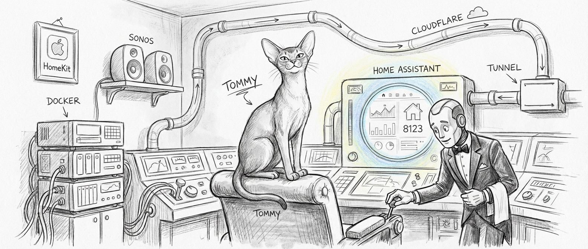

import { Aside, Steps, Tabs, TabItem } from '@astrojs/starlight/components';

Home Assistant is Sanctum's haus automation hub. Since 2026-06-28 it runs on a dedicated **Home Assistant Green** appliance — its own tailnet node, holding static `10.0.0.3` on the LAN — after earlier lives in the VM and as a Docker container on the Mac Mini. Sonos speakers are managed by a separate native bridge running directly on the Mac, because Docker bridge networking and Sonos callbacks had a relationship best described as "irreconcilable differences."



<Aside type="note">
  Much of what follows is the engineering record of the retired Docker-on-Mini deployment, decommissioned 2026-07-06 — see [the twin that would not die](/operations/2026-07-06-the-twin-that-would-not-die/). Do-not-resurrect; the lessons stay because they were expensive.
</Aside>

## Architecture

Today's layout, refreshingly boring by design:

```
┌──────────────────────────────┐          ┌─────────────────────────────────┐
│ Home Assistant Green         │          │ Mac Mini                        │
│  10.0.0.3 (static, LAN)      │◄─────────│  ha-green-bridge (outbound WS)  │
│  Port 8123 → Web UI          │          │  ha-gateway (:8199)             │
│  Tailnet node → remote access│          │  Sonos Bridge (native, :1969)   │
└──────────────────────────────┘          └─────────────────────────────────┘
```

The retired Docker-on-Mini layout, preserved for the record:

```
┌────────────────────────────────────────────────┐
│ Mac Mini                                       │
│                                                │
│  ┌──────────────────────────────────────────┐  │
│  │ Sonos Bridge (native, port 1969)         │  │
│  │  SoCo → SSDP → 10 Sonos speakers         │  │
│  │  Chatterbox → port 8008 → Yoda voice     │  │
│  └────────────┬─────────────────────────────┘  │
│               │ REST (host.docker.internal)    │
│  ┌────────────▼─────────────────────────────┐  │
│  │ Docker / OrbStack (host networking)      │  │
│  │                                          │  │
│  │   ┌──────────────────────────────────┐   │  │
│  │   │ Home Assistant Container         │   │  │
│  │   │  Port 8123 → Web UI              │   │  │
│  │   │  Port 21063 → HomeKit Bridge     │   │  │
│  │   │  SSH agent → VM access           │   │  │
│  │   └──────────────────────────────────┘   │  │
│  └──────────────────────────────────────────┘  │
│                                                │
│  Cloudflare Tunnel → ha.example.net            │
└────────────────────────────────────────────────┘
```

HA moved from the VM to Mac Docker because SLIRP networking couldn't keep up with this many integrations and real-time device traffic. Sonos was later pulled out of HA entirely because Docker networking on macOS couldn't reliably hold the bidirectional callback connection Sonos demands. Two migrations, two networking problems, one closet.

## Docker Configuration

The container used `network_mode: host`. On macOS that was the impossible setting for years — Docker Desktop runs containers inside a Linux VM, so "host networking" meant the VM's host, not the Mac's. OrbStack is the runtime that actually delivers it: the container shares the Mac's real network stack, which is the whole reason it can see the mDNS and SSDP broadcasts that HomeKit and Sonos discovery depend on.

### Key Settings

| Setting           | Value                                            |
|-------------------|--------------------------------------------------|
| Image             | `ghcr.io/home-assistant/home-assistant:stable`   |
| Network mode      | host (`network_mode: host`)                      |
| Web UI port       | 8123                                             |
| HomeKit port      | 21063                                            |
| Config directory   | `~/.openclaw/homeassistant/`                     |
| Restart policy    | unless-stopped                                   |

### Compose File

The `compose.yaml` at `~/.openclaw/homeassistant/` defined the container with these essential directives:

- **Network mode**: `host` — no `ports:` block, because there's no NAT to traverse. 8123 and 21063 bind straight to the Mac.
- **Volume mount**: Local config directory into `/config`
- **`cap_add: NET_RAW`**: lets the container send the raw mDNS/SSDP packets discovery relies on
- **Extra hosts**: `host.docker.internal:host-gateway` for reaching Mac-native services (like the Sonos Bridge) from inside the container
- **SSH agent socket**: `/run/host-services/ssh-auth.sock` mounted for agent forwarding to the VM

### Runtime: OrbStack, not Docker Desktop

Docker Desktop on macOS runs a Linux VM and tells you `--network=host` means host networking. It does not — it means the VM's network, a thing that cannot see mDNS broadcasts and so cannot discover the Ecobee thermostats HA's HomeKit Controller finds via Bonjour. Docker Desktop was first swapped for Colima, then Colima for OrbStack on April 27, 2026 (Colima's SSH ControlMaster bug wedged the daemon one too many times). OrbStack gives containers the Mac's real network stack — true host networking, no VM seam. Its socket:

```
DOCKER_HOST=unix:///Users/neo/.orbstack/run/docker.sock
```

The startup chain is intentionally sequential:

1. `com.sanctum.orbstack-engine-autostart` runs `orbctl start` at boot
2. `com.sanctum.openclaw.docker-startup` runs `~/.openclaw/launch-after-docker.sh`, which waits for the socket (`docker info` succeeds) before acting
3. Once the socket was live, it brought up the Home Assistant container (the signal-cli stack rode along until it was retired in the Colima cut)

The migration was uneventful, which is the highest compliment infrastructure work can receive. The Ecobee sensors appeared in HA's discovery panel within seconds. They had been broadcasting the entire time. The VM just couldn't hear them.

<Aside type="caution">
  If you're on Docker Desktop and your HomeKit integrations can't discover devices: it's not your config, not your firewall. It's the VM boundary — mDNS packets don't cross it, and never will. Switch to OrbStack or run HA on bare metal and the devices appear like they were there all along, because they were.
</Aside>

## Sonos Integration

Sanctum manages 10 Sonos speakers across the haus, but **not** through HA's built-in Sonos integration — that's disabled. Instead a native Python service, the Sonos Bridge, runs directly on the Mac Mini. It listens on port 1969 and exposes a REST API for speaker control, TTS announcements, and media playback. In the container era HA called it via `rest_command` entries; today its callers are Mini-side (haus-control's curfews chief among them), and Green-side intent rides the outbound `ha-green-bridge` websocket.

```
┌─────────────────────────────────────────────┐
│ Mac Mini (native)                           │
│                                             │
│  ┌───────────────────────────────────────┐  │
│  │ Sonos Bridge (port 1969)              │  │
│  │  SoCo → SSDP → 10 speakers on LAN     │  │
│  │  Chatterbox → Yoda voice generation   │  │
│  └──────────▲────────────────────────────┘  │
│             │ REST API                      │
│  ┌──────────┴────────────────────────────┐  │
│  │ Mini-side callers                     │  │
│  │  haus-control → :1969/tts (curfews)   │  │
│  │  Green intent ← ha-green-bridge WS    │  │
│  └───────────────────────────────────────┘  │
└─────────────────────────────────────────────┘
```

### Why Not the HA Integration?

The HA integration needs `advertise_addr` and static host IPs to compensate for the bridge boundary, but Sonos speakers still have to reach back *into* the container for event callbacks — and that callback path breaks unpredictably after container restarts, networking warmups, and the occasional firmware update. We tried socat tunnels, socket_vmnet, and timed reload automations. None of it was reliable.

The native bridge uses SoCo directly on the Mac's LAN interface. SSDP discovery works instantly. Speaker callbacks land on the Mac's real IP. No tunnels, no NAT, no prayers.

### HA REST Commands

In the container era, HA scripts and automations called the bridge through two REST commands — `host.docker.internal` being the container's window back to the Mac:

```yaml
rest_command:
  sonos_tts:
    url: "http://host.docker.internal:1969/tts"
    method: POST
    content_type: "application/json"
    payload: '{"rooms": {{ rooms }}, "text": "{{ message }}", "severity": "{{ severity }}"}'
  sonos_announce:
    url: "http://host.docker.internal:1969/announce"
    method: POST
    content_type: "application/json"
    payload: '{"rooms": {{ rooms }}, "text": "{{ message }}", "severity": "{{ severity }}"}'
```

Severity maps to volume: `low` (30%), `medium` (50%), `high` (80%), `critical` (100%). The bridge handles TTS generation, audio file serving, and Sonos playback in a single call.

### Text-to-Speech

The bridge generates speech through the sanctum-tts server on port 8008 — an OpenAI-compatible `/v1/audio/speech` endpoint with the Chatterbox `cbx-yoda` worker on port 8011 behind it today (XTTS-v2 retired 2026-04-19), resolved by model id so the backend can change without touching the bridge. It saves the WAV locally and tells Sonos to fetch it from `http://<mac-lan-ip>:1969/<id>.wav`. The voice is Yoda. There was a discussion. Yoda won.

### Bridge Management

```bash
# Check bridge health
curl -s http://localhost:1969/health | python3 -m json.tool

# List all speakers
curl -s http://localhost:1969/speakers | python3 -m json.tool

# Manual TTS test
curl -X POST http://localhost:1969/tts \
  -H 'Content-Type: application/json' \
  -d '{"rooms": ["living_room"], "text": "Testing", "severity": "low"}'

# Restart bridge
launchctl kickstart -k gui/$(id -u)/com.openclaw.sonos-bridge
```

<Aside type="tip">
  If a Sonos speaker changes IP (router reboot, LAN renumber), the bridge just shrugs. There is no longer a room-to-IP map to go stale — speakers are addressed by room *name* (the normalized Sonos player name) and rediscovered live via SSDP every 30 seconds (`DISCOVERY_TTL`). The static map was deleted when the LAN was renumbered on 2026-06-08, and nothing has missed it since. Firewalla DHCP reservations are still nice for sanity, but the bridge no longer needs them to stay correct.
</Aside>

<Aside type="note">
  The HA Sonos integration config entry (`01KHHZ98C0MYWPAGKBZM9K1ZB2`) still exists in HA's storage but is set to `disabled_by: user`. It can be re-enabled from HA's Settings > Devices & Services if needed for rollback, though we'd recommend therapy first.
</Aside>

## SSH Agent Forwarding

In the container era, some HA automations needed SSH access to the VM. The Mac's SSH agent socket at `/run/host-services/ssh-auth.sock` was mounted as a volume in the compose file, so scripts inside the container could `ssh openclaw` using the Mac's loaded keys — no private keys ever stored in the container. Wrapper scripts lived at `~/.openclaw/ha-scripts/` and exec'd SSH to the VM with agent forwarding enabled.

## Network Configuration

The `configuration.yaml` carries network-specific settings so HA reports the right client IP when a request arrives through a proxy hop:

```yaml
homeassistant:
  internal_url: "http://10.0.0.3:8123"
  external_url: "http://homeassistant.<your-tailnet>.ts.net:8123"

http:
  use_x_forwarded_for: true
  trusted_proxies:
    - 172.16.0.0/12
    - 192.168.64.0/20
```

The trusted proxies let HA read the real client IP from `X-Forwarded-For` instead of attributing every visitor to the proxy; the ranges date to the container era's OrbStack and Tailscale hops.

## Remote Access

Remote access is Tailscale, full stop. The Green joins the tailnet as its own node through the Tailscale add-on, so there is no tunnel, no reverse proxy, and no extra login page — WireGuard end to end, HA's own auth on top. (The container era's Cloudflare tunnel retired with the container; the council picked Tailscale over a public tunnel four-to-one.)

### Browser Access (Tailscale)

`http://10.0.0.3:8123` on the LAN; `http://homeassistant.<your-tailnet>.ts.net:8123` from anywhere on the tailnet.

### iPhone Companion App (Tailscale)

The HA Companion app connects the same way. Tailscale provides end-to-end WireGuard encryption, so HTTPS is not needed.

<Aside type="caution">
  HA binds 8123 on the Green's interfaces (not just `127.0.0.1`), which is exactly what Tailscale access needs. Safe because HA has its own auth, and LAN access is required anyway for HomeKit.
</Aside>

#### Companion App Setup

<Steps>
1. Install [Tailscale](https://apps.apple.com/app/tailscale/id1470499037) on iPhone and connect (do NOT enable exit node)
2. Install [HA Companion](https://apps.apple.com/app/home-assistant/id1099568401)
3. Open HA Companion → Settings → Companion App → Server & Connection
4. Configure connection URLs:

   | Field | Value |
   |-------|-------|
   | **Internal URL** | `http://10.0.0.3:8123` |
   | **External URL** | `http://homeassistant.<your-tailnet>.ts.net:8123` |

5. Under **Internal Connection**: add your haus Wi-Fi SSID so the app uses the LAN when haus
6. Enable **Local Push** for instant notifications on haus Wi-Fi
7. Test: turn off Wi-Fi briefly — the app should reconnect via Tailscale
</Steps>

<Aside type="tip">
  Use `http://` for both URLs, not `https://`. The internal hop is on your LAN; the external hop is already encrypted by Tailscale's WireGuard tunnel. Adding TLS on top buys you cert management for zero security gain. Save your energy for problems that matter.
</Aside>

## HomeKit Bridge

The HomeKit bridge runs on port 21063, allowing Apple Home app control of HA-managed devices.

| Setting        | Value                                  |
|----------------|----------------------------------------|
| Port           | 21063                                  |
| Pairing code   | shown in HA → Settings → Devices & Services |

The pairing code is generated per-bridge and lives in HA's UI — never hardcode or commit it; a HomeKit code plus LAN access is all someone needs to pair. The bridge exposes selected devices to Apple Home while keeping the full HA device list in the web UI.

## Management

These commands operated the retired container — kept for the record; running them today resurrects the decommissioned twin.

### Starting and Stopping

```bash
# Start HA
cd ~/.openclaw/homeassistant && docker compose up -d

# Stop HA
cd ~/.openclaw/homeassistant && docker compose down

# View logs
docker logs -f homeassistant

# Restart
cd ~/.openclaw/homeassistant && docker compose restart
```

### Rollback

When the Mac Docker instance had issues, a rollback path existed to the VM:

<Steps>
1. Stop the Mac container: `docker compose down`
2. SSH to the VM: `ssh openclaw`
3. Start the VM instance: `~/.openclaw/ha-docker.sh recreate`
</Steps>

<Aside type="note">
  The VM kept a preserved HA configuration at `~/.openclaw/homeassistant/`, stopped but not removed, making rollback straightforward. Think of it as a parachute — you hope you never need it, but you'd be a fool to cut it loose. Today the whole plane is retired; the Green is the deployment.
</Aside>
