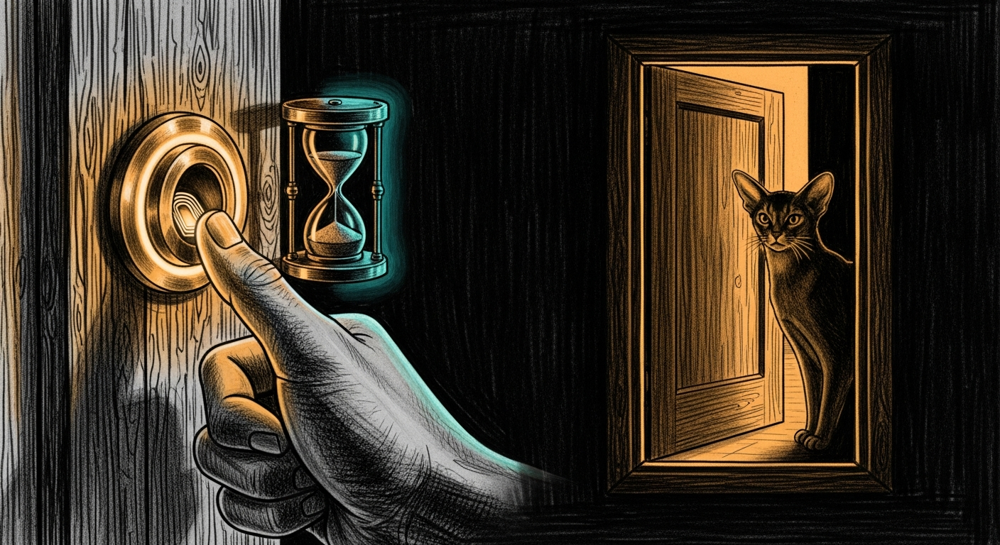

import { Aside, Steps } from '@astrojs/starlight/components';



Parent unlock is the **second door** on haus controls. Passkey (or sitting at the Mini) gets you into Command Center; Touch ID or PIN opens writes for a short shared session.

| Surface | What is gated |
|---------|----------------|
| **Holocron** | Family / Controls / Haus / Add device tabs; HA service calls; Force Flow POSTs via IPC |
| **Command Center** | Mutating `/api/*` after passkey (PIN chip in the header) |
| **Force Flow** `:4077` | Interactive browser/Electron `POST`/`DELETE` on `/screen/*` |

Reads stay open (status dots, Living Force, dashboards). Daemons and scripts that call loopback **without** a browser User-Agent keep working while locked — so homework bridges and cron do not brick when you lock the panel.

## Shared session

One unlock opens every surface for **`session_ttl_sec`** (default 900s / 15 minutes):

- Policy: `~/.sanctum/secrets/parent-unlock-policy.json`
- PIN hash: `~/.sanctum/secrets/parent-pin.hash` (never in git)
- Session: `~/.sanctum/state/parent-unlock-state.json` (`unlocked_until`)
- Audit: `~/.sanctum/logs/parent-unlock-audit.jsonl`
- CLI: `sanctum-parent-unlock`

Holocron Touch ID and Command Center PIN write the same `unlocked_until`.

## Operator setup

<Steps>

1. **Confirm Touch ID** on manoir (or set a PIN first if the machine has no biometrics).

2. **Enable** — Touch ID only, or either method after a PIN:

   ```sh
   sanctum-parent-unlock enable --method touchid
   # or
   sanctum-parent-unlock set-pin --enable --method either
   ```

3. **Use it** — Holocron → control tab → **Unlock with Touch ID**. Or Command Center header → **Unlock controls** (PIN when configured).

4. **Lock early** — Holocron **Lock** chip, CC **Controls unlocked · Lock**, or:

   ```sh
   sanctum-parent-unlock lock
   ```

</Steps>

## Break-glass

```sh
sanctum-parent-unlock disable     # gate off; PIN hash retained
sanctum-parent-unlock clear-pin   # remove PIN + disable
```

You need a shell on manoir as the operator user. There is no remote PIN reset by design.

## Kids and the network

Parent unlock is **not** a firewall. Kids on Tailscale are limited by ACL (`tag:family` → host `:4077` only). LAN peers still need the screen control token for non-loopback `/screen/*`. See also [Home Network](/guides/home-network/) and the tailnet ACL under `Claude_Code/tailnet/acl.hujson`.

## Ports (Deadpool)

| Port | Role |
|------|------|
| **1701** | Command Center backend (NCC-1701 — loopback) |
| **1111** | PQ terminator → Command Center on the tailnet |
| **4077** | Force Flow / screen-time API |

## Verify

Two commands prove the gate is real: one reports the session state, and one
attempts an interactive write while locked and must be refused. A `403` with
`parent_unlock_required` is the door working. A `200` means the door is
painted on.

```sh
sanctum-parent-unlock status
# Interactive write while locked → 403 parent_unlock_required
curl -s -o /dev/null -w '%{http_code}\n' -X POST http://127.0.0.1:4077/screen/block \
  -H 'Content-Type: application/json' \
  -H 'Origin: http://127.0.0.1:3333' \
  -H 'User-Agent: Mozilla/5.0 Electron' \
  -d '{"target":"shared"}'
```

<Aside type="tip">
  Canonical operator notes also live in the machine repo: `~/.sanctum/runbooks/parent-unlock.md` (sanctum-config). This page is the human-facing twin.
</Aside>
