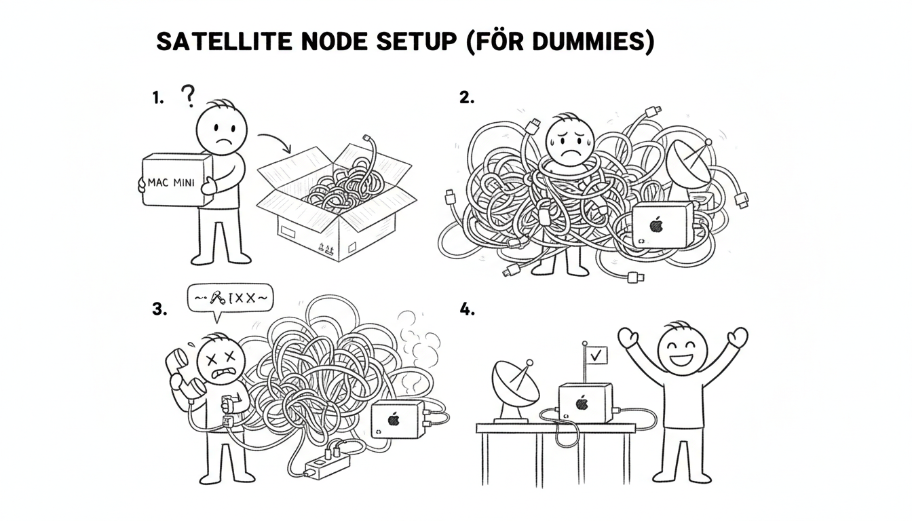

A satellite node is a lighter Sanctum installation at a secondary location that syncs with your hub. Congratulations on deciding that one location running an AI-powered haus intelligence platform wasn't enough. You are now operating a distributed system. Every distributed systems paper ever written is trying to warn you about something, and you're doing it anyway.



## Prerequisites

- Mac Mini at the satellite location
- Tailscale installed on both hub and satellite
- The satellite Mac on the same Tailscale network as your hub
- A willingness to debug networking problems in a location you don't live in full-time

## Step 1: Mac Setup

On the satellite Mac, set hostname, enable SSH and Screen Sharing, and install Tailscale from the App Store. Screen Sharing is non-negotiable — you will need to reach this machine remotely, and "drive hours to a remote property to restart a LaunchAgent" is not an acceptable runbook.

## Step 2: Install Sanctum

```bash
mkdir -p ~/.sanctum/lib
echo "satellite" > ~/.sanctum/.node_id
```

Copy `instance.yaml` and `lib/` from the hub (via iCloud sync or scp). The node identity file is a single word that tells the system who it is. Philosophy students may find this reductive. The system does not care.

## Step 3: Add Node to Config

Add the satellite to `instance.yaml`:

```yaml
nodes:
  satellite:
    type: satellite
    host: 192.168.1.10
    tailscale_ip: 100.0.0.30
    ssh_user: operator
    sync:
      hub: hub
    services:
      home_assistant:
        enabled: true
      heartbeat:
        interval: 120
```

## Step 4: Install Services

```bash
brew install node@22
npm install -g openclaw
~/.sanctum/generate-plists.sh
```

Install Docker Desktop for Home Assistant if needed. Set memory to 4 GB unless the satellite Mac has resources to spare, in which case, set it to 4 GB anyway. Docker will take whatever you give it and ask for more.

## Step 5: On-Site Setup

Configure integrations requiring physical presence: cameras, alarm systems, smart switches. Note the local router IP and update `instance.yaml`. This is the step that requires you to actually be in the building, pressing buttons on physical objects, like some kind of cave person. Every other step can be done remotely.

## Ongoing Sync

The hub pushes skills, config, and secret updates to satellites via Tailscale. The satellite doesn't need to think about staying current — it receives updates from the hub the way a branch office receives memos from corporate. Whether it reads them is between it and the LaunchAgents.
