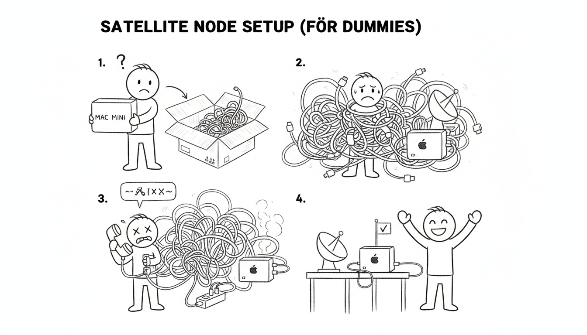

A satellite node is a lighter Sanctum installation at a secondary location that syncs with your hub. Congratulations on deciding that one location running an AI-powered haus intelligence platform wasn't enough. You are now operating a distributed system. Every distributed systems paper ever written is trying to warn you about something, and you're doing it anyway.



## Prerequisites

- Mac Mini at the satellite location
- Tailscale installed on both hub and satellite
- The satellite Mac on the same Tailscale network as your hub
- A willingness to debug networking problems in a location you don't live in full-time

## Step 1: Mac Setup

On the satellite Mac, set hostname, enable SSH and Screen Sharing, and install Tailscale via the open-source Homebrew formula:

```bash
brew install tailscale
```

Use the formula, not the App Store / GUI build — the sandboxed App Store build cannot host an SSH server, which is exactly the reachability the rest of this step depends on. Screen Sharing is non-negotiable for the same reason: you need to reach this machine remotely, and "drive hours to a remote property to restart a LaunchAgent" is not an acceptable runbook.

## Step 2: Install Sanctum

```bash
mkdir -p ~/.sanctum/lib
echo "satellite" > ~/.sanctum/.node_id
```

Copy `instance.yaml` and `lib/` from the hub (via iCloud sync or scp). The node identity file is a single word that tells the system who it is. Philosophy students may find this reductive. The system does not care.

## Step 3: Add Node to Config

Add the satellite to `instance.yaml`:

```yaml
nodes:
  chalet:
    type: satellite
    host: ''                      # empty — remote nodes are reached over Tailscale, not LAN
    tailscale_ip: 100.0.0.30
    tailscale_name: chalet
    ssh_user: neo
    sync:
      hub: manoir                 # the hub NODE NAME, not the literal "hub"
      skills_rsync: true
      state_reconcile: true
    services:
      home_assistant:
        enabled: true
        port: 8123
      heartbeat:
        enabled: true
        interval: 300
```

`host` is only meaningful for nodes on the hub's LAN; a satellite over Tailscale leaves it empty and is addressed by `tailscale_name`. The `hub:` under `sync` must name the hub node (`manoir`), not the literal string `hub` — the system resolves it back to a node, and "hub" resolves to nothing.

## Step 4: Install Services

```bash
brew install node
pnpm add -g openclaw
~/.sanctum/generate-plists.sh
```

Match the hub's Node line rather than pinning a version — the haus runs Node 26, and a satellite stranded on an older track is just version skew waiting to surface during a sync. And it is `pnpm`, not `npm`: the workspace went pnpm-only to kill lockfile drift, and one `npm install` on a remote box reintroduces exactly the drift the migration buried.

Install OrbStack for Home Assistant if needed — the haus runtime since the Colima retirement. OrbStack manages memory dynamically with native networking, so there is no 4 GB knob to agonize over. This is, genuinely, one fewer decision than you used to have.

## Step 5: On-Site Setup

Configure integrations requiring physical presence: cameras, alarm systems, smart switches. Note the local router IP and update `instance.yaml`. This is the step that requires you to actually be in the building, pressing buttons on physical objects, like some kind of cave person. Every other step can be done remotely.

## Ongoing Sync

The satellite's `sync` block declares its intent — `hub: manoir`, `skills_rsync: true`, `state_reconcile: true` — and the schema is wired for a hub that pushes skills, config, and secrets over Tailscale the way a branch office gets memos from corporate.

The push driver itself is not built yet. Today the contract is honest about the satellite's appetite but there is no LaunchAgent doing the rsync; bringing a chalet current is still a manual `scp` of `lib/` and `instance.yaml`, same as Step 2. The flags are a promise, not a cron job — which is the most corporate thing about the whole arrangement.
