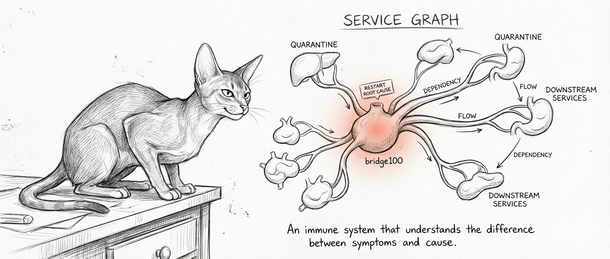

import { Aside, Steps } from '@astrojs/starlight/components';

The [old watchdog](/guides/watchdog/) was honest and dumb. One list, one idea: check everything, restart whatever's broken. No context. No depth perception. The emotional intelligence of a `while true; do restart; done` loop.

When the Ubuntu VM goes down, the flat watchdog dutifully restarts everything that depends on it — a retry storm that accomplishes nothing, because the root is dead and nobody told it to look down. Like calling an ambulance for every room in a haus that lost power. The problem was the breaker, and the watchdog didn't know breakers existed.

The service graph replaced that flat list with a tree. Thirty-seven services, wired by who-needs-whom. When something breaks, the graph walks upward until it finds the cause, then names *that*. Everything downstream recovers once the root is back — or doesn't, in which case you have a different problem and possibly a different hobby.



## Service Manifests

Every monitored service gets a YAML file in `~/.sanctum/services/` — one per service, thirty-seven files. Each declares what the service provides, what it requires, how to check its pulse, and how to restart it when the pulse stops: a birth certificate, a résumé, and a DNR order in one.

```yaml
# ~/.sanctum/services/voice-agent.yaml
name: voice-agent
host: mac
type: service
provides:
  - voice-agent
  - port:1138
requires:
  - sanctum-tts
health:
  liveness:
    type: port
    host: localhost
    port: 1138
    interval: 60
remediation:
  responsible_agent: quigon
  max_restarts: 3
  cooldown: 60
  restart_cmd: /Users/neo/.sanctum/scripts/heal_launchagent.sh com.sanctum.yoda-agent
```

The `requires` field is where the graph gets its edges — a flat list of names another manifest `provides`. If `voice-agent` requires `sanctum-tts`, then when sanctum-tts is dead the graph won't waste time restarting the voice agent — it would just die again. Sisyphus on a sixty-second timer.

An empty `requires` makes a root — it depends on nothing but the machine being on and the laws of physics holding. If either fails, you have bigger problems than YAML can solve.

## The Dependency DAG

Here's where it gets beautiful, in the way that only directed acyclic graphs can be: extremely, if you're reading this page, and invisibly to everyone else in your haushold.

`service-graph.py graph` reads every manifest, extracts the `requires` edges, and builds a DAG. Most of the thirty-seven are roots — independent islands. The interesting part is the handful wired up:

```
sanctum-tts            vm                health-center      graphiti-server
├── sonos-bridge       ├── orbi-bridge   └── health-tunnel  └── health-ingester
└── voice-agent        └── health-tunnel        ^
                                                 └── (also requires vm)
```

`health-tunnel` earns the graph its middle initial: it requires both `health-center` and `vm` — a join, not a leaf.

Root-cause analysis walks UP. When `voice-agent` fails, `service-graph.py root-cause` checks `sanctum-tts`; if that's also down, it's your root cause — one fix, not two. The old watchdog would have filed two complaints and restarted two corpses, one only a symptom.

Topological ordering also gives the graph a restart sequence: you don't restart a service before its dependencies are alive, the way you don't serve dinner before turning on the stove. The Force has a direction, root to leaf.

## Manifest Validation

`service-graph.py validate` asks a simple, uncomfortable question: do the manifests even agree with *each other*? Right after a fresh edit, usually not — they've technically never broken up but haven't been in the same room for months.

Validation runs four structural checks across all manifests:

| Check | What It Catches |
|-------|----------------|
| Dependency resolution | A `requires` entry that no other manifest `provides` — a dangling edge |
| Circular dependency | A cycle in the graph (Kahn's algorithm); the "acyclic" in DAG is load-bearing |
| Sudo path safety | A `restart_cmd` invoking `sudo somebinary` by bare name instead of an absolute path, which won't match the NOPASSWD sudoers rule |
| Pre-restart steps | A `pre_restart` hook missing its `name` or `command`, or an unknown `when` clause |

A dangling `requires` is the most common find — someone renamed what a service `provides` and forgot the other end of the edge. None are fatal at runtime; all mean someone changed something and didn't tell the graph.

What validation does *not* yet do is reconcile manifests against live reality — diffing what they declare against what LaunchAgents run and what ports actually listen, to surface drift, orphans, and ghosts. That cross-check is designed, not built; today the runtime side falls to the narrower [`drift-sentinel.sh`](/operations/drift-sentinel/).

## Remediation Ladder

When a service fails its liveness check, the graph doesn't panic — panic is for flat lists. `service-graph.py remediate <name>` works in three deliberate moves.

<Steps>
1. **Root-cause first** — Before touching the failed service, `root-cause` asks whether this is the breaker or just a dark room. If a dependency is the real corpse, you remediate *that* — restarting a service whose foundation is dead just repaints a ceiling over a cracked slab.
2. **Pre-restart, then self-heal** — Optional `pre_restart` steps (clear a stale lock, kick a dependency) run conditionally; if they don't fix it, the graph fires the `restart_cmd`, waits the startup timeout, and re-probes liveness to confirm the patient woke up. Most failures are transient, and transient failures respond to percussive maintenance.
3. **Budget, then quarantine** — Every restart counts against a budget (`max_restarts`, default 3) in a rolling window. Exhaust it and the service is quarantined instead of restarted again — the graph stops digging.
</Steps>

What it does *not* yet do automatically is climb past a single service — cascading a dependency restart, replaying a subtree in topological order, or dispatching the code-forge agent. The DAG already computes the transitive deps and order those rungs need; the engine is built, the escalation isn't. Past quarantine, the manifest's `responsible_agent` names who to page — [Qui-Gon](/agents/quigon/) for the voice agent above — and a human arrives with hands, judgment, and a glass of something strong.

## Crash Loop Quarantine

<Aside type="danger">
  If a service burns its restart budget — `max_restarts` (default 3) within a rolling window of `cooldown × 10`, ten minutes at the default `cooldown: 60` — the graph stops restarting it and marks it **quarantined**. Neo4j taught this lesson: it crash-looped on a corrupted index, every restart making the corruption worse, while the old watchdog kept restarting it like a well-meaning friend who keeps setting you up with the same terrible person. The graph stops after three and walks away.
</Aside>

Quarantine isn't permanent exile — it's a timeout that gets longer each time. The graph self-releases on an exponential backoff (1h, then 4h, 12h, 24h by tier) and allows one retry with a fresh budget; if that also fails, the timer doubles down and the service goes back in the corner. A human can cut the wait short with `service-graph.py unquarantine <name>`, which force-releases it *and* resets the budget and backoff tier — for when you've already fixed the corrupted index and you'd like the machine to take your word for it. Bring coffee.

## Metrics

A system that heals itself needs to remember what it healed and whether the patient is getting worse — otherwise you're not a doctor, you're a bartender with aspirin.

`metrics-collect.sh` is designed to run every five minutes, recording per-service RSS (`rss_kb`), disk usage, load average, and Docker container counts into a SQLite database at `~/.sanctum/metrics/metrics.db`. Small footprint, append-only, auto-purged past 30 days. The catch: no LaunchAgent fires it, so the newest row is from April. The script works; the cron around it went missing — an accountant on unannounced sabbatical.

`anomaly-detect.py` reads that database for two patterns. A **threshold anomaly** is a service whose current RSS sits more than 2σ above its rolling 24-hour mean — the suddenly-fat process. An **RSS leak** is subtler: a linear regression on the last 6 hours of `rss_kb` projecting the service past a fixed 1.5 GB ceiling within 4 hours. Precrime, but for RAM. Both need live data — which loops back to the absent collector.

| Script | Interval | Storage | Purpose |
|--------|----------|---------|---------|
| `metrics-collect.sh` | 5 min (designed; agent not installed) | `metrics.db` (SQLite) | RSS, disk, load, containers |
| `anomaly-detect.py` | per run, against the DB | same | 24h mean + 2σ threshold, 6h leak regression |

The difference between monitoring and surveillance is consent. Your services consented when you wrote their manifests — and skipped the terms, but that's a problem for robot lawyers.

<Aside type="tip">
  The schema is deliberately narrow — `(ts, service, metric, value)`, `ts` as integer epoch — so one table holds RSS, disk, and load without ever growing a column. Query it directly: `sqlite3 ~/.sanctum/metrics/metrics.db "SELECT service, value FROM metrics WHERE metric='rss_kb' AND ts > strftime('%s','now','-1 hour') ORDER BY value DESC LIMIT 10;"` — values in KB. Useful when something feels slow but nothing has technically failed yet. The gut feeling before the pager goes off.
</Aside>
