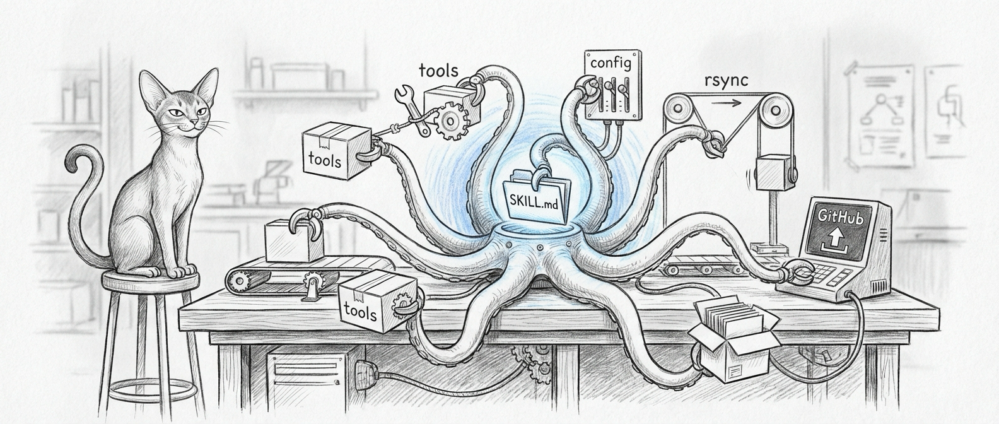

import { Aside, Steps, Tabs, TabItem } from '@astrojs/starlight/components';

Skills are how you teach the council new tricks. Each skill is a self-contained package — documentation, executable tools, configuration — that any agent can pick up and use. You build it once, push it to GitHub, and thirty minutes later a Jedi named after a Mon Calamari healer can invoke it on a VM that has never seen the internet. The future is strange and beautiful and running on cron.



## Skill Structure

Every skill follows a standard directory layout:

```
skill-name/
├── SKILL.md           # Skill documentation and usage instructions
├── tools/             # Executable scripts
│   ├── tool-one.sh
│   ├── tool-two.sh
│   └── tool-three.py
└── config/            # Optional configuration files
```

### SKILL.md

The `SKILL.md` file serves as both human documentation and agent instructions. It describes the skill's purpose, available tools, required parameters, and usage examples. Agents read this file to understand how and when to invoke the skill's tools. Write it well — your agents are only as smart as the instructions you give them, and they will follow bad instructions with absolute confidence.

### Tools Directory

The `tools/` directory contains executable scripts that agents can invoke. Tools are typically shell scripts or Python scripts with clear input/output contracts. Each tool should:

- Accept parameters via command-line arguments or environment variables
- Write structured output to stdout
- Return meaningful exit codes (0 for success, non-zero for failure)
- Include error messages on stderr

## Available Skills

The skills repository contains the following skills:

| Skill                | Description                                                      |
|----------------------|------------------------------------------------------------------|
| **apple-toolkit**    | Unified Mac management: iMessage, WhatsApp, Signal, Slack messaging, LaunchAgents, boot checks, iCloud backup and filing |
| **mac-mini-ops**     | QEMU VM control, LM Studio model operations, network topology     |
| **dench-ops**        | Gateway restart, auth token refresh, plugin and model management, troubleshooting |
| **firewalla-toolkit**| Firewalla network management: rules, DNS, device monitoring      |
| **council-bridge**   | Jocasta-Yoda cross-instance agent communication                  |
| **council-router**   | Agent routing, escalation configuration, port and service tests  |
| **haus-pulse**      | Home monitoring and environmental status                         |
| **reboot-check**     | Post-reboot verification of services and connectivity            |
| **service-doctor**   | Service health diagnosis and automated repair                    |
| **yoda-voice**       | Voice agent management and TTS configuration                     |
| **orbi-toolkit**     | Orbi router and access point management                          |
| **memory-vault**     | Persistent memory storage and retrieval                          |

Twelve skills. One repository. Six agents and a dead cat. If any of them ever unionize, you're in trouble.

## Skills Repository

The shared skills repository lives at `~/Projects/openclaw-skills` on the Mac and is cloned from a private GitHub repository.

```
~/Projects/openclaw-skills/
├── apple-toolkit/
├── mac-mini-ops/
├── dench-ops/
├── firewalla-toolkit/
├── council-bridge/
├── council-router/
├── haus-pulse/
├── reboot-check/
├── service-doctor/
├── yoda-voice/
├── orbi-toolkit/
└── memory-vault/
```

Both the Mac (DenchClaw) and VM (OpenClaw) gateways load skills from this directory via the `extraDirs` configuration in their respective `openclaw.json` files. Skills appear under the `openclaw-extra` source in the gateway's skill listing.

## Sync Pipeline

The VM has no direct internet access (host-only networking), so skills are synced through the Mac using a two-stage pipeline. The VM is, essentially, an air-gapped system that receives care packages from the outside world.

```
GitHub Repository
       │
       ▼ git pull (every 30 min)
Mac: ~/Projects/openclaw-skills/
       │
       ▼ rsync (every 30 min)
VM: ~/Projects/openclaw-skills/
```

### Schedule

A Mac cron job runs every 30 minutes:

```
*/30 * * * * cd ~/Projects/openclaw-skills && git pull && rsync -az --delete ./ ubuntu@10.10.10.10:~/Projects/openclaw-skills/
```

<Steps>
1. `git pull` fetches the latest changes from GitHub to the Mac
2. `rsync` mirrors the Mac copy to the VM over SSH
3. The `--delete` flag ensures removed skills are also removed on the VM
</Steps>

<Aside type="caution">
  Because the VM has no GitHub access, any skill changes made directly on the VM will be overwritten on the next sync cycle. Always commit changes through GitHub and let the pipeline propagate them. The VM forgets your local edits every thirty minutes. This is not a bug. This is a boundary.
</Aside>

## Developing a New Skill

<Steps>
1. **Create the directory** under `~/Projects/openclaw-skills/` with a descriptive name using kebab-case.

2. **Write SKILL.md** documenting the skill's purpose, tools, parameters, and examples. This file is critical as agents rely on it to understand tool usage.

3. **Add tools** to the `tools/` directory. Make them executable (`chmod +x`). Use shell scripts for system operations and Python for data processing.

4. **Test locally** by invoking tools directly from the command line to verify inputs, outputs, and error handling.

5. **Commit and push** to GitHub. The sync pipeline will distribute the skill to both Mac and VM within 30 minutes.

6. **Verify** by asking an agent to list its available skills and confirm the new skill appears.
</Steps>

### Tool Conventions

- Use `#!/bin/bash` or `#!/usr/bin/env python3` shebangs
- Accept the most important parameter as the first positional argument
- Use environment variables for configuration that rarely changes
- Output JSON when returning structured data
- Log diagnostic information to stderr, not stdout
- Keep tools focused on a single action

<Aside type="tip">
  A tool that does two things is two tools wearing a trenchcoat. Split them. Your future self will thank you when one half breaks at 3 AM and the other still works.
</Aside>

## Skill Loading

Gateways discover skills at startup by scanning configured directories. The loading process:

1. Enumerate all subdirectories in the skills path
2. Check for a valid `SKILL.md` in each subdirectory
3. Parse the skill metadata from `SKILL.md`
4. Register available tools from the `tools/` directory
5. Make skills available to all agents on that gateway

<Aside type="caution">
  After adding a new skill, restart the gateway for it to be discovered. Skills are loaded at gateway startup, not dynamically at runtime. Hot-reloading skills would be convenient, but also terrifying — so we don't.
</Aside>
