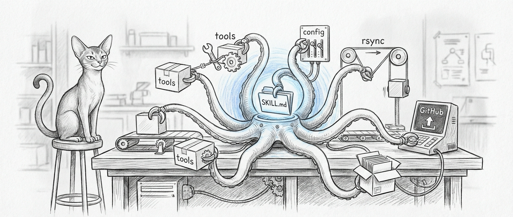

import { Aside, Steps, Tabs, TabItem } from '@astrojs/starlight/components';

Skills are how you teach the council new tricks. Each skill is a self-contained package — documentation, executable tools, configuration — that any agent can pick up and use. You build it once, push it to GitHub, and by the next morning's bundle sync a Jedi named after a Mon Calamari healer can invoke it on a VM that has no internet route at all. The future is strange and beautiful and running on cron.



## Skill Structure

Every skill follows a standard directory layout:

```
skill-name/
├── SKILL.md           # Skill documentation and usage instructions
├── tools/             # Executable scripts
│   ├── tool-one.sh
│   ├── tool-two.sh
│   └── tool-three.py
└── config/            # Optional configuration files
```

### SKILL.md

The `SKILL.md` file serves as both human documentation and agent instructions. It describes the skill's purpose, available tools, required parameters, and usage examples. Agents read this file to understand how and when to invoke the skill's tools. Write it well — your agents are only as smart as the instructions you give them, and they will follow bad instructions with absolute confidence.

### Tools Directory

The `tools/` directory contains executable scripts that agents can invoke. Tools are typically shell scripts or Python scripts with clear input/output contracts. Each tool should:

- Accept parameters via command-line arguments or environment variables
- Write structured output to stdout
- Return meaningful exit codes (0 for success, non-zero for failure)
- Include error messages on stderr

The repository holds 22 documented skills (a `SKILL.md` apiece) and grows whenever someone teaches the council a new trick. A representative slice:

| Skill                  | Description                                                      |
|------------------------|------------------------------------------------------------------|
| **apple-toolkit**      | Unified Apple management: messaging read access (iMessage, WhatsApp, Slack, Signal), LaunchAgents, boot health, post-boot remediation, iCloud backup/filing status |
| **mac-mini-ops**       | Lima VM control, LaunchAgent management, boot resilience, network topology |
| **dench-ops**          | DenchClaw/OpenClaw gateway management, auth token refresh, plugin and model management, log diagnostics |
| **firewalla-toolkit**  | Firewalla network security via the REST bridge: device inventory, alarms, blocking, DNS mapping, flow analysis |
| **security-policy**    | Policy-driven auto-block on Firewalla's native quarantine — monitors alarms, quarantines threats, auto-unblocks on timeout, escalates to Yoda |
| **orbi-toolkit**       | Orbi 960 mesh management: device inventory, WiFi blocking, mesh reboot, DHCP reservations, health checks |
| **council-router**     | Universal multi-agent routing for the Jedi Council — structured messages, broadcasting, sessions, escalation |
| **council-bridge**     | *(legacy — superseded by council-router; direct Jocasta ↔ Yoda SSH messaging as a fallback only)* |
| **house-pulse**        | Single-command infrastructure dashboard: Mac services, VM health, network, Firewalla devices, boot chain |
| **service-doctor**     | Diagnose and fix Mac Mini services — ports, LaunchAgents, Docker, tunnels, Memory Vault, VM gateway; predictive anomaly detection |
| **reboot-check**       | Pre-reboot verification: LaunchAgents, Login Items, Docker auto-start, service health, VM reachability, boot chain |
| **chaos-forge**        | Controlled failure injection and monthly fire drills to validate self-healing, escalation, and recovery |
| **memory-vault**       | Obsidian-compatible shared memory for all agents — Markdown notes with frontmatter and `[[wikilinks]]` |
| **yoda-voice**         | Live phone-call voice conversations with the operator, for matters too urgent or complex for text |

Twenty-two skills. One repository. Seven council seats and a dead cat. If any of them ever unionize, you're in trouble.

## Skills Repository

The shared skills repository lives at `~/Projects/openclaw-skills` on the Mac and is cloned from a private GitHub repository.

```
~/Projects/openclaw-skills/
├── apple-toolkit/
├── mac-mini-ops/
├── dench-ops/
├── firewalla-toolkit/
├── security-policy/
├── council-router/
├── council-bridge/       # legacy
├── house-pulse/
├── service-doctor/
├── reboot-check/
├── chaos-forge/
├── memory-vault/
├── yoda-voice/
└── ...                   # 22 in all, and counting
```

Both the Mac (DenchClaw) and VM (OpenClaw) [gateways](/architecture/sanctum-gateway/) load skills from this directory via the `extraDirs` configuration in their respective `openclaw.json` files. Skills appear under the `openclaw-extra` source in the gateway's skill listing.

## Sync Pipeline

The VM has no internet route at all (host-only networking), so it can't `git fetch origin`. It still ends up with the same skills as the Mac — by two completely separate paths that happen to share a name. Conflating them is the easiest mistake on this page, so here they are pulled apart.

```
                 GitHub: openclaw-skills
                 ┌──────────┴──────────┐
                 ▼                     ▼
   git pull (hourly)        git bundle (daily airgap sync)
                 │                     │
                 ▼                     ▼
   Mac: ~/Projects/         VM: ~/Projects/openclaw-skills/
        openclaw-skills/    (its own clone, fed by bundle)
                 │
                 ▼ rsync --delete (same hourly cron)
   Mac: ~/.openclaw/skills/  (local gateway mirror)
```

Both machines hold a real git clone. Neither receives a file-copy of the other's working tree — that arrow does not exist. The Mac's `rsync` is a strictly *local* mirror step.

### Schedule

The Mac cron runs hourly, on the hour:

```
0 * * * * cd ~/Projects/openclaw-skills && git pull >> ~/.openclaw/logs/skills-sync.log 2>&1 \
  && rsync -az --delete ~/Projects/openclaw-skills/ ~/.openclaw/skills/
```

<Steps>
1. `git pull` fetches the latest changes from GitHub into the Mac clone.
2. `rsync` mirrors that clone into the **local** gateway directory `~/.openclaw/skills/` — no network hop, no SSH.
3. `--delete` keeps the mirror in lockstep with the repo, so removed skills disappear from the mirror, not just newly-added ones.
</Steps>

The VM is on its own schedule. The daily airgap sync (`com.sanctum.vm-sync`, 03:00) bundles `origin/main` into a portable file, SCPs it across the host-only link, and fast-forwards the VM's clone — the only way to move git history to a machine with no route to GitHub.

<Aside type="caution">
  Because the VM can't reach GitHub, always commit through GitHub and let the bundle sync carry your work across. But the VM does **not** silently clobber your local edits: its `git merge --ff-only origin/main` *refuses* a dirty tree, logs it, and pages the operator — your work survives, the decision is yours. The boundary is real; it's just polite about it.
</Aside>

## Developing a New Skill

<Steps>
1. **Create the directory** under `~/Projects/openclaw-skills/` with a descriptive name using kebab-case.

2. **Write SKILL.md** documenting the skill's purpose, tools, parameters, and examples. This file is critical as agents rely on it to understand tool usage.

3. **Add tools** to the `tools/` directory. Make them executable (`chmod +x`). Use shell scripts for system operations and Python for data processing.

4. **Test locally** by invoking tools directly from the command line to verify inputs, outputs, and error handling.

5. **Commit and push** to GitHub. The Mac picks it up on its next hourly pull; the VM gets it on the next daily airgap bundle sync. Two clocks, not one.

6. **Verify** by asking an agent to list its available skills and confirm the new skill appears.
</Steps>

### Tool Conventions

- Use `#!/bin/bash` or `#!/usr/bin/env python3` shebangs
- Accept the most important parameter as the first positional argument
- Use environment variables for configuration that rarely changes
- Output JSON when returning structured data
- Log diagnostic information to stderr, not stdout
- Keep tools focused on a single action

<Aside type="tip">
  A tool that does two things is two tools wearing a trenchcoat. Split them. Your future self will thank you when one half breaks at 3 AM and the other still works.
</Aside>

## Skill Loading

Gateways discover skills at startup by scanning configured directories. The loading process:

1. Enumerate all subdirectories in the skills path
2. Check for a valid `SKILL.md` in each subdirectory
3. Parse the skill metadata from `SKILL.md`
4. Register available tools from the `tools/` directory
5. Make skills available to all agents on that gateway

<Aside type="caution">
  After adding a new skill, restart the gateway for it to be discovered. Skills are loaded at gateway startup, not dynamically at runtime. Hot-reloading skills would be convenient, but also terrifying — so we don't.
</Aside>

That is the loop, start to finish: you write a skill on the Mac, push it to GitHub, and by the next morning's bundle a Jedi on an airgapped VM has learned a new trick — no packet ever crossing the boundary to teach it. One of those twenty-two skills is [the router the council talks through](/architecture/council-router/), which means the system's own coordination arrives the same way everything else does: on cron, overnight, from a repo.

The council gets smarter on a schedule.
