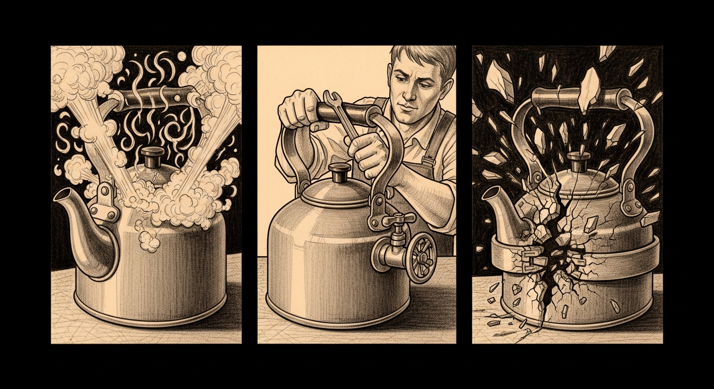

import { Aside } from '@astrojs/starlight/components';




{/* TODO(hero): generate via tools/gen_hero_image.py — prompt: "A pressure gauge with three faces — green, orange, red — etched onto a dark workshop wall. Behind it, a Rust crab holds a wrench in one claw and a SIGKILL tag in the other, looking apologetic. Technical pencil sketch, dark background, amber localized accent lighting, clean lines, hand-drawn feel, no text, no words, no letters." */}

One day, three acts. At midnight the Mini panicked. By lunch we had shipped a Rust daemon to make sure it never happened again. By dinner that same daemon had, within five minutes of going live, killed the exact service it existed to protect — twice — while the actual memory hog sat untouched a few gigabytes away. This is that day, told in order, because the mistake teaches more than the fix, and the fix teaches more than the original design.

## Midnight — the reboot was a panic

Earlier in the day we had shrugged at the midnight reboot: macOS applied an update, or the kernel panicked, or gravity hiccuped. It was gravity's alibi that failed. `/Library/Logs/DiagnosticReports/Retired/panic-full-2026-04-19-235812.0002.panic` is a 3.4 MB receipt for an `AppleARMWatchdogTimer` kernel panic — `watchdog timeout: no checkins from watchdogd in 90 seconds` — fired at 23:58:12 EDT on the Mini.

The JetsamEvent thirteen minutes after reboot tells the story better than the panic log. At kill time, a 64 GB machine was carrying this:

| Process | RSS |
|---------|-----|
| `sanctum-mlx` (pid 9221) | 65,813 MB |
| `talagentd` (Apple Intelligence agent, macOS 26, idle) | over 7 GB |
| QEMU Ubuntu VM | 4.5 GB |
| `com.apple.Virtualization.VirtualMachine` | 1.9 GB |
| four leaked `metal` shader-compilers (a forgotten `cargo build`) | ~770 MB each |

The `metal` processes were collateral from the `council-integrity` build earlier that evening, four of them pinned at 100% CPU. The compressor hit 100% of its segment limit, sixty-nine swapfiles deep. `watchdogd` could not get scheduled for 90 seconds because every thread was blocked on a page fault. The kernel watchdog fired. The boot was a recovery, not a maintenance window.

The [148,181-error forensic analysis](/operations/2026-04-15-living-force-deployment/) that produced the living-force manifests had already named this: memory-pressure cascade, Pattern 011, with `memory_pressure_tier2` and `memory_pressure_tier3` shed lists enumerated in `sanctum-cascade-prevention.yaml`. Line 985 declared the pattern `dependent_on: ["service-graph.py", "watchdog", "system-memory-monitor"]`. Of those three, exactly two existed. The `system-memory-monitor` was YAML. Nothing enforced it, and the kernel does not read intentions.

## Lunch — a valve, shipped

The fix was `sanctum-pressure-valve`: a 2.2 MB Rust binary, 14 unit tests and 3 integration tests, one LaunchAgent, living at `services/sanctum-pressure-valve/` in the sanctum-rs workspace. It polls `vm_stat` and `sysctl -n vm.swapusage` on a 5-second tick and classifies pressure against thresholds tuned to the M4 Pro. Promotion requires two consecutive confirming samples; recovery is immediate.

| Level | Threshold (worst of) | Action |
|-------|----------------------|--------|
| green | healthy | none |
| yellow | 8 GB available or 70% swap | shed one tier-3 agent (`kiwix-serve`, `reranker`, `xtts-server`) |
| orange | 4 GB available or 85% swap | shed tier-2 (`memory-vault`, `qwen3-tts`, `mdns-docs`); SIGSTOP any allowlisted hog over 10 GB RSS |
| red | 2 GB available or 95% swap | SIGKILL the largest allowlisted RSS consumer |

The allowlist is tight and explicit; the denylist is hard-coded and not overridable by environment.

| List | Members |
|------|---------|
| Allowlist | `sanctum-mlx`, `qemu-system-aarch64`, `com.apple.Virtualization.VirtualMachine`, `LM Studio Helper`, `metal` (only matched with `-x metal`), Docker's VZ shim, `ollama-runner` |
| Denylist | `launchd`, `WindowServer`, `watchdogd`, `kernel_task`, `sshd`, `tailscaled`, and the valve itself |

A heartbeat at `~/.openclaw/state/sanctum-pressure-valve.json` is atomic-renamed every tick with the current `Snapshot`, `machine_level`, `last_action`, pid, and binary version — so `sanctum-watchdog` can mtime it to catch a wedged valve the way it catches zombie listeners.

```
plist:    ~/Library/LaunchAgents/com.sanctum.pressure-valve.plist
binary:   /Users/neo/Projects/sanctum-rs/target/release/sanctum-pressure-valve (2,276,192 bytes)
logs:     ~/.openclaw/logs/sanctum-pressure-valve.{log,err}
state:    ~/.openclaw/state/sanctum-pressure-valve.json
alerts:   ~/.sanctum/alerts.json (appended, source="sanctum-pressure-valve")
```

It came online at 2026-04-20 15:03:23 UTC, classified `orange` at 15:03:28 (5 s to promote, debounce working as designed), and fired its first action the same tick — `launchctl bootout gui/501/com.sanctum.memory-vault`. Swap dropped from 90% to 88% by the next tick. The manifest had finally grown teeth.

<Aside type="caution" title="The kernel has its own watchdog, and it will not wait for yours">
`AppleARMWatchdogTimer` is a hardware-backed 90-second deadman. If user-space does not relieve pressure before it fires, you get a `panic-full-*.panic` file, 90-ish seconds of downtime, and no say in which page of work was in flight. A manifest that names a `system-memory-monitor` but never deploys one is not a monitor. It is an intention.
</Aside>

### The corollary

`launchctl list` is not proof of a running service. The second column is a last-exit-status. A row whose first column is `-` and whose second is `1` is a service that tried to start and failed — in this case 3,671 times since midnight — while the dashboard cheerfully reports it "configured" because the plist sits in `~/Library/LaunchAgents/`. The health surface of a service is the heartbeat it writes, not the plist that claims it should be writing one.

## Dinner — the valve killed what it guarded

We shipped at 15:03 and watched for five minutes. In those five minutes the valve SIGKILL'd `sanctum-mlx` twice — pid 788 at 10.9 GB, pid 2861 at 9.0 GB — during the process's legitimate 27B-4bit model-load burst, which transiently needs about 14 GB of RSS before settling at 18 GB steady-state. Launchd respawned it both times. The valve killed it again. Meanwhile the actual top-RSS hog — an LM Studio node shim at `/Users/neo/.lmstudio/.internal/utils/node`, 8.6 GB — went untouched, because the v0.1.0 allowlist searched for the literal substring `LM Studio` and the shim's path does not contain it.

A safety daemon that kills the service it protects while ignoring the real offender has read the wrong page of the manual.

The right move was not to iterate alone. The [sanctum council](/operations/2026-04-19-council-mlx-silence/) was the correct reviewer — but the gateway on the VM was unreachable, the VM itself having been a casualty of the valve's earlier `qemu-system-aarch64` kill, and the local `openclaw agent --agent main` calls against Opus returned abandoned sessions or blank responses. The reasoning infrastructure had been starved by the exact pressure we were trying to solve. That is the best data point in the entry: a pressure-relief system whose first act kills the oracle that diagnoses pressure has re-invented deadlock. Review fell to an external-context subagent as stand-in. It returned five corrections in 30 seconds. All five shipped in `sanctum-rs 920c0eb`.

## The five corrections

| # | Fix | Mechanism |
|---|-----|-----------|
| 1 | The kernel is the authoritative signal | Read `kern.memorystatus_vm_pressure_level` — NORMAL (1), WARN (2), URGENT (3), CRITICAL (4), the same enum Jetsam consults — every tick; final level is `max(kernel_level, threshold_level)`. Lesson from systemd-oomd: the kernel already knows, don't reimplement it out of `vm_stat`. |
| 2 | Compressor growth is the leak signature | 30-second rolling window over `Pages occupied by compressor`; at ORANGE, escalate to RED when growth exceeds 100 MB/s. Load-bursts show near-zero growth (clean, pre-faulted pages); paired with per-process RSS floors, never trusted alone. |
| 3 | Per-entry policy, not a flat allowlist | `sanctum-mlx` and the LM Studio processes are now `SigstopOnly` (reversible freeze), never `SIGKILL`. QEMU and Apple Virtualization VMs stay `KillAllowed` with an 8 GB kill floor — they allocate at boot and stay flat, so runaway growth there is always a leak. |
| 4 | Regex matching, not substring | The `regex` crate (already compiled via `tracing-subscriber`'s env-filter feature — zero marginal build cost); patterns `r"\.lmstudio/"` and `r"/metal(?: \|$).*?-x metal"`. The metal pattern excludes the MTLCompilerService GPU runtime. earlyoom learned this in 2018. |
| 5 | Cooldown 60 → 120 s | 60 s could still stack three actions in a 15-second window against launchd's respawn timing. 120 s gives the system a full breath between moves. |

## Dry-run as the default for the first hour

Phase 2 deploys with `PRESSURE_VALVE_DRY_RUN=1` set in the plist. Every planned action logs to `~/.openclaw/logs/sanctum-pressure-valve.log` with `dry_run=true` and executes nothing. The first tick after redeploy — 02:37 UTC, machine in severe pressure (swap 100%, kernel=CRITICAL, compressor growing at 850 MB/s) — planned a `SIGSTOP` on pid 45013 at 8.6 GB in `/Users/neo/.lmstudio/`. Exactly the process v0.1.0 could not see. The SIGSTOP was a dry-run; the log was real. After six hours of clean observation with zero false-positive kills, the `DRY_RUN` line comes out and the valve goes live. If any planned action looks wrong, the patch cycle runs again before the switch is flipped.

<Aside type="tip" title="Ship the safety net, then watch it for an hour before you trust it">
Unit tests prove the classifier is correct. Integration tests prove the sampling works. Neither proves the remediation does the right thing on your actual machine with your actual workload. The cost of a dry-run window is measured in log size. The cost of a wrong live action was, today, a `sanctum-mlx` outage loop and a kernel-pressure spiral that nearly panicked us a second time.
</Aside>

## What the day was actually teaching

Three rules survive it. The kernel, not your derived metric, is the authority — `kern.memorystatus_vm_pressure_level` is one sysctl away and it does not lie. SIGKILL is for leaks, SIGSTOP is for load-bursts, `launchctl bootout` is for evictions; these three verbs are not interchangeable, and the per-entry `Policy` field now encodes the choice at the config layer rather than the action layer. SIGKILL a service on a live listener and you orphan every socket, child proc, and in-flight request — for `sanctum-mlx` that means council integrity goes red and the off-box canary across Tailscale starts logging `502`s. And if your oracle lives on the resource you are conserving, you have built a deadlock: the braces must live outside the belt, which is why the next crisis needs a [cached off-machine advisor](/architecture/capacity-doctrine/) that stays reachable when the local reasoner is itself the victim.

The valve now runs on manoir at pid 46053, v0.1.0 phase 2, `sanctum-rs 011252d` (phase 1) plus `920c0eb` (phase 2), pushed to origin and mbp — dry-run until roughly 08:37 UTC on 2026-04-21, cooldown 120 s, debounce 2 ticks, 27 lib + 2 main + 3 integration tests green, up from 19. The heartbeat now refreshes every 5 s with the kernel pressure enum and the compressor growth rate alongside the prior fields. Four follow-ups stay open: flip `DRY_RUN=0` after the window; leave `launchctl bootout sanctum-mlx` a human decision rather than auto-escalating at sustained RED (the one-second latency is cheaper than a false-positive eviction); build the cached council path; and teach `sanctum-watchdog` to treat a heartbeat older than 30 s as a wedge and kickstart the valve.

Six hours after it first killed the thing it was built to guard, the valve was watching a machine in genuine crisis and, this time, reaching for the right process. That is the whole trilogy: it took a panic to build it, a self-inflicted outage to correct it, and a dry-run to trust it. The [redux](/operations/2026-04-26-valve-trilogy-redux/) is where it earns the trust.
