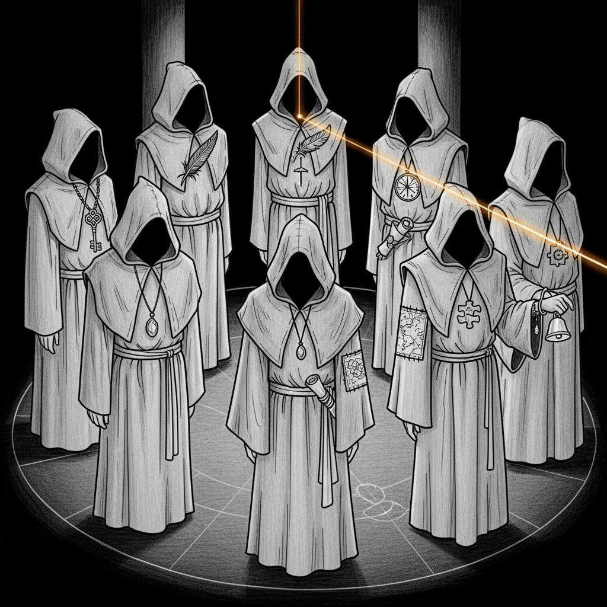

import { Aside } from '@astrojs/starlight/components';



The previous probe discipline had the council's MLX inference server — the 27B / 35B Qwen on `:1337` — covered: guardian, canary, drift-check, off-box watcher. That service got a full liveness regime after the sixteen-hour silence on April 19th. But the *other* inference target — LM Studio on `:1234`, serving Qwen2.5-Coder-14B behind every agent's system prompt — had exactly zero probes. The port was listed in `instance.yaml`. The watchdog checked that the port was open. That was the entire assertion.

Today that changed.

## What Got Built

Two new Rust modules inside `sanctum-watchdog`, wired directly into the check loop so their results flow through the existing notification, dedup, and incident-learning pipelines. No separate LaunchAgent, no shell wrapper, no second binary to manage.

### `lm_studio.rs` — ensure coder-14b is resident

Every watchdog tick:

1. Shell out to `/Users/neo/.lmstudio/bin/lms ps --json` and parse the loaded-model list.
2. If `qwen2.5-coder-14b-instruct` is present, emit a healthy `lmstudio-coder14b` service. Done.
3. If not, check available RAM via `vm_stat`. Refuse to load unless there is at least **12 GB free** — enough for the 9 GB GGUF plus KV cache and OS breathing room.
4. If the memory gate passes, `lms load qwen2.5-coder-14b-instruct`. Then re-verify via `lms ps --json` — some failure modes exit 0 but leave nothing loaded.

The memory gate exists because of the 2026-04-23 panic lineage. Loading a large model onto a host already thrashing through swap doesn't fail — it *succeeds very slowly*, and the act of succeeding pushes the host deeper into OOM territory. The refusal is surfaced to `/health` as an `lmstudio-coder14b` service with status `unhealthy` and a message like `deferred: 4.8 GB available, need 12 GB free`. Next tick retries. Eventually the memory frees and the load happens unattended.

<Aside type="caution" title="vm_stat page size is not 4 KB on Apple Silicon">
The first version of the memory gate hardcoded a 4 KB page size and consistently reported four times less RAM than actually existed. Apple Silicon uses 16 KB pages. The parser now reads the page size from the `vm_stat` header — `(page size of 16384 bytes)` on M-series, `(page size of 4096 bytes)` on Intel — and multiplies accordingly. Unit tests cover both.
</Aside>

### `council.rs` — roll-call every council member

On a separate cadence (hourly by default, `LIVING_FORCE_COUNCIL_INTERVAL`), the watchdog opens `~/.sanctum/agent_prompts.yaml`, pulls the `system:` prompt for each of the eight council members, and for every agent POSTs to `http://127.0.0.1:1234/v1/chat/completions`:

```json
{
  "model": "qwen2.5-coder-14b-instruct",
  "messages": [
    {"role": "system", "content": "<agent's real system prompt>"},
    {"role": "user", "content": "What is your name? Respond with just your name, one word, nothing else."}
  ],
  "temperature": 0.0,
  "max_tokens": 16
}
```

The response is asserted to contain the agent's own name (case-insensitive substring — `yoda`, `jocasta`, `windu`, `qui` for Qui-Gon, `cilghal`, `mundi`, `ahsoka`, `mothma`). A successful self-identification proves three things in one query:

1. LM Studio is accepting chat completions.
2. Coder-14B is loaded and decoding sanely — not emitting `190/ 190/` loops or empty strings.
3. The agent's system prompt got applied. A blank-prompt call to coder-14b would reply with a generic "I am an AI assistant" kind of answer; only a prompted agent will answer *as* that agent.

Each agent's result — healthy / unhealthy — is appended to the health snapshot as a `council-<name>` service. Failures flow through the same notification and remediation pipeline as any other service. Eight new virtual services, free.

### Guardrails in the loop

Not every code path leads to all eight agents being interrogated. Three gates short-circuit work that would just hurt:

- **Sanity probe first.** Before touching the agents, the roll-call sends a trivial `Reply with only: ok` prompt with a 30-second budget. If that hangs, the whole roll-call is marked skipped — no point queuing eight long requests behind a stuck server.
- **Consecutive-timeout bail.** If two agents in a row time out, the rest of the list is skipped and marked `skipped after 2 consecutive timeouts`. LM Studio's in-flight queue stays cleanable.
- **Memory gate first.** If coder-14b isn't loaded (because the memory gate deferred it), the roll-call doesn't even start.

## The Flow As It Reads Now

The new steps live inside `run_check()` as Step 2.1, right after the service-graph check and before any remediation. The Living Force results are folded into the same `services` vec that the existing pipeline reads:

```
run_check()
├── Step 0.5  memory sentinel
├── Step 1    validate service manifests
├── Step 2    service-graph check-all
├── Step 2.1  Living Force
│     ├── lm_studio::ensure_coder14b_loaded
│     │     ├── lms ps --json (fast path: already loaded?)
│     │     ├── vm_stat gate (need ≥ 12 GB free)
│     │     └── lms load + re-verify
│     └── council::run_roll_call (hourly)
│           ├── sanity probe (30 s)
│           └── for each of 8 agents:
│                 query → assert name in response → push ServiceStatus
├── Step 2.5  anomaly detection
└── Step 3+   healthy path / remediation / notification
```

Every surfaced service — `lmstudio-coder14b`, `council-yoda`, `council-jocasta`, etc. — passes through the existing dedup, restart-budget, and incident-learn machinery exactly the same way as pre-existing services. Zero additional plumbing.

## Configuration

Two environment variables, both respected by `com.sanctum.watchdog.plist`:

| Variable | Default | Purpose |
|----------|---------|---------|
| `LIVING_FORCE_COUNCIL_ENABLED` | `true` | Master switch — setting `false` skips Living Force entirely without otherwise affecting the watchdog |
| `LIVING_FORCE_COUNCIL_INTERVAL` | `3600` | Seconds between roll-calls. Rate-limits the 8 × 500-token prompts so we're not burning GPU cycles every 10 minutes when the 10-minute `lms ps` check is enough to catch an unload |

The memory gate (`12 GB free`) is currently a compile-time constant in `lm_studio.rs` — if a future host has different headroom characteristics, that's the one place to change.

## Verification

Thirteen unit tests cover the non-network logic:

- `lms ps --json` parsing — empty list, modelKey match, identifier match, other-model no-match, garbage input.
- `vm_stat` parsing — Apple Silicon 16 KB pages, Intel 4 KB pages (regression test for the original bug), missing header.
- Council name matching — case-insensitive, partial (`qui` matches `Qui-Gon Jinn`), mismatch rejection.
- UTF-8-safe truncation.
- Real-file parse of `~/.sanctum/agent_prompts.yaml` — confirms every one of the eight agents has a `system:` prompt. Skipped on machines without the sanctum tree.

End-to-end verification is intentionally *not* automated — the roll-call itself is the verification. A successful check emits `LIVING FORCE: council roll-call — 8/8 responded` to `~/.openclaw/logs/watchdog.log` and the full per-agent detail to the same file.

## What This Gives Us

Before today, a failure of coder-14b or any agent's system prompt would be detected by the first human who noticed that Yoda's replies had become generic or that Jocasta was confused about which email account she was servicing. The first *mechanical* indication that an agent was broken was the agent itself producing broken output in production.

After today, an agent that can no longer self-identify inside the system prompt loads as an explicit `council-<name>: unhealthy` service. Quiet failures have a loud name.

<Aside type="tip" title="Why not use a smaller probe model?">
The temptation is to keep LM Studio on a 1B or 3B model for the roll-call — cheaper, faster, always loaded. But the agents *run on* coder-14b. A probe against a different model wouldn't tell us whether the thing the agents actually use is working. The probe has to share the inference path with production, or it's theater.
</Aside>
