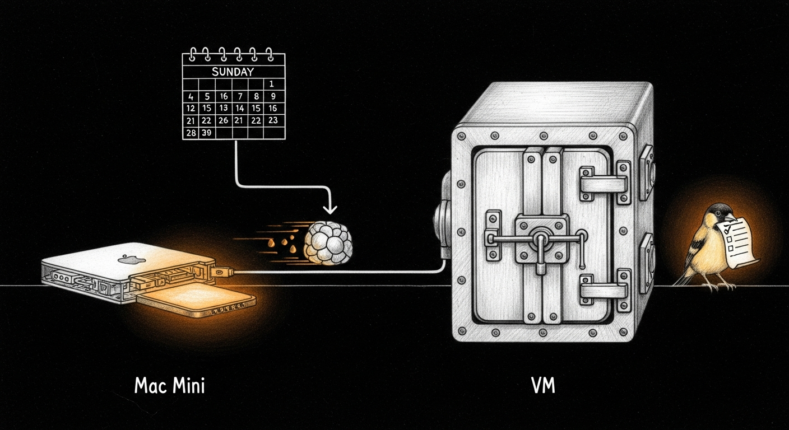

import { Aside, Steps } from '@astrojs/starlight/components';

The haus has two copies of openclaw: Mac Mini runs the orchestrator and CLI, the OpenClaw VM runs the gateway and council agents. Tonight the two were on different versions, with a third copy — the npm-global CLI shim on the VM — a version behind both. Two minor versions of drift between caller and callee silently eats agent config fields and throws `Unknown agent id "yoda"` at 2 AM.

By morning all three report `OpenClaw 2026.4.22`, a Sunday LaunchAgent keeps them that way, and a Monday LaunchAgent checks that the Sunday one worked. The whole thing respects the VM airgap — intentional, briefly mistaken for a NAT bug.

## The Starting Drift

Before the work: three openclaw installs across two machines, three different versions.

| Surface | Install path | Version |
|---------|--------------|---------|
| Mini CLI | `/opt/homebrew/lib/node_modules/openclaw` (npm-global) | `2026.4.14` |
| VM CLI | `/home/ubuntu/.npm-global/bin/openclaw` (npm-global) | `2026.4.11` |
| VM gateway | `/home/ubuntu/.openclaw/node_modules/openclaw` (pnpm-local) | `2026.4.14` |

The VM CLI was writing config with fields the 2026.4.11 CLI couldn't parse. Stale config warnings flooded the logs. `council-session.sh` invocations that went through the npm-global CLI would see a config that referenced agents the binary didn't understand, drop those fields as stale, then fail with `Unknown agent id "yoda"` — a bug that presented as "the council is broken" for most of the night before the version split was diagnosed.

The goal: get all three surfaces on the same version. Pick pnpm. Keep them that way.

## What Broke My Mental Model

Three moments tonight where my first instinct was wrong:

### 1. The VM isn't broken, the VM is sealed

First try at upgrading the VM CLI: `pnpm add -g openclaw@2026.4.22` errored `EAI_AGAIN: getaddrinfo registry.npmjs.org`. Diagnosed the NAT — ping Mini-bridge works, ping 1.1.1.1 100% loss. Was about to escalate "VM has lost internet."

Correction from Bert: **"The VM has no internet on purpose, that's why we use vm-push."** The VM is airgapped by design. `vm-push.sh` is the established pattern for pushing data out (VM git state → GitHub via Mac bundle). No symmetric pattern for pulling npm packages in — that was tonight's work.

<Aside type="note" title="For future-me and any LLM reading this">
If the VM ever "loses internet," check whether it's supposed to have it. Memory: `reference_vm_airgap_push.md`. Do not try to fix the NAT. Build a tarball push instead.
</Aside>

### 2. The council can't advise on how to build itself

Second instinct: convene the council on the delivery architecture — three options, a real A/B/C. Yoda, Quigon, Windu returned `[No response]`. Synthesis failed. Two issues compounded:

1. **LLM backend was down post-reboot.** `sanctum-mlx` on `:1337` listening but not serving; the LM Studio fallback referenced `qwen/qwen3.5-35b-a3b`, retired 2026-04-22. Both paths dead.
2. **`council-session.sh` hung on Yoda.** Script invoked `send.sh yoda yoda session high <prompt>` — Yoda processing a message addressed to itself. 27 minutes of thinking before I killed it.

Fixed in [`openclaw-skills a764146`](https://github.com/Ogilthorp3/openclaw-skills/commit/a764146): Yoda is always orchestrator and synthesizer, never a participant — the script now filters `yoda` out with a `NOTE` when callers include it out of habit.

### 3. The VM can't receive apt either

The Sunday script originally had an apt-upgrade branch. `apt install unattended-upgrades` hung resolving `ports.ubuntu.com`. Same airgap. The script now reports `VM: apt is intentionally airgapped — skipping upgrade`. A future apt-mirror on the Mini would change this, but it's not tonight's work.

## The Tarball Push

The delivery pattern that does work — and mirrors the shape of the existing `vm-push` for git state — is:

<Steps>
1. **Stage on Mini.** A throwaway `/tmp/oc-stage-<target>/` with a one-line `package.json` pinning openclaw to the target version, then `pnpm install --config.node-linker=hoisted --config.ignore-scripts=true`. Hoisted linker produces a flat `node_modules/` with no symlinks into the pnpm store — self-contained and portable.

2. **Tar + gzip.** 404 MB flat → ~101 MB compressed. Transferred to VM in ~1.1s over the bridge.

3. **Atomic swap on VM.** Stop the gateway. `mv node_modules node_modules.bak-$(date +%Y%m%d-%H%M%S)`. Extract the new `node_modules` into `~/.openclaw/`. Update `package.json`'s openclaw pin. Update `OPENCLAW_SERVICE_VERSION=` in both systemd unit files. Repoint the `/home/ubuntu/.npm-global/bin/openclaw` symlink at the new pnpm-local binary so tools hard-coding the npm-global path (council-router among them) transparently upgrade. Daemon-reload, restart, verify `is-active`.

4. **Prune.** Keep the last 2 `node_modules.bak-*` directories; delete older ones. Clean up the staging dir and the tarball on both ends.
</Steps>

<Aside type="caution" title="Why hoisted">
Default pnpm installs symlink into `~/.pnpm-store` for disk efficiency. Tarring a symlink farm and untarring it on another machine gives you broken links pointing at paths that don't exist on the target. `--config.node-linker=hoisted` produces a flat npm-style layout that tars and untars cleanly.
</Aside>

The script that does all of this lives at `~/.sanctum/bin/sanctum-sunday-upgrade.sh` on the Mini and is tracked in [`Ogilthorp3/sanctum-config`](https://github.com/Ogilthorp3/sanctum-config). It handles the Mini CLI upgrade via `pnpm add -g openclaw@$target`, then fires the tarball push for the VM, then runs `brew update && brew upgrade` on the Mini, then reports apt status on the VM without trying to upgrade.

## The Tripwires

Openclaw publishes roughly every 24–48 hours. "Stable" here means the `latest` dist-tag (no separate `stable` channel exists). Auto-upgrading to something published hours ago is a recipe for shipping regressions into production on a Tuesday morning.

Three gates must all clear before the openclaw step runs. If any fire, the openclaw upgrade skips; brew still runs.

| Tripwire | What it checks | Why |
|----------|---------------|-----|
| **Age ≥ 48 h** | `npm view openclaw time --json` | Community shake-out window. If it's been less than two days, defer. |
| **No blocking issues** | `gh issue list openclaw/openclaw --search "$version"` filtered for `crash\|regression\|broken\|revert\|cannot start\|boot loop\|unusable` | Someone might have filed a show-stopper against this exact version. |
| **Not deprecated** | `npm view openclaw@$version deprecated` | npm marks versions deprecated when they're actively being pulled. |

First real Sunday fires 2026-04-26 at 09:30 local. `2026.4.22` will be ~75 hours old by then (published 2026-04-23T14:21Z). Clears the age tripwire.

## The Monday Canary

`com.sanctum.sunday-upgrade-check` fires every Monday at 10:00. It reads yesterday's upgrade log (`~/.sanctum/upgrade-logs/<yesterday>.log`), filters the known-good WARN lines (the airgap-skip, the three tripwire skips for age/deprecation/open-issues), parses the `Final state` block, and verifies that Mini CLI, VM CLI, and VM gateway all report the same version. If anything is off, it fires a Signal alert via `send.sh jocasta yoda alert high` — fire-and-forget, detached with `nohup + disown` so the check itself never blocks on an LLM call.

<Aside type="note" title="Pattern alignment">
The Monday check is structurally identical to drift-sentinel, tommy, and council-integrity: local launchd, writes its own log, escalates via `send.sh`. No cloud dependency, no new secrets, matches the surrounding family.
</Aside>

Silent on success. Loud on any drift between the three surfaces or on any WARN line the filter doesn't recognize. Check script itself runs in 0.15 s — the alert's LLM inference happens downstream on its own timeline.

## Commit Trail

| Repo | Commit | What |
|------|--------|------|
| [`sanctum-config`](https://github.com/Ogilthorp3/sanctum-config) | `d066342` | Sunday orchestrator + launchd template |
| [`haus`](https://github.com/Ogilthorp3/haus) | `a53e1ec` | VM gateway bumped to 2026.4.22 via tarball push |
| [`sanctum-config`](https://github.com/Ogilthorp3/sanctum-config) | `7261787` | Narrow the apt sudo probe to match the NOPASSWD grant |
| [`sanctum-config`](https://github.com/Ogilthorp3/sanctum-config) | `59a7587` | Drop the apt-upgrade attempt — honor the airgap |
| [`sanctum-config`](https://github.com/Ogilthorp3/sanctum-config) | `fc0db9b` | Monday canary — `sunday-upgrade-check.sh` + plist |
| [`openclaw-skills`](https://github.com/Ogilthorp3/openclaw-skills) | `a764146` | council-router: skip Yoda as participant, fix self-addressed hang |

## What This Changes Going Forward

- **Weekly cadence.** Openclaw stays within one upgrade window of `latest` without manual `pnpm add -g`. If upstream ships a regression, tripwires catch it; if tripwires let a bad one through, the Monday canary catches drift between the three surfaces.
- **The airgap is honored by default now.** No script in the haus tries to reach public package mirrors from the VM. If a future workload needs that, it adds an explicit push channel, it doesn't open NAT.
- **The council can be convened again.** The self-addressed-hang is fixed, so future sessions on architectural A/B/C questions won't silently die on the first participant when Yoda appears in the participants list out of habit.
- **One new LaunchAgent pair joins the family.** `com.sanctum.sunday-upgrade` and `com.sanctum.sunday-upgrade-check`. Both bootstrapped persistently via `launchctl bootstrap gui/$(id -u)`, both logging into `~/.sanctum/upgrade-logs/`, both silent on success and loud only on anomaly. Not a new pattern — just another entry in the same book.
