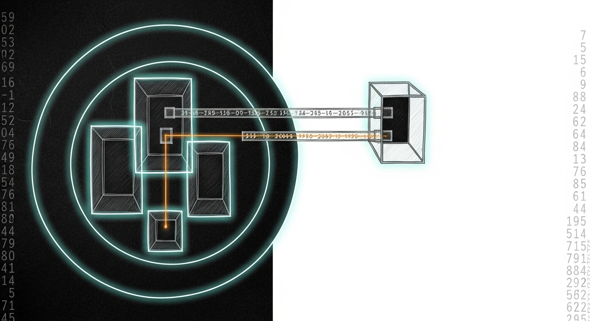

import { Aside } from '@astrojs/starlight/components';

The haus was honest when it broke. That's the only reason we caught it.

Friday night, Albert wanted TV with a friend over. The dashboard said his TV was unblocked; the TV said it wasn't. Force-Flow's `/screen/unblock` returned `{"status":"unblocked"}` whether or not the underlying Firewalla rules had taken. Albert watched no Netflix that evening, and that single visible failure pulled the thread on a much longer pattern: services that lie, state that accumulates without bound, and endpoints baked in as literals across a dozen files.

By Sunday night the haus had borders that mean what they say and edges that find their own services.

## Layer 1: honest API, bounded state

The Friday incident had three stacked causes. `/screen/unblock` reported success even when one MAC silently stayed at `acl=False`. `_block_services` created Firewalla DNS rules with no expiry, so 115 stale rules had accumulated on the Living Room MACs over six days. The 2026-04-18 "temporary" MAC-pause workaround had become permanent and itself drifted.

Layer 1 closed all three:

- Per-MAC verification on every block/unblock. Any drift returns HTTP 502 with a `failures` array; status string becomes `*_partial`. The dashboard can no longer be fooled by a half-success.
- Every `_block_services` call carries an `expire` fence — next wake plus an hour. If force-flow crashes between block and unblock, Firewalla auto-releases. Permanent stale-rule accumulation is structurally impossible.
- `_unblock_services` returns `{ok, cleaned, failures}` instead of blanket `True`. Fallback delete failures surface to the API.

Twelve new regression tests lock in the silent-failure paths. The deploy script snapshots before overwriting; revert is a single `cp`.

## Layer 2: closed-loop reconciler

Layer 1 made drift visible. Layer 2 made it close. Every 30s tick, Force-Flow compares its intended state (`_blocked_screens`) with observed state (Firewalla ACL polled via the bridge) and converges. Drift that persists more than 120s on a screen produces a single parent notification per episode. A nightly reaper at 04:00 sweeps DNS-block rules on managed MACs that no schedule currently calls for, and skips screens currently in `_blocked_screens` so it never deletes legitimate state.

When Firewalla is unreachable, the reconciler skips silently rather than alarming on a full outage; the bridge's own `/health` endpoint surfaces that.

## The trigger: a router reboot

Saturday afternoon, Albert's brother rebooted the upstream router because the basement PC felt slow. Manoir's Wi-Fi re-associated onto Bell directly instead of the Orbi mesh. Both networks default to `192.168.2.0/24` — same subnet number, different broadcast domain. ARP resolved cleanly, L3 traffic to the Firewalla didn't. The bridge had `192.168.1.1` baked into `group.json`, into the SSH-fallback host string, into a console.log line. Layer 1's honest API correctly returned 502 for hours, but the underlying cause was structural: every sanctum service had IP literals scattered through it.

## The doctrine: no hardcoded endpoints

Three artifacts shipped together to make literals impossible to introduce silently:

| Artifact | Role |
|---|---|
| `tailnet/topology.yaml` | Single source of truth — hosts (Tailscale MagicDNS), devices (mDNS), services (sanctum-bound), cloud (SaaS). Plus allowlist + migration_backlog. |
| `tailnet/audit-topology.sh` | Pre-commit / CI gate. Greps for IP literals, `.local` hostnames, well-known ports. Anything not allowlisted or declared fails the audit. |
| `sanctum-presence /resolve/<name>` | Centralized resolver. Reads topology, runs the discovery ladder (Tailscale → mDNS → cache → env), returns descriptor with attempts trail. 60s in-process cache. |

The Firewalla bridge had already gone adaptive earlier the same day — discovery via `firewalla.local`, then `firewalla.home`, then ARP-by-MAC, with auto-rediscovery on three consecutive SDK failures and a 60s no-success watchdog. Screen-time's Sonos TTS endpoint at `192.168.1.10:1969` was the first non-bridge migration: now resolved through `/resolve/sonos-tts`.

## Tailnet identity, four lanes

The old SSH posture — `authorized_keys` files, key sprawl, MBP-rebuild-loses-trust — became Tailscale-SSH-as-primary plus a Secure-Enclave cold failover. The tailnet ACL is now the source of truth for who reaches what:

| Tag | Members | Lane |
|---|---|---|
| `tag:sanctum-host` | manoir | server-class; mutually trusting; reaches satellites |
| `tag:sanctum-admin` | berts-mbp | dev box; silent SSH to host + satellite |
| `tag:satellite` | chalet | remote outpost; admin can reach freely; can only reach `:1949` + `:4077` back; cannot SSH back |
| `tag:family` | iPad, iPhone | parental-control PWA on `:4077` only; no SSH |

Five network rules, three SSH rules, and eight machine-checkable invariants in `tests` + `sshTests` that Tailscale runs on every save. SSH from the MBP to manoir is silent — the tag is the authorization. SSH from a freshly-rebuilt untagged Mac requires Touch ID via SSO every 12h (the `check` action). Containment is structural: a compromised satellite can register presence on `:1949` and read screen-time state on `:4077`. Nothing else.

## Six Tailscale HuJSON gotchas pinned

It took five save rounds to land the policy clean, Claude-for-Chrome driving the admin UI. The empirical findings are now in doctrine memory and worth listing for next time:

1. ACL must be saved before machines can be tagged (`tagOwners` definitions unlock the per-machine tag editor).
2. `sshTests` schema is asymmetric within itself — `src` is scalar, `dst` is `[]string`.
3. `ssh` action `check` rejects tags in `src` — only user identities can perform a biometric prompt.
4. Test assertion key must match the rule's action verb — a `check`-action rule needs `"check": [...]` in the test, not `"accept"`.
5. Empty `"accept": []` or `"deny": []` is rejected — assert default-deny with an explicit `"deny": ["bert"]`.
6. Tags persist for offline nodes — chalet was tagged while offline weeks earlier and the assignment held.

<Aside type="tip" title="Identity replaces keys, discovery replaces literals">
The two doctrines codified today are the same shape: stop encoding *where* and *who* as ground truth in source files; encode them once in a central artifact (tailnet ACL, topology.yaml) and let services resolve at the edge. The day a router reboots, a laptop is rebuilt, or a service moves, nothing structural is lost — the haus reconverges from the source-of-truth on its next tick.
</Aside>

## Cold failover

Secretive 3.0.4 holds an ECDSA-256 key inside the Mac mini's Secure Enclave. The public half lives in manoir's `authorized_keys` labelled `# sanctum-rescue 2026-04-26`; Touch ID required per use; the private half cannot leave the enclave. When the tailnet itself is dead, native sshd plus the SE key gets you in. One layer, no key files anywhere on disk.

## Whole / Next / Related

**Whole:**
- Layer 1 + Layer 2 deployed live on manoir; 71 screen-time tests + 13 resolver tests green
- Adaptive Firewalla discovery, SDK-call health tracking, log timestamps everywhere
- `tailnet/topology.yaml` + `audit-topology.sh` + sanctum-presence `/resolve/<name>` wired and clean
- Tailscale SSH primary path with four tags, eight rules, eight invariants; Secretive cold failover
- Six new doctrine memories pinned for future sessions

**Next:**
- Sanctum scripts inventory still has 24 Tailscale-100.x literals; migrate to MagicDNS names
- Rust port of screen-time + bridge once Layer 1+2 have soaked, per the language-maturity doctrine
- GitOps for the tailnet ACL — currently applied via admin UI; webhook deploy is the goal

**Related:**
- [Force-Flow](/architecture/force-flow/) — the screen-time enforcement service this rebuilds
- [Capacity Doctrine](/operations/feature-status-matrix/) — same closed-loop pattern at the host level
- [Language Maturity](/architecture/language-maturity/) — the rule deferring the Rust port until the abstractions soak
