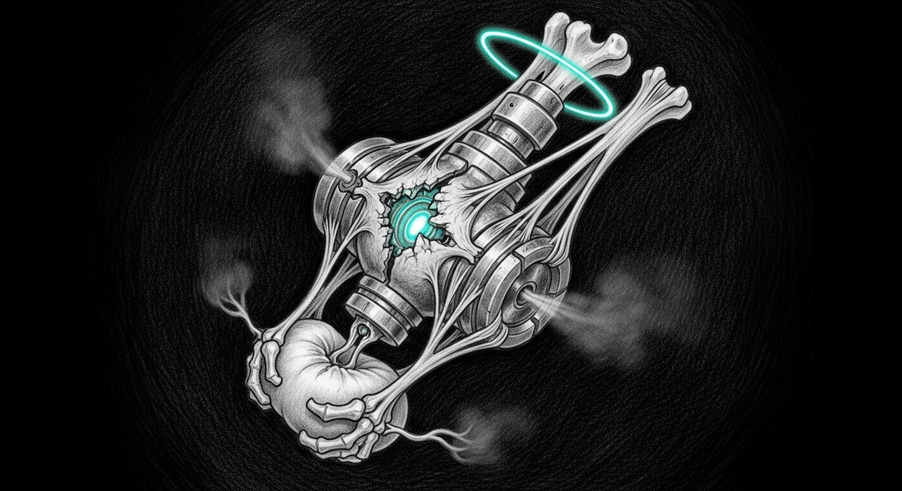

import { Aside } from '@astrojs/starlight/components';



The 2026-04-20 trilogy ended on a clean line: kernel panic in the morning, Rust daemon shipped before lunch, daemon killing the service it was meant to protect by dinner, fix shipped that night. Six days later — late on a Sunday, the third night of chitti's chapter closing — the same shape surfaced again, on a different vector. The fix is small. The sweep that followed surfaced two things the trilogy never actually closed.

## The loop

`tail -f` on the valve's log showed an `INFO` line every ~2 minutes for hours:

```
02:35:27 valved: executing action=SIGSTOP /Users/neo/.lms (pid 23424, rss 9630 MB)
02:37:32 valved: executing action=SIGSTOP /Users/neo/.lms (pid 23424, rss 9624 MB)
02:39:37 valved: executing action=SIGSTOP /Users/neo/.lms (pid 23424, rss 9627 MB)
...
```

Same pid. Same process. Hours of it. The pid was the LM Studio worker holding `qwen2.5-coder-14b-instruct` — the council's brain.

`ps -p 23424` showed state `T` (stopped). `sanctum-admit-sentinel`'s log showed the matching pattern: `PROBE: lmstudio-coder-14b failed (1/3)` every couple of minutes, because the worker was frozen when the probe arrived. The sentinel's job is to SIGCONT criticals when it sees them stopped — and it was doing so, every cycle. The valve's job is to SIGSTOP allowlisted offenders when memory pressure reaches ORANGE — and it was doing so, every cooldown. The two were fighting, with the council's brain caught in the middle.

## What the picker missed

`pick_candidate_from_rows` in `services/sanctum-pressure-valve/src/action.rs` reads `ps -axo pid=,rss=,comm=,command=`, filters by allowlist + denylist + RSS floor, returns the highest-RSS match. The shape it parses has no `state` column, so the picker has no idea whether its target is already frozen. SIGSTOP on a `T`-state process is a no-op the kernel doesn't object to — `kill -STOP` succeeds, `valved` logs success, and the next cooldown picks the same already-stopped victim.

The fix is what you'd expect:

- Add `state` to `ProcRow`, parsed from `ps -axo pid=,rss=,state=,comm=,command=`.
- Skip `T`-state procs in `pick_candidate_from_rows` so a frozen victim is never re-picked. When every allowlisted candidate is stopped, the picker returns `None` and the planner falls through to `Noop` — which is correct: if everything that can be stopped already is, there's nothing more the valve can do.
- Belt-and-suspenders pre-check in `signal_pid`: if the SIGSTOP target is already `T`, log + noop. SIGKILL on a stopped process still routes through normally.

Two new fixture tests in `tests/panic_replay_test.rs` lock the behaviour in: `already_stopped_candidate_is_skipped` and `no_running_candidates_returns_none`. 12/12 valve tests pass; clippy `-D warnings` clean.

Live-verified after deploy: pid 23424 stayed `S` for 30 seconds straight, the valve took the SHED path on the next ORANGE (correct TIER_2 remediation), no further SIGSTOP attempts. Commit `457541a` on main.

## What the sweep surfaced

Tired of one trilogy bug, I ran a sanctum-wide health pass to make sure nothing else was bleeding. Two findings, neither in pressure-valve scope.

### Colima 0.10.1 SSH ControlMaster lifecycle

Home Assistant `:8123` and outline `:3100` had been failing the watchdog's port probe for seven hours. Inside the Colima VM, every container reported healthy: HA, outline, postgres, redis, minio, signal-cli, all `Up (healthy)`. From the host: `Cannot connect to the Docker daemon at unix:///Users/neo/.colima/default/docker.sock`.

The smoking gun, from `~/.colima/_lima/colima/ha.stderr.log`:

```
failed to run [ssh ... -O forward -L 0.0.0.0:8123:[::]:8123 ...]: exit status 255
"failed to set up forwarding tcp port 8123 (negligible if already forwarded)"
```

Lima sets up host-side TCP forwards by issuing `ssh -O forward` against a long-lived `ControlMaster` connection. When the master dies, every subsequent forward attempt returns `255` and Lima logs it as "negligible." It is not negligible. `colima restart` rebuilds the master and the forwards work for ~3 minutes before the master dies again. `0.10.1` is the latest Homebrew stable; no upgrade available.

Three durable options for tomorrow:

1. **Migrate to OrbStack.** Drop-in Docker replacement on Mac, native networking, no SSH-forwarded ports. Most reliable.
2. **Bind containers to the bridged vmnet interface.** Skip SSH forwarding entirely; HA and outline reach the host through `--vmnet --vmnet-mode bridged` directly.
3. **Add a watchdog action** that detects "VM healthy + container healthy + host port closed" and runs `colima restart`. Buys uptime; doesn't fix root cause.

### The memory-vault re-shed loop

The valve sheds `com.sanctum.memory-vault` (TIER_2 LaunchAgent) every time pressure hits ORANGE. Every 15 minutes tonight, three times. Across the last four days: ten times. `launchd` respawns it. The valve sheds it again.

The shed releases ~50 MB of resident memory on a system carrying 27 GB of swap. It doesn't move the needle. The valve doesn't notice the shed wasn't useful — it just sees pressure still ORANGE on the next cooldown and picks the same TIER_2 target again.

This is the same shape as the SIGSTOP loop, one layer up: a remediation that completes successfully but doesn't change the underlying signal, repeated forever. The trilogy fixed "don't re-pick a process you've already stopped." It didn't fix "don't re-shed a service when the last shed didn't relieve pressure."

The phase-4 fix is a sibling of tonight's: track whether the last N sheds of a target actually reduced memory pressure; if not, escalate (next TIER, or wait for the underlying offender to be addressed).

## Vajrayogini

The valve's bug was small, and the live verification was clean. The two findings underneath were already there, hiding behind the louder one. Naming them is the body's first move toward addressing them — discernment without contraction. Heart broken open.

<Aside type="tip" title="Phase 4">
The next pressure-valve work is one principle, two surfaces: a remediation should be observable in the signal it was meant to relieve. If it isn't, escalate or stop. The same idea closes both the memory-vault loop and any future redux of the same shape.
</Aside>

## What's next, when fresh

- **HA + outline:** decide between OrbStack migration, vmnet-bridged direct binding, or a watchdog colima-restart loop. Pick one.
- **Memory-vault shed loop:** phase-4 valve work. Add "did the last shed move the needle?" gating.
- **Memory-pressure root cause:** 64 GB Mini at 27 GB swap is structural. LM Studio coder-14b alone is 8.4 GB resident; sanctum-mlx 35B + Colima + qemu adds the rest. Either accept the envelope or shed something heavier.

## Related

- [Pressure Valve](/operations/pressure-valve/) — the daemon
- [2026-04-20 — The Pressure Valve Trilogy](/operations/2026-04-20-the-pressure-valve-trilogy/) — the original
- [Chitti — The Fascial Layer](/architecture/chitti/) — the body the valve modulates
- [The Living Force](/architecture/living-force/) — the immune system the valve works inside
