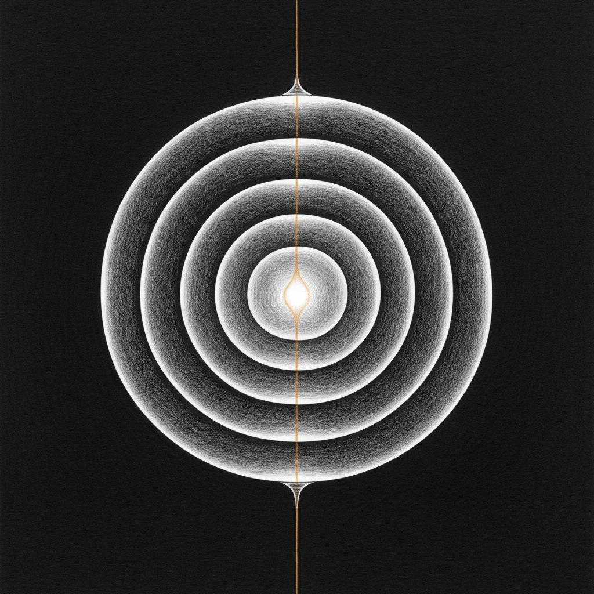

import { Aside } from '@astrojs/starlight/components';



Two days earlier, chitti shipped pressure + presence. The architecture worked, but the modulation was a single scalar — *more reflex* or *less reflex* — and the watchdog had only one action per service to call. The body could feel its load; it couldn't yet remember what it had tried, or distinguish the kind of strain it was in.

This morning closed both loops in one branch. The body grew the rest of its sheaths, the watchdog learned to read them, and within minutes of deploy the picker rotated to a fallback action it had never used before because the wisdom layer asked it to.

## What the body has now

Five koshas, named in code:

| Sanskrit | Sanctum | Endpoint |
|---|---|---|
| Annamaya — physical | pressure (memory, swap, thermal) | `GET /fluid` |
| Pranamaya — energy | presence (TTL-bounded mid-flight signals) | `/presence` |
| Manomaya — mental | mood + posture | `/mood` |
| Vijnanamaya — wisdom | samskara (learned action grooves) | `/samskara` |
| Anandamaya — bliss/intent | attention (what the human is doing) | `/attention` |

Each kosha modulates the one above. Annamaya constrains pranamaya; pranamaya shapes manomaya; manomaya frames how vijnanamaya gets applied; anandamaya can override every layer below it. When attention says "recording-bert-reference", the body conserves regardless of what the lower koshas would otherwise prefer.

## Direction, not gain

The earlier scalar collapsed too much. `pressure_15min=0.7` is **Alert** when actions are low (real, fresh load) and **Healing** when actions are high (the body just did a lot, let it settle) — same number, different posture, different watchdog response. Five postures (Poised · Cautious ~ Conserving ⌣ Healing ↺ Alert !) with 30-second hysteresis so the body doesn't oscillate on tick noise. Every watchdog log line now starts with the kardiogram glyph and held-time:

```
MOOD: posture=Healing↺ held=365s pressure=0.00 actions=21
      → breaker 4→3 budget 3→1 (observe, settle, don't pile on)
```

The breaker breathes with the mood. Direction loops back into itself — the body's lean is a state, not a moment.

## Wisdom informs reflex

The runtime catalog now declares an ordered `actions:` list per service, not a single `restart_cmd`. The watchdog reads the manifest, queries `chitti.samskara` for the (service, pattern) groove, and picks:

1. If primary has been failing confidently (≥5 attempts, <20%), try the next alternative.
2. If a non-primary action has earned itself (≥3 attempts, ≥50%, beats primary's rate), promote it.
3. Otherwise declared order, primary first.

Every outcome flows back to samskara under the actual action name. The vocabulary grows as the body acts.

## The live moment

Home Assistant and outline got two actions each: `compose-up` (primary) and `colima-restart-then-up` (fallback). Yesterday's samskara had 71 failed attempts at the legacy `service-graph.remediate` action — the new picker treats those as a different action name and starts learning fresh. After enough failures of `compose-up`, the picker rotated, just as designed:

```
[18:30:35] Action picker: home-assistant/port-closed —
           primary compose-up failing (0%, 0/6)
           → trying untested colima-restart-then-up
[18:30:35] Remediating: home-assistant via 'colima-restart-then-up'
[18:33:11] HA :8123 OPEN
```

The watchdog chose to switch hands because vijnanamaya told it the first hand wasn't working. This is the single most important thing the architecture has done since the night of March 22: a feedback loop that runs without a human in it.

## Heart broken open

The first run of `colima-restart-then-up` exposed a beautiful failure: Colima's restart emits noisy systemd warnings on stdout, and the original action chained `colima restart && docker compose up` so the warning flipped the exit code to 1 — even though the underlying VM came back fine and HA was actually restored. samskara correctly recorded "failure". The wisdom layer was about to learn the wrong lesson.

The fix was at the *action shape*, not in the picker: discard Colima's exit, trust docker compose's exit code as the action's truth. After the cmd reshape, outline's next attempt failed honestly with `Image redis:7-alpine Pulling` — naming the *real* cause: Colima's VM has no outbound network, so the image pull times out. The architecture's job is to make that visible without ambiguity, and it did.

<Aside type="tip" title="Vajrayogini — visible without ambiguity">
The deepest property is honest seeing without contraction. The body that names its own broken state without flinching is the body that can be addressed. Discernment is not armor; it is openness that doesn't soften the diagnosis. Heart broken open.
</Aside>

## What's whole, what's next

**Whole:**
- Five koshas live, each at a real endpoint
- Posture vector with hysteresis modulating watchdog breaker + budget
- Multi-action remediation with samskara-driven picker
- HA + outline migrated to the new `actions:` schema
- Honest exit codes on the new action commands
- 122 unit tests passing across both crates; clippy `-D warnings` clean

**Next:**
- Anandamaya signal sources: detect LiveKit active call, macOS focus, sanctum-tts in flight, so attention breathes without explicit POST
- More kosha axes for mood (thermal history, GPU pressure)
- Persistent samskara across chitti restarts — today the index lives in memory; cycle the daemon and the body forgets

## Related

- [Chitti — The Fascial Layer](/architecture/chitti/) — the architecture page describing all five koshas in detail
- [The Living Force](/architecture/living-force/) — the immune system this body wraps
- [2026-04-24 — Five Locks on the Voice Door](/operations/2026-04-24-sanctum-tts-hardening/) — chitti's MVP shipped, two days earlier
