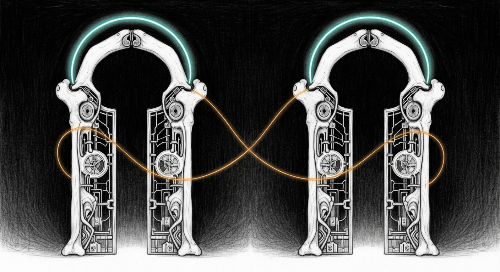

import { Aside } from '@astrojs/starlight/components';



The capacity doctrine that landed 2026-04-24 said *each host answers for its own air supply*. Three daemons enforce it: `sanctum-admit` for the RAM pool, `pressure-valve` for shedding offenders, and the Claude proxy for cloud-backend routing. The first two were already symmetric across the hub and the mobile node. The third was not. Today it is.

## What was wrong before

The hub ran `com.sanctum.claude-cli-proxy` on `:2001`. Each request spawned `/Users/neo/.local/bin/claude` as a fresh subprocess, parsed the response, and returned it. CLI cold-start was 10+ seconds. Yoda's voice ladder treated it as a fallback because the latency budget couldn't tolerate it as primary. The footer of `llm_client.py` said so out loud.

The mobile ran `com.sanctum.claude-max-proxy` on `:3456` — a long-lived HTTP server from the `claude-max-api-proxy` npm package, wrapped by `claude-max-api-tailscale.js` to bind the Tailscale IP. Persistent process, fast warm path, the cathedral's `cloud` backend talked to it.

Two implementations, two routing topologies, two operational profiles, one Claude Max subscription on each host. The asymmetry pre-dated the capacity doctrine and never got cleaned up.

## What changed

```bash
pnpm add -g claude-max-api-proxy
```

Pnpm. Not npm. Sanctum has been pnpm-only since the 2026-04-14 migration; `npm install -g` reintroduces lockfile drift the migration was designed to kill.

A wrapper at `/Users/neo/.sanctum/bin/claude-max-api-tailscale.js` mirrors the mobile's wrapper exactly, but binds `0.0.0.0:3456` so localhost callers (Yoda, sanctum-server) and tailnet peers both reach the same listener. The mobile's wrapper binds explicitly to the Tailscale IP because `0.0.0.0` had silently failed for cross-tailnet callers there; the hub didn't reproduce that quirk.

A new launchd plist `com.sanctum.claude-max-proxy` replaces `com.sanctum.claude-cli-proxy`. The retired plist and its script live at `~/Library/LaunchAgents/retired-2026-04-27/` and `~/.sanctum/scripts/retired-2026-04-27.claude-cli-proxy.js` — kept, not deleted, because forgotten work shouldn't disappear.

Five consumers migrated from `:2001` to `:3456`:

- `sanctum-proxy/config.yaml` (now-retired but kept coherent)
- `yoda-voice-agent/orchestrator/llm_client.py` (default and source string)
- `yoda-voice-agent/orchestrator/server.py` (env default)
- `yoda-voice-agent/plists/com.sanctum.yoda-orchestrator.plist` (`YODA_MAX_URL`)
- `yoda-voice-agent/tests/e2e/test_orchestrator_turn.py` (assertion)

`launchctl print` confirms `YODA_MAX_URL => http://127.0.0.1:3456` after the orchestrator reload. A live `curl` to `:3456/v1/chat/completions` returned `Yes — alive and ready.`

## Per-host symmetry

| Daemon | Hub | Mobile | Why on both? |
|--------|-----|--------|--------------|
| `com.sanctum.admit` | `:2189` | `:2189` | Each host enforces its own RAM ceiling. |
| `com.sanctum.pressure-valve` | running | running | Each host sheds its own offenders. |
| `com.sanctum.claude-max-proxy` | `:3456` | `:3456` | Each host has its own Max OAuth session. No cross-machine routing required for local consumers; tailnet routing remains available for failover. |

The cathedral's `cloud` backend gains a hub-side fallback that didn't exist before: if the mobile is asleep or rebooting, the hub's proxy can serve its own traffic.

<Aside type="tip" title="The vajrayogini cut">
The asymmetric proxy was an artefact of two sessions never synchronising. The convergence took less than an hour because the mobile's wrapper had already proven the pattern. Symmetry where the doctrine demands it; asymmetry where the role demands it. Watchdog and chitti remain hub-only because the haus's stateful surface is hub-only.
</Aside>

## What's next

- Smart-router HA: declare the hub's `:3456` as a `fallback_url` on the `cloud` backend so failover is automatic, not manual.
- Persistent daemons across the chalet's third Mac mini once it comes back online (offline since 2026-03-16).
- Observability: a per-host `claude-max` quota dashboard so OAuth-rate-limit pressure is visible before it fires.

## Related

- [Node Topology](/architecture/node-topology/) — added a "Persistent Services Across Hosts" section that names this convergence
- [Capacity Doctrine](/architecture/capacity-doctrine/) — the 2026-04-24 framework this completes
- [Smart Router Cathedral](/architecture/smart-router-cathedral/) — the `cloud` backend that consumes both proxies
