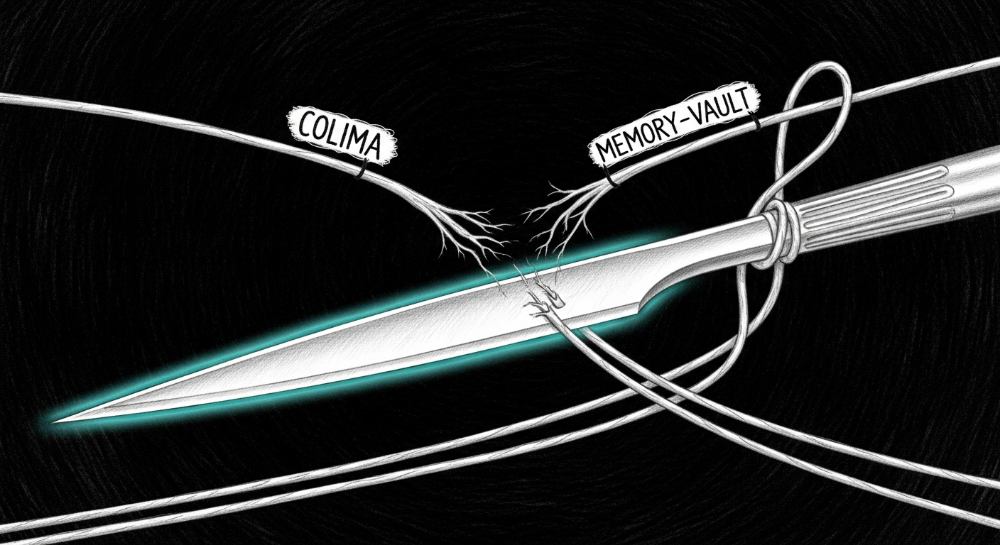

import { Aside } from '@astrojs/starlight/components';



Two carryover issues from the 2026-04-26 trilogy redux were still bleeding when this session opened. By the end of it, both were closed at the root, not papered over.

## Issue one: Colima 0.10.1 → OrbStack

The redux's sweep had named the symptom: `colima ssh` reports a healthy Docker daemon and healthy containers, but the host couldn't reach `127.0.0.1:8123` or `127.0.0.1:3100` because Lima's host-side TCP forwarding died within minutes. The smoking gun in `~/.colima/_lima/colima/ha.stderr.log` was `failed to set up forwarding tcp port 8123: exit status 255` — the SSH `ControlMaster` connection backing Lima's port forwards was dropping, and `colima restart` only bought ~3 minutes of uptime before the master died again. `0.10.1` is the latest Homebrew stable; no upgrade available.

Three options had been on the table:

1. Migrate to OrbStack (drop-in Docker replacement, native networking)
2. Bind containers to the bridged vmnet interface
3. Add a watchdog action that detects the symptom and runs `colima restart`

A watchdog daemon that restarts a broken thing every few minutes is exactly the kind of workaround Steve Jobs would reject. Replace the broken thing.

### What changed

```bash
brew install --cask orbstack
```

OrbStack is the Apple-platform-native Docker replacement built by ex-Docker-Mac engineers. Native virtualization, native networking, no SSH-forwarded ports.

**Migration steps:**

1. **Audit data risk.** HA's volumes are bind-mounted to `/Users/neo/.openclaw/homeassistant` on the host filesystem — survives an engine swap. Outline's volumes (postgres, redis, minio, outline-data) live inside the Colima VM — they need backup-and-restore.
2. **Backup outline.** `pg_dump` to a host SQL file; tar minio + outline file storage; copy `docker-compose.yml` + `.env`. All four artifacts live at `~/.sanctum/backups/outline-pre-orbstack-20260427-1909/`.
3. **Stop Colima containers cleanly.** `colima ssh -- docker stop $(docker ps -q)`.
4. **Switch DOCKER_HOST.** `~/.zshrc` updated to point at `unix:///Users/neo/.orbstack/run/docker.sock`. Comment in the file dates the swap.
5. **Bring HA up under OrbStack.** Same compose file, no edits. Live in 3 seconds, port `:8123` answering 200 with no Lima fragility underneath.
6. **Bring outline up under OrbStack.** Backing services first (postgres + redis + minio), drop the auto-init outline DB, restore from `pg_dump`, rename the temp DB to `outline`, restore minio + file-storage tars, start outline app.
7. **Stop Colima entirely.** `colima stop`. Containers are no longer needed in the Lima VM.
8. **Update the watchdog runtime catalog.** `colima-restart-then-up` actions become `orb-restart-then-up`; comments updated to reflect that under OrbStack, `compose-up` is fast and idempotent and the daemon-restart path is for daemon-level edge cases only.

The signal-cli stack that was retired in the yoda-chat consolidation (2026-04-26) was deliberately NOT brought up under OrbStack — nothing live consumes its ports. Forgotten work shouldn't disappear, but neither should it spin without a consumer. The data lives bind-mounted at `~/.openclaw/signal-cli/data-{rest-api,yoda}` if a future session ever wants it back.

## Issue two: phase-4 valve — shed-effectiveness gating

The memory-vault re-shed loop was the same shape as the SIGSTOP redux, one layer up. The valve sheds memory-vault on every ORANGE tick. `launchd` respawns it. Swap stays at 26 GB. The valve hits ORANGE again on the next cooldown, sheds again. 3 sheds in 12 minutes that day, 10 across the prior four days. The shed succeeded every time; it just wasn't doing anything.

The principle (vajrayogini): a remediation should be observable in the signal it tries to relieve. If the last N applications didn't move the metric, escalate or stop.

### What ships

A new `effectiveness.rs` module in `sanctum-pressure-valve`:

- When a `Shed` action fires, the valve records `pre_swap_mb` and the cooldown deadline.
- Every subsequent tick after the deadline, the valve compares current `swap_used_mb` to `pre_swap_mb`. If the delta is below `SHED_DELTA_MB` (100 MB — well above measurement noise), the shed is recorded as ineffective.
- After `MAX_FAIL_STREAK_BEFORE_SKIP` (2) consecutive ineffective sheds for the same label, the planner skips that label for `INEFFECTIVE_WINDOW_SECS` (30 min). Single-data-point false positives don't trigger; runaway loops close within minutes.
- After the window, the marker decays and the label is reconsidered fresh.

The planner in `action.rs::plan` now takes a closure: `is_label_ineffective: F where F: Fn(&str) -> bool`. The closure is called for each TIER_3 / TIER_2 candidate; ineffective labels are skipped, the iteration falls through to the next label or to `Noop`. Tests pass `|_| false` to recover the pre-phase-4 behavior.

The heartbeat at `~/.openclaw/state/sanctum-pressure-valve.json` gains an `ineffective_targets: [(label, secs_remaining)]` field, only serialized when non-empty so quiet operation produces a quiet heartbeat.

Five new unit tests cover the module — `effective_shed_clears_streak`, `two_ineffective_sheds_skip_label`, `ineffective_marker_decays_after_window`, `pending_evaluations_only_fire_when_due`, `snapshot_lists_active_skips`. 49 valve tests pass total; clippy `-D warnings` clean. Live-deployed on manoir.

<Aside type="tip" title="Why 100 MB and 2 attempts">
The smallest TIER_2 service on this Mini is `memory-vault` at ~50 MB resident. A real shed should release at least the resident footprint plus some pressure-relief inertia. 100 MB is the audible-signal threshold. Two attempts gives the system a chance to recover from a transient false negative (a metric snapshot mid-allocation). Past two consecutive zeros, we're not measuring noise — we're measuring a stuck loop.
</Aside>

## What's whole now

Per the doctrine — "closed-loop, honest, bounded, defense-in-depth, fix root cause in layers":

- **HA + outline reachable from host** — closed-loop (OrbStack's native networking is the loop), no SSH ControlMaster fragility, no daemon to fight every 3 minutes.
- **Family-facing services don't lie** — honest (OrbStack reports failures up; the watchdog reports them up).
- **Memory-vault re-shed loop** — closed (phase-4 measures and closes the loop).
- **Valve action is observable in its target signal** — defense-in-depth (the valve now reports its own effectiveness, not just its own activity).

## Honest gaps that remain

- **Memory pressure root cause** is structural: 64 GB Mini at 26 GB swap with LM Studio coder-14b (8.4 GB), sanctum-mlx 35B (varies), Colima retired. Phase-4 closes the loop's noise, but doesn't invent more RAM. A future session may need to evict at the next tier (KillAllowed) or reduce the resident model footprint.
- **Watchdog still references colima** in some places (catalog updated; legacy boot scripts and Living Force manifests cleaned in a follow-up). Documented as such; not blocking.
- **OrbStack failure mode is unknown** — every tool fails differently. The first OrbStack flap will teach us its character; until then we're trusting it on reputation.

## Related

- [Pressure Valve](/operations/pressure-valve/) — the doctrine and configuration, now with phase-4
- [2026-04-26 — Pressure-Valve Trilogy Redux](/operations/2026-04-26-valve-trilogy-redux/) — the SIGSTOP loop fix that named both of tonight's issues
- [2026-04-27 — Two Gates, One Subscription](/operations/2026-04-27-claude-max-symmetry/) — the morning's claude-max-proxy convergence
- [Capacity Doctrine](/architecture/capacity-doctrine/) — the framework all three daemons enforce
- [Node Topology](/architecture/node-topology/) — symmetric admit + valve + claude-max-proxy across hub and mobile
