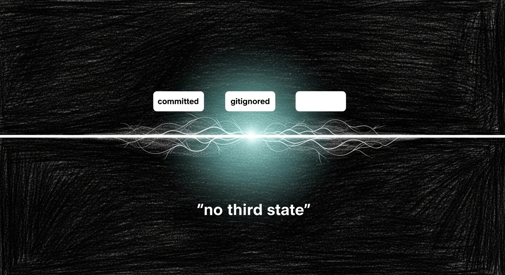

import { Aside } from '@astrojs/starlight/components';

The 2026-04-27 colima→OrbStack and pressure-valve phase-4 commits closed two long-running runtime gaps. They surfaced a deeper one: every tracked sanctum repo had been quietly accumulating untracked files for weeks. ~/.sanctum alone had 1,827 untracked items at the start of the cleanup. Most were rolling state (logs, metrics, build artefacts) that should have been gitignored from the start. Some were real new content that needed triage. A few were genuinely sensitive (a `voipms-secrets.sh`, an `api_key.py` from a vendored library) and should never be in git at all.

Cleaning each repo by hand is the wrong answer. The right answer is a permanent mechanism that catches drift on day one, not month two.

## The doctrine

> If it's not in git, it's either gitignored or it doesn't exist. No third state.

Untracked-but-not-ignored is a bug, not a tolerated background condition. The same shape as the pressure-valve trilogy redux: a thing that completes successfully ("untracked file added") but doesn't change the underlying signal ("no one knows about it"), repeated forever.

Three layers enforce the doctrine.

## Layer 1 — Canonical gitignore template

`~/.sanctum/templates/sanctum-gitignore.template` is the single source of truth for sanctum-wide ignore patterns: OS noise, editor state, Python build/runtime, pnpm/node_modules, Rust target trees, manual snapshots (`*.bak`, `*.pre-*`, `*.stale-*`), rolling runtime state (logs, metrics, audit), local databases, secrets (keys, env, credentials/, secrets/, .ssh, .aws), apple-platform local state. The block lives between two markers (`sanctum-gitignore-managed` begin/end) so per-repo additions remain intact below.

`~/.sanctum/scripts/sanctum-gitignore-sync.py` propagates the canonical block into every tracked sanctum repo's `.gitignore`. Re-running the sync replaces the block in-place — no duplication, no drift between repos. After today's first sync, the block is identical across all seven tracked repos.

## Layer 2 — Daily git-drift-sentinel

`~/.sanctum/scripts/sanctum-drift-sentinel.py` runs daily at 06:30 ET via `com.sanctum.git-drift-sentinel`. It walks every tracked sanctum repo, lists `git ls-files --others --exclude-standard`, and classifies each untracked path:

| Class | Triggered by | Outcome |
|------|-------------|---------|
| `sensitive` | basename matches secret patterns (`.env*`, `*.key`, `id_rsa`, `*api_key*`, `*secret*`, `credentials/`, `secrets/`, `.aws/`, `.ssh/`) — but excluding library paths (`node_modules/`, `site-packages/`, `vendor/`, `target/`, `.venv/`, `.cache/`, `.tox/`) | RED alert in `~/.sanctum/alerts.json`; exit 2 |
| `auto` | matches well-known auto-ignore patterns (`*.bak`, `*.stale-*`, `*.pre-*`, `node_modules/`, `__pycache__/`, `.DS_Store`, `**/target/`, `staging/`) — already covered by template, listed for awareness | logged, no alert |
| `review` | everything else — real new content the human must triage | yellow alert; exit 1 |

State at `~/.sanctum/state/git-drift.json`. Brevity-gated: a clean run prints one OK line and writes no alert. Drift produces a structured report.

The sensitive classifier is intentionally narrow at the basename level. `fastapi/security/api_key.py` is a vendored library file, not your secret — the `LIBRARY_PATH` exclusion catches it. A top-level `api_key.txt` is your secret — the `SENSITIVE_BASENAME` regex catches it. Both calls are right.

## Layer 3 — Refusal-grade pre-commit hook

`~/.sanctum/hooks/pre-commit` is the canonical hook. `~/.sanctum/scripts/sanctum-hooks-install.sh` symlinks it into every tracked sanctum repo's `.git/hooks/` (worktree-aware via `git rev-parse --git-path hooks`). Per-repo custom hooks aren't overwritten — the installer skips with a warning.

Behavior on every commit:

- Lists untracked files (`git ls-files --others --exclude-standard`).
- Sensitive matches → **refuse** with `exit 1`. Bypassable via `--no-verify` for emergencies; the bypass is intentional friction, not a back door.
- Other untracked → **warn** with the file list, but allow the commit. The warning is the prompt: "decide what these are."
- Library paths excluded as in the sentinel.
- Portable bash 3.x (macOS default ships without `mapfile`; the hook uses a read-loop instead).

Tested in a sandbox repo: `.env` refused with rc=1; `newfile.txt` warned with rc=0 and commit proceeded.

<Aside type="tip" title="Three layers, one doctrine">
The template prevents drift from accumulating; the sentinel surfaces what slipped through; the hook refuses the worst of it at commit time. The doctrine isn't enforced by any one of the three — it's the *combination* that makes "no third state" structural rather than aspirational.
</Aside>

## What changed in the repos

Seven repos now share the canonical gitignore block at the top of their `.gitignore`:

- `~/.sanctum`
- `~/.openclaw`
- `~/.openclaw/skills`
- `~/Projects/sanctum-rs`
- `~/Documents/Claude_Code/sanctum-docs`
- `~/Projects/openclaw-skills`
- `~/Projects/yoda-voice-agent`

The `~/Projects/yoda-voice-agent` repo dropped from 10,782 untracked files to 1 after the template covered `.tts-venv/`. The other six show only real triage candidates — content that genuinely needs a human verdict.

## What's next

- **Triage the surfaced backlog.** The first sentinel run flagged 309 files in `~/.sanctum`, 9 in `openclaw-skills`, 1 in `sanctum-rs`, 1 in `yoda-voice-agent`, and 1 sensitive (`voipms-secrets.sh`). Each needs a verdict: commit, ignore, or rm. The sentinel will keep flagging them until you decide.
- **Wire morning-briefing integration.** Today the alert lands in `alerts.json`; tomorrow it should fold into Yoda's dawn briefing so quiet days stay quiet and drift days surface as one terse line.
- **Watchdog manifest.** Add `git-drift-sentinel` to the watchdog's expected service list so it self-heals if the LaunchAgent fails to load after a reboot.

## Related

- [Pressure Valve](/operations/pressure-valve/) — the doctrine sibling: phase-4 effectiveness gating closes the same shape one runtime layer down
- [2026-04-27 — The Vajrayogini Cut](/operations/2026-04-27-the-vajrayogini-cut/) — the day before; the sweep that revealed the drift
- [Capacity Doctrine](/architecture/capacity-doctrine/) — same principle, capacity surface: each host answers for its own air
