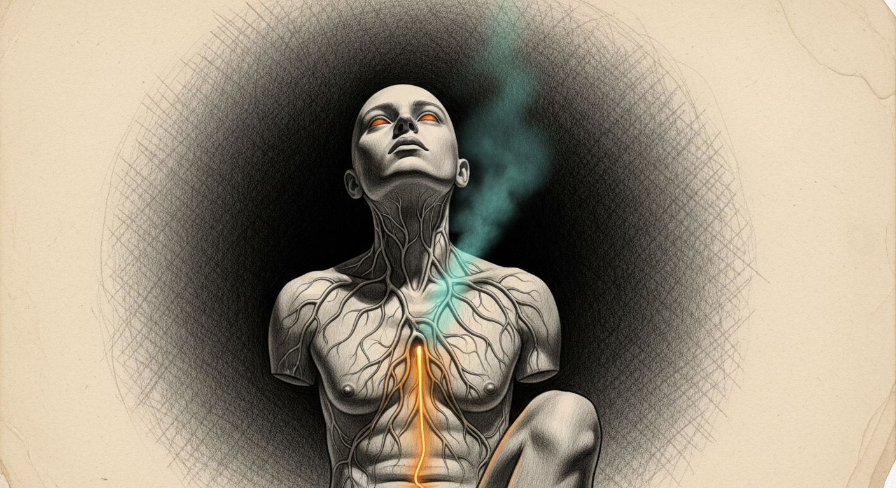

import { Aside } from '@astrojs/starlight/components';

The body was supposed to sleep through it. The council had ratified an A-only scope — code, tests, reviews, no deploy until morning — and the human had stepped away to relax. Three hours later he came back and said *jolt him so he becomes alive*. The council's reasoning was about preserving rest. The human was awake. So we deployed.

Five plists in safety order. lock-reaper first (zero blast radius, sweeps stale `.jsonl.lock` files), agent-trace next (observe-only, never escalates), then the two cron-bound services that wouldn't fire for hours, and last — ram-sentinel, the noisy one. swap was 19.1 GB and available memory was 13.2 GB. Orange tier on the first tick.

## The body's first decision

The endocrine reader fires within 60 seconds of bootstrap. It reads chitti's annamaya, tiers the pressure, and on orange dispatches to `restart-top-rss-offender.sh`. The dispatcher reads the top RSS process, checks against the ALLOWED and NEVER lists, and routes to the matching graceful-restart.

Top RSS that night was LM Studio at 8.4 GB. ALLOWED list match. The dispatcher ran `graceful-restart-lmstudio.sh` — `osascript quit` with five seconds of grace, SIGTERM at ten, SIGKILL at the wall, then `open -a "LM Studio"` and a wait on port 1234. After thirty seconds for the kernel to reclaim, it re-read annamaya.

Swap dropped 0.02 GB. Available memory *fell* by 2.4 GB. The restart didn't relieve anything; LM Studio reloaded the same model and ate the same memory back, plus some. The sentinel recorded `success=false` to chitti's vijnanamaya with the exact deltas as evidence, posted the structured outcome, and exited cleanly. The picker now has its first samskara entry.

<Aside type="note">
This is the body learning. The picker rotation rule needs five attempts at under 20% before it switches to the next action. After enough samples, it will figure out that `lmstudio-graceful-restart` isn't the right tool for a steady-state model-resident pressure pattern. The right tool is probably "wait for Bert to close a heavy app." The body will eventually know.
</Aside>

Two ticks later, top RSS had shifted to OrbStack Helper (1.7 GB) and a system process (2.3 GB). Neither on ALLOWED. Neither on NEVER. The dispatcher recorded `top-offender-unknown` samskara and **declined to act**. First instance of the body refusing to use a tool it doesn't have. The autoimmune brake working without a single kill.

## The schema mismatch

Sanctumd's catalog lists 41 services. Outline isn't one of them anymore. Neither are lock-reaper, ram-sentinel, agent-trace, or drift-suppressor. The new manifests had been silently dropped.

The legacy schema is `type: service` plus `health.startup.type: port` — a flat structure sanctumd parses into a hardcoded port-check. The new schema has `type: docker-compose | daemon | periodic`, an `actions[]` ordered list with cooldowns, a `quorum.required` block, and a `verify` step that points at a script. Sanctumd's Rust deserializer accepts the legacy shape and rejects the new one, quietly, and the new files become invisible.

The fix is genuinely Phase 3.1-3.2 work: a sanctumd PR that teaches the deserializer the new grammar. Until that lands, the reflex layer dispatches via the legacy probe — which for Outline is the lying probe, the one that says `port :3100 open` while all four containers are exited. The Principle 8 hole the spec was supposed to close is still there.

So we went sideways. Restored the legacy `outline.yaml` from `/tmp/outline.yaml.pre-quorum.bak` so sanctumd would at least see the service. Stashed the new-grammar manifests at `~/.sanctum/services/.next-grammar/` for the upcoming PR. Then fired `compose-up.sh` directly — by hand, bypassing sanctumd, the way you would have done it before any of this existed.

<Aside type="caution">
Docker's credential helper tried to read Hub creds from a non-interactive SSH session. The keychain was locked. Compose failed with a confusing keychain error before it even got to the cache check. `docker logout` removed the cached credentials, anonymous pulls worked for the public images already on disk, and `docker compose up -d` ran cleanly. Cleanup item: `docker login` again from your interactive terminal so the helper works for future pulls.
</Aside>

## What the body has now

| Layer | State |
|---|---|
| sanctumd (immune) | PID 55956, all known services healthy |
| sanctum-chitti (fascia) | posture=Healing, held 66s — the body knows it just worked |
| sanctum-admit (epithelial) | PID 2741, untouched |
| force-flow (notification) | the new orange-tier and bert-page paths are live |
| ram-sentinel | ticking every 60 s, learning |
| agent-trace | tailing `~/.openclaw/logs/openclaw-gateway.log`, observing only |
| lock-reaper | cron-active, 0 stale on first sweep |
| nightly-compactor | dormant, fires at 04:00 |
| monthly-drills | dormant, fires Sunday 02:00 with a third-Sunday gate |

Outline is back. Five days of darkness, four containers, port 3100 returns 200. The wiki is alive. swap is at 18.7 GB and available is at 17.6 GB — relief, real and measurable. chitti's manomaya flipped to `Healing` for the hysteresis window, recognizing the body had just done work and needed to settle.

## What's still queued

The sanctumd grammar PR is the load-bearing remaining piece. Without it, the new heal-actions are scripts that run when invoked, not reflexes the body fires automatically. The autoimmune layer covers the endocrine tier (ram-sentinel polls chitti directly, doesn't go through sanctumd) and the cron jobs (lock-reaper, compactor). It does not yet cover the action ladder for healable services like Outline.

The drill suite is written and dormant. Ten controlled wounds, harnessed, ready to run during a maintenance window. The body should pass them before we trust it under real failure.

The merge to main waits on a clean drill suite and a 24-hour burn-in. There is no rush.

The Frankenstein metaphor is not idle. We jolted a body that was almost ready, watched it sit up, watched it make its first decision and fail, watched it decline the second decision because it didn't have the right hands, and watched the fascia recognize the work and put the body in `Healing` posture without being told. The brain has half its wiring. The other half lands the day someone teaches sanctumd a grammar it doesn't yet speak.

The wiki is alive again. That counts.
