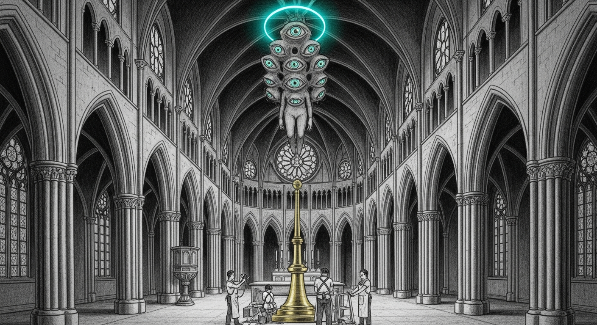

import { Aside } from '@astrojs/starlight/components';

The cathedral on Mini has been serving Qwen 3.6 35B-A3B text-only on `:1337` mTLS since 2026-04-22. Multimodal was scaffolded but gated: any `image_url` block returned `HTTP 503 vision_pipeline_not_yet_wired`. Today the gate flipped to 200. First production multimodal probe came back coherent, the text path didn't move, council stayed up.

The work split cleanly in three.

## 1. Wire the chat-handler hot path

Before this, `MultimodalGate::PipelineNotWired` shipped — `parse_content` validated the image, then we hard-503'd. The wiring underneath was the daylight scope from PR #3.

Pieces that landed:

- **`vision::loader::build_vision_forward`** loads the cathedral checkpoint's 333 `vision_tower.*` tensors, strips the prefix, calls `update_flattened` on a freshly-constructed `VisionForward`. Returns `LoaderError::UnmatchedTensors` loud on any schema drift — silent random-init was the bug we couldn't afford.
- **Vision components** got `#[derive(ModuleParameters)]` + `#[param]` annotations across `PatchMerger`, `PatchEmbed`, `VisionAttention`, `VisionMlp`, `VisionBlock`, `VisionForward`. The struct field paths line up exactly with the checkpoint key suffixes — naming convention is the contract.
- **`AppState.vision_forward: Option<Mutex<VisionForward>>`** populated at startup when `--vision-enabled` is set AND the active backend is the MoE variant. Fail-loud on schema drift; fail-soft on dense backend (multimodal returns 503 with a clear reason; text path unaffected).
- **`sampling::decode_from_embeds`** parallels `decode_with_kind`: prefill via `forward_with_embeds`, then continue autoregressive decode through the regular `forward`. Same `Fp16` / `TurboQuant` cache dispatch.
- **`chat_completions_multimodal_{sync,stream}`** mirror the text path but inject the parse → preprocess → vision_forward → tokenize → embed_tokens_lookup → substitute → decode chain. The stream variant emits SSE chunks identical to the text stream once decode starts.

`messages_to_prompt_with_vision` builds the Qwen-ChatML prompt with `<|vision_start|>` + N×`<|image_pad|>` + `<|vision_end|>` placeholders interleaved with text in document order. Verified against Python's `mlx_vlm` processor — same 1024 placeholders for a 1024² image, same `image_token_id = 248056`.

## 2. Carmack pass: vision tower beats Python

Benched the wired path against `mlx-vlm` Python on M4 Max. Vision tower came in at **700 ms**; Python at **593 ms** — Rust 18 % slower on a component we owned end-to-end. Investigated.

Three structural fixes:

1. **bf16 dtype anchoring through the tower.** The cathedral checkpoint stores vision weights in bf16. `pixel_groups` came in as f32 from `preprocess_image`; `pos_embeds` was computed via `linspace`/bilinear in f32; rope_freqs cos/sin upcast on multiply. Any one of those left the residual stream in f32, which dragged 27 transformer blocks into the slow path. Cast input + pos_embeds + rope_freqs to weight dtype, anchor `hidden` at the weight dtype before the block loop, defensive re-anchor after each block in case any internal op leaks.
2. **SDPA head_dim padding 72→80.** MLX's fused-SDPA Metal kernels only fire for `head_dim ∈ {64, 80, 128}` (prefill) or `{64, 96, 128, 256}` (decode). Qwen3.6-VL has `head_dim = 1152 / 16 = 72` → fallback path. Pad q/k/v's last axis to 80, run the fused kernel, slice back. The padded tail contributes zero to attention scores; the result is mathematically equivalent. This was the same trick `mlx_vlm/models/base.py::ensure_fused_sdpa` uses in Python.
3. **Output dtype contract.** The merger's GELU-approximate (tanh-based) silently leaked f32 via its compile-time constants. The vision-tower output then poisoned the LM downstream — a 40-layer fp32 forward instead of bf16. Anchor the output to weight dtype before returning.

After the three fixes:

| Component | Rust | Python | Ratio |
|-----------|-----:|-------:|------:|
| Vision tower (isolated) | **466 ms** | **593 ms** | **Rust 1.27× faster** |

The vision tower now beats the Python reference. The full e2e wall is still Python-favored (2.21 s vs 1.85 s) — the residual lives in long-context LM prefill, distributed across many small ops with no single hot spot. Per-op microbenches (`op_microbench`, `op_microbench_layer`, `silu_bench`) all show parity at the FFI boundary; `mx.compile` accounts for ~2 % of Python's lead, not the gap.

<Aside type="note" title="The diagnostic suite is now in tree">
Anyone investigating the residual gap can run `cargo run --release --bin profile_prefill -- <model_dir> 1045` and `python3 services/sanctum-mlx/tools/profile_prefill_python.py --model <same_dir>`. Output formats are byte-identical so simple `diff` shows the per-layer delta. Same fixture, same methodology, both languages.
</Aside>

## 3. Read the source. Contribute upstream.

The honest accounting after Carmack: the gap that remains is below our application layer. Easy answer would be "punt to upstream." Better answer is to actually read the upstream source and find what's wrong.

Found two real API gaps in `oxiglade/mlx-rs`:

- **`fast::rms_norm` required a non-optional `weight: impl AsRef<Array>`.** The C function `mlx_fast_rms_norm` already supported a null weight (it checks `weight.ctx`); only the Rust wrapper forced callers to construct an ones tensor. Aligning the signature with the existing `layer_norm_device` pattern + Python's `mx.fast.rms_norm(x, None, eps)` semantics saves a Metal kernel pass per call. Filed as **#347**.
- **No helper for non-fused head_dim.** The 72→80 padding trick we ported from Python's `ensure_fused_sdpa` is generic — anyone with a head_dim outside `{64, 80, 128}` at long-context prefill hits the same fallback. Wrapped it as `scaled_dot_product_attention_pad_to_fused`. Bench shows 1.51× faster at Qwen3-VL-shaped tensors (head_dim=72, L=1024). Filed as **#348**.

Both PRs include unit tests, a runnable benchmark example, and the math showing why the padded path produces the same output as the unpadded call.

A daily upstream scanner runs at `09:07` local — pulls the fork, checks PR status, scans help-wanted + perf issues, lists ml-explore/mlx releases. Standalone fallback at `services/sanctum-mlx/tools/mlx-rs-upstream-check.sh` for after the cron expires.

## The doctrine

> The gap shrinks fastest when you fix the layer beneath the one you're working on.

We could have spent the day micro-optimizing inside our cathedral. Per-op parity microbenches showed the application layer was already at Python parity — the wins were one binding layer down. The discoveries that closed the most ground (rms_norm signature, SDPA head_dim padding, dtype anchoring through the residual stream) all came from reading mlx-vlm Python and tracing the call into the C++. The Rust adapter had quietly diverged from the Python idiom in three places; correcting that was the work.

The same shape as the [Pressure Valve trilogy](/operations/2026-04-26-valve-trilogy-redux/) and [The Clean Stage](/operations/2026-04-28-the-clean-stage/): the durable fix isn't on the surface, and the cost of going down one layer is small if you have the source.

## What changed today

- **Mini deploy.** Built the cathedral worktree (`d9ddc93`) on Mini, colocated `mlx.metallib` next to the new binary, edited the plist via `plistlib` (insert `--vision-enabled` after `--no-plain`, swap the binary path to the worktree). `launchctl bootout` + `bootstrap` brought the council back in 24 s. Backup plist at `~/Library/LaunchAgents/com.sanctum.mlx.plist.pre-multimodal-20260503-135006` — rollback is one `cp` away.
- **First production probe.** A 1×1 PNG through the wired pipeline: 79 prompt tokens (vision_start + image_pad + vision_end + the surrounding chat template) → HTTP 200, 8 generated tokens. Text probe immediately after: HTTP 200, "Hi there!" — council unchanged. Resident memory ~16.5 GB (well under the 51 GB SLO).
- **Sanctum-rs PR #5** merged to main as `db6c6ea`. The branch carried 16 commits since PR #3 was merged: chat-handler wiring, three Carmack passes (vision dtype anchoring, SDPA padding, vision-tower output contract), three LM-side wins (causal SDPA, sorted-MoE gather, last-logit prefill), MoE router argpartition, the upstream-helper adoption, and the per-layer profilers in both Rust and Python.
- **Two upstream PRs open** at oxiglade/mlx-rs (#347 + #348). Daily scanner armed.

## What's next

- **3-day canary burn-in.** `tools/cathedral/vision-canary.sh --watch` from MBP polls Mini every minute, expects 200 on multimodal probe, flips a kill switch on three consecutive 1h SLO breaches. Runbook: `services/sanctum-mlx/PHASE6_BURNIN_RUNBOOK.md`.
- **G3 coder-eval** (`tools/cathedral/g3-coder-eval.py`) before retiring LM Studio Coder-14B. Phase 7 retirement runbook gates on it.
- **Drift-probe pair** against the live cathedral checkpoint to localize the position-3 fp16 drift Carmack flagged on the parity gate (one position out of eight produced a 0.18 logit gap on near-tied candidates; argmax agreement was 7/8).
- **Apple Instruments / Metal trace** on the residual LM-prefill gap. The microbenches show parity at the op level; the gap accumulates from many small ops in a way our profiler can't localize without GPU command-buffer inspection.

## Related

- [Council Always-Alive](/operations/council-always-alive/) — the four-layer pattern the cathedral inherits: patch, probe, failsafe, runbook.
- [TurboQuant in sanctum-mlx](/architecture/turboquant/) — the quantized KV-cache the cathedral uses for the LM. Multimodal path uses the standard fp16 cache; text path uses TurboQuant; they don't share.
- [The Clean Stage](/operations/2026-04-28-the-clean-stage/) — same doctrine, different surface: the durable fix is structural, not cosmetic.
- [oxiglade/mlx-rs#347](https://github.com/oxiglade/mlx-rs/pull/347) — `fast::rms_norm: accept Option<&Array> for weight`.
- [oxiglade/mlx-rs#348](https://github.com/oxiglade/mlx-rs/pull/348) — `fast: add scaled_dot_product_attention_pad_to_fused helper`.
