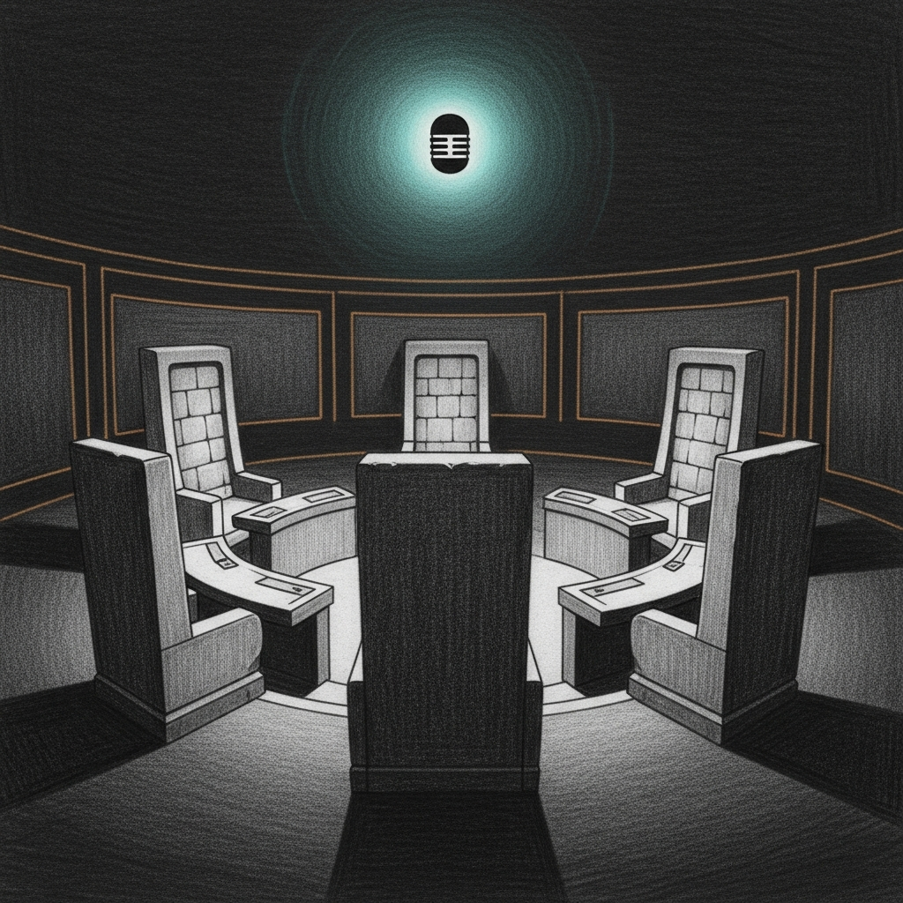

import { Aside } from '@astrojs/starlight/components';



Today the council went mute. Not from a bug — from architecture. `ask-council.sh` tunnels mTLS into `council-mlx` on `:1337`. `council-mlx` is the cathedral. The cathedral was the broken thing. The silence wasn't a failure of the council; it was the system asking its operator to operate without it.

The arc ran from 11:44 EDT, when the first multimodal request after a clean rebuild trip-wired a Metal validation error, to 22:11 EDT, when PR #6's kill-switch consumer finally validated end-to-end on a recovered binary. Three latent SSH/sudo bugs in our own recovery tooling surfaced one at a time as we tried to fix the regression. Each one closed permanently.

## 1. The rebuild that broke

This morning's deploy carried two things on top of `feat/cathedral-phase-2b-3-4`: a cherry-pick of [PR #6](https://github.com/Ogilthorp3/sanctum-rs/pull/6)'s kill-switch consumer (`c0ead27`), and the underlying perf commit `d9ddc93` ("scaled_dot_product_attention_pad_to_fused upstream helper") that had landed on the cathedral worktree last week. `cargo build --release` produced a 29.8 MB binary at `~/Projects/sanctum-rs-cathedral/target/release/sanctum-mlx`. `strings | grep -c cathedral-vision-disable` returned 1. The kill-switch consumer was in the binary.

11:44 EDT, first multimodal request after the rebuild:

```
-[_MTLCommandBuffer addCompletedHandler:]:1011: failed assertion
   `Completed handler provided after commit call'
```

The crash was deterministic. Each cathedral PID served three to seven multimodal requests with progressively worse latency — 200 ms prefill drifting to 5.6 s, 70 tok/s falling to 0.13 — before tripping the Metal assertion and dying. `launchd` respawned. Four cathedral PIDs in three hours.

Diagnosis took five minutes of `git show --stat`. `d9ddc93` modified `services/sanctum-mlx/src/vision/forward.rs` (vision-tower forward) and `vendor/mlx-rs/mlx-rs/src/fast.rs` (Metal command-buffer code path for fused SDPA). The error fires on `addCompletedHandler` after `commit` — exactly the kind of ordering invariant a refactor consolidating "encode + commit + register handler" sequences could miss. Prime suspect locked.

## 2. The recursive failure

Bert had to leave at the worst moment. The authorization that came with him out the door was three sentences: ask the council, make this Apple-grade and military-grade, work autonomously.

`tools/ask-council.sh "..."` returned a JSON decode error. The tool tunnels into `council-mlx` on `:1337`. `council-mlx` is the cathedral. The cathedral was the broken thing.

This is a property of the design, not a bug in the tool. Routing the council through the same process that hosts every other capability is what makes the council fast and trusted — and what makes it the first thing to go silent when that process fails. There is no second voice. The recursive sentry, when it falls, falls in mid-question.

Standing rules took over: durable fix only; nothing deployed without operator authorization; fix the layer underneath rather than the surface; document everything for the operator's return.

## 3. The surgical revert

Branched off `c0ead27` (the kill-switch cherry-pick), reverted `d9ddc93` only. Kept `e86eda9` (sibling perf commit, smaller signature change, doesn't touch the SDPA path) so the bisect signal stays clean if the regression recurs against any future build that drops the revert without dropping the sibling.

`cargo build --release -p sanctum-mlx`: 26 s incremental. `strings`-positive for `cathedral-vision-disable` — kill-switch consumer preserved. PR opened against `feat/cathedral-phase-2b-3-4` as [#7](https://github.com/Ogilthorp3/sanctum-rs/pull/7). `tools/cathedral/cathedral-recover.sh` written for the deploy. Hand-off doc at `docs/superpowers/notes/2026-05-07-autonomous-recovery-handoff.md`.

## 4. Three bugs below

The fix shipped clean. The deploy script didn't. Each iteration surfaced a bug latent since the recovery tooling was first written.

| # | bug | symptom | fix |
|---|---|---|---|
| 1 | `ssh "$MINI" "sudo …"` without `-t` | Sudo can't prompt — silently exits non-zero with "a terminal is required". Script printed PASS because exit code was unchecked. Cathedral never restarted. | Single `ssh -t` argv form, all sudo calls in one TTY so `tty_tickets` cache is shared. |
| 2 | `ssh -t … bash -s <<HEREDOC` | OpenSSH refuses `-t` when stdin is piped. Forced with `-tt`, sudo can't read its password from the same stdin that's already feeding the shell the script. | scp-then-bash-file pattern: ssh #1 pipes script to `cat > /tmp/script.sh`, ssh #2 runs `ssh -t bash /tmp/script.sh`. Sudo's stdin is the user's real terminal. |
| 3 | `set -o pipefail` plus `strings $BIN \| grep -q str` | `grep -q` exits 0 immediately on match. `strings` then takes SIGPIPE (exit 141). With `pipefail`, the pipe's exit is the rightmost non-zero — 141. The `if !` inverts to true. False negative on a check that was actually finding the string. | `grep -aq str "$BIN"` — direct file read, no pipe, no SIGPIPE possible. |

Each fix was committed with the diagnosis in the message body. The patterns are now codified in `cathedral-recover.sh` and `kill-switch-e2e.sh`; any future tool in `tools/cathedral/` that needs interactive sudo on Mini will find both shapes already established.

## 5. Validation

8/8 PASS at 22:11 EDT. Marker present, restart, log line:

```
WARN sanctum_mlx::server: Cathedral vision kill-switch present —
  forcing vision_enabled=false. Remove the marker and restart to
  re-enable vision.
  kill_switch=/Users/neo/.sanctum/cathedral-vision-disable
```

That's the WARN the consumer in `server.rs` emits. Vision tower NOT loaded. Marker removed, restart, vision tower loaded, no kill-switch WARN. Forensics sentinel captured both PID transitions (`38804 → 9207 → 11437`). PID 11437 is current, vision ON, multimodal probe `200` in 1.2 s, second probe `200` in 0.4 s — no degradation pattern. Text probe `200` in 1.0 s. No Metal assertion in the log. The d9ddc93 revert closed it.

[PR #7](https://github.com/Ogilthorp3/sanctum-rs/pull/7) merged as squash `7410689`. Burn-in clock restarted 22:19 EDT. 72 h gate Sunday ~22:19 EDT. Cloud reminder armed for Sunday 22:45 EDT (gate plus 30 min review buffer).

## 6. The doctrine

> The recursive sentry, when it falls, falls in mid-question. The fallback path is the test, and it runs whether you wanted it to or not.

The council's silence was a feature, not a bug. The recursive routing forced first principles — read the diff, name the suspect, revert one commit, build, validate, document — and exercised every tool that didn't depend on the cathedral. The fallback path *is* the test of the standing rules.

Three latent bugs in our own recovery tooling surfaced under load. They weren't authored today; they had been quietly waiting since the scripts were first written, exercised paths that hadn't been run together before. Apple-grade isn't "no bugs ship." It's "every bug that ships is caught, traced, fixed durably, and codified so the same shape can't trip you twice." Today three did.

## What's next

- 72 h burn-in: gate Sunday ~22:19 EDT. `tools/cathedral/burn-in-verdict.sh` runs the five-criterion check.
- Phase 7 G3 (Coder-14B parity → LM Studio retirement) if the gate passes.
- `e86eda9` is the next bisect target if the Metal misuse ever recurs against a build that doesn't have `d9ddc93`. So far, no recurrence.

## Related

- [The Reboot Reveals](/operations/2026-05-07-the-reboot-reveals/) — same day, the haus-daemon-layer story. The 04:25 reboot that started this exposed seven latent bugs in the gui-session-dependent service stack and triggered four waves of LaunchDaemon promotion. The cathedral binary regression covered here is independent of (and ran in parallel with) the doctrinal cleanup covered there.
- [The Cathedral Sees](/operations/2026-05-03-the-cathedral-sees/) — `d9ddc93` was adopted there with claimed parity wins. Today it shipped a regression that crash-looped the cathedral. Both observations are true; the regression was rare and caught by the next deploy.
- [Council Always-Alive](/operations/council-always-alive/) — the four-layer pattern (patch + probe + failsafe + runbook). The kill-switch consumer is the failsafe; today proved the whole stack works end-to-end.
- [Ogilthorp3/sanctum-rs#6](https://github.com/Ogilthorp3/sanctum-rs/pull/6) — kill-switch consumer (validated 8/8 today).
- [Ogilthorp3/sanctum-rs#7](https://github.com/Ogilthorp3/sanctum-rs/pull/7) — `d9ddc93` revert (merged today).
