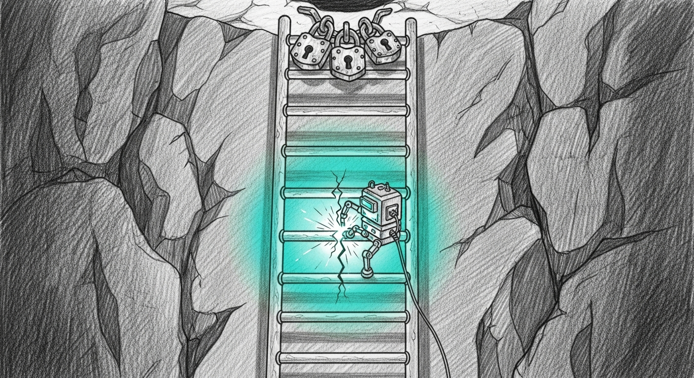

import { Aside } from '@astrojs/starlight/components';




Six nights in a row, the autoresearch nightly fell in the same hole. April 29 through May 5 — every fire identical: launch at 1am, OOM at iter 1, post-flight breadcrumb, no rows added to `results.tsv`, no learnings, eight GPU-hours wasted. The fix on May 7 stopped the silent failure mode by adding a post-flight delta check, but it didn't change the underlying problem: there was no actual research loop. `train.py` carried fixed hyperparameters at the top of the file. `experiment.sh` ran train → eval → keep/revert with the same shape every time. `run_overnight.sh` ran two of those, back-to-back, with the same config.

Today autoresearch becomes autoresearch.

## The hardcoded nightly that wasn't

The bug wasn't the OOM. The bug was that an OOM produced no learning. If iter-1 fails on a given config, the right behavior is to mark it dead, pick a safer rung, and burn the rest of the night exploring. The old loop's right behavior was: print a banner, wait 30 minutes, do the same thing again. It was a loop, not a search.

The shape we needed:

| | v1 (yesterday) | v2 (tonight) |
|---|---|---|
| Configs per night | 1 (same) | up to 4 (different) |
| OOM behavior | Print, retry same config | Mark dead, back off, retry safer |
| Failure recovery | Manual diagnosis morning-after | Self-heal in-flight |
| Cross-night memory | Whatever's in commit log | `dead_configs.tsv` blacklist |
| Time budget | 8h, no Phase 2 separation | Phase 1 (7h) + Phase 2 (40m eval) |
| Hard stops | None | 3 consecutive OOM slots → abort |
| Eval cadence | After each train (40min/4 = 16% of night) | Batch at end (10% of night) |

## The ladder

Nine rungs, ordered safe → aggressive, each varying one knob from a curated baseline:

```python
LADDER: list[Cfg] = [
    Cfg("safe-baseline",   rank=16,  alpha=32,  lr=5e-6, iters=800,  max_seq=1280, batch=1, grad_accum=4),
    Cfg("more-iters-1200", rank=16,  alpha=32,  lr=5e-6, iters=1200, max_seq=1280, batch=1, grad_accum=4),
    Cfg("rank-32",         rank=32,  alpha=64,  lr=5e-6, iters=800,  max_seq=1280, batch=1, grad_accum=4),
    Cfg("rank-32-iters",   rank=32,  alpha=64,  lr=5e-6, iters=1200, max_seq=1280, batch=1, grad_accum=4),
    Cfg("rank-64",         rank=64,  alpha=128, lr=5e-6, iters=800,  max_seq=1280, batch=1, grad_accum=4),
    Cfg("higher-lr",       rank=16,  alpha=32,  lr=1e-5, iters=800,  max_seq=1280, batch=1, grad_accum=4),
    Cfg("longer-seq",      rank=16,  alpha=32,  lr=5e-6, iters=800,  max_seq=2048, batch=1, grad_accum=4),
    Cfg("rank-128",        rank=128, alpha=256, lr=5e-6, iters=800,  max_seq=1280, batch=1, grad_accum=4),
    Cfg("aggressive",      rank=64,  alpha=128, lr=1e-5, iters=1200, max_seq=2048, batch=1, grad_accum=4),
]
```

The picker walks this list forward — first un-blocked rung wins. The `back_off_for_memory` walker walks it backward when an OOM hits — first rung where all four memory-pressure knobs (rank, max_seq, batch, grad_accum) are weakly smaller. None of this is Bayesian. None of it is neural-architecture-search. It is a static curated table that an operator can edit in twenty seconds, plus an algorithm that picks intelligently from it.

## The picker that won't blacklist what isn't its fault

This is where the smoke caught the real bug.

The first design wrote every failure into the cross-night `dead_configs.tsv`. OOM, sure. PYTHON_CRASH, sure. But also `BUDGET_HIT` — meaning when a slot ran out of training time without producing an adapter, the rung that was training got marked permanently dead. Run that on `safe-baseline` once, and `safe-baseline` is removed from the ladder forever. The picker walks the ladder, can't find safe-baseline, picks `more-iters-1200` instead, that hits BUDGET_HIT too, also blacklisted. By the third night, the ladder is empty, the search loop returns None, and the autoresearch nightly does no work — silently, with no error.

The smoke ran `safe-baseline` at a 45-minute budget specifically to verify the orchestration end-to-end. It hit BUDGET_HIT at iter 46 (during the val pass, ten iterations short of the first save_every). The slot exited cleanly per spec. And the `dead_configs.tsv` had `safe-baseline` listed.

Wrong. BUDGET_HIT is not the rung's fault. It's the orchestration running out of time. The fix:

```bash
# Record DEAD class in cross-night dead_configs.tsv ONLY for failures
# attributable to the rung itself. BUDGET_HIT (orchestration ran out of
# time) and MISSING_LOG (tee/race) are NOT the rung's fault — blacklisting
# them across nights would brick rungs the next overnight should still try.
case "$failure" in
    BUDGET_HIT|MISSING_LOG)
        echo "[slot] Skipping cross-night dead_configs write for $failure (not rung's fault)."
        ;;
    *)
        # ... write to dead_configs.tsv ...
        ;;
esac
```

Without the smoke, this would have shipped to production tonight, and within three nights the system would have been silently no-oping. The post-flight breadcrumb would have caught it on the morning briefing — but only after three nights of wasted launchd fires.

## Two phases, one budget

The other shape change: train and evaluation now run in separate phases.

In v1, every train was followed immediately by its own evaluation pass. Train, eval, decide, restart — fifty-two minutes per loop, of which ten are eval. With four loops a night, that's forty minutes of evaluation. Eight percent of the eight-hour window doing GPU-bound scoring instead of GPU-bound training.

In v2, Phase 1 is up to four train slots back-to-back, each 90 minutes, with a 7-hour cap. Phase 2 is one evaluation pass per adapter that produced a `pending_eval_step.json` breadcrumb. The breadcrumb is dropped by `train.py` after a clean train; eval discovers it via a glob over `adapters-experimental/*/pending_eval_step.json`. Idempotent re-runs skip already-scored adapters because the breadcrumb is removed when scoring lands.

The total wall-clock for the eight-hour window stays constant. The fraction spent on training goes from 84% to about 90%.

## The 3-OOM ceiling

Hardware can drift. Metal wired-limit can change with an OS update. A stuck process can eat 30 GB of GPU memory before the resource guard sees it. If three consecutive train slots all OOM, something is wrong at a level the search loop can't reason about, and continuing to fire training jobs against a doomed environment burns the rest of the night.

The orchestrator counts consecutive-OOM-failed slots. At three, it writes a vault breadcrumb (`autoresearch-3oom-abort-{run_id}.md`), prints a hard-ceiling banner to the overnight log, and exits Phase 1 early. Phase 2 still runs over whatever pending adapters exist (likely none in this scenario), and the post-flight breadcrumb fires regardless because `ROWS_DELTA <= 0`. Two breadcrumbs reach the morning briefing — one says "ladder needs new safer base", one says "no useful work". Both are actionable.

## What the smoke actually proved (and didn't)

End-to-end coverage is asymmetric and worth being explicit about.

Proved by smoke (real GPU, real model, real eval):
- The rung override path: `--rung-id safe-baseline` actually reads from `LADDER` and mutates the right module globals.
- BUDGET_HIT classification: the failure-class matchers correctly identify "TIME BUDGET EXCEEDED".
- The dead_configs skip-on-BUDGET_HIT: the bug fix is in place and verified against actual TSV state.
- Eval schema migration: a synthetic adapter with a `pending_eval_step.json` produced a `results.tsv` row with the new `rung_id` column populated at position 5.
- `pending_eval_step.json` removal post-eval: idempotent re-runs skip already-scored adapters.
- The orchestrator end-to-end (added after Bert asked the right question): a real `run_overnight.sh` fire with a 1-slot, 180-second budget. Banner showed `1 max, 25200s cap` (env override applied), Phase 1 fired one slot at `safe-baseline`, train BUDGET_HIT at iter 1 (no adapter saved at this budget), failure classified BUDGET_HIT, dead_configs.tsv correctly skipped (the bug fix held), `attempted_tonight.tsv` row written (`safe-baseline DEAD_BUDGET_HIT`), Phase 2 glob found nothing, summary printed `Phase 1 completed: 1`, post-flight delta=0 → vault breadcrumb fired → exit 1. The exit 1 is what tonight's launchd will see if the cron produces no useful work; the breadcrumb is what the morning briefing will surface. Both confirmed working.

Not proved by smoke (covered by unit tests):
- The OOM → mark dead → back-off → safer rung integration path. `rank-128` was supposed to OOM and didn't (peak mem 55 GB on M4 Max with current safe defaults). The OOM unit test, the back-off unit tests, and the matchers fixture test all cover the components — but the live integration relies on real OOM, which the current ladder doesn't reliably produce on this hardware.
- The 3-consecutive-OOM hard ceiling. Same reason.

The council voted to accept the gap. Real OOMs in production will produce diagnostic breadcrumbs the first time they occur, and the unit coverage is solid enough that the components compose correctly. The cost of forcing an artificial OOM (designing a rung specifically to fail) is higher than the value of the integration assertion.

## The council in the loop

Three architectural decisions during execution went to the council before they were acted on:

1. **Smoke strategy.** Three options on the table: cheap orchestration-only smoke, full E2E smoke that produces a real adapter, or skip smokes entirely and trust the cron. Council picked full E2E. The smoke caught the BUDGET_HIT bug. Cheap-only would have missed it; skip-smokes would have shipped it.

2. **OOM gap acceptance.** When `rank-128` failed to OOM, three options: accept the gap, add a disposable force-OOM rung, or mock `train.py` to emit OOM signatures. Council unanimous on accept — unit coverage was solid, real-world failures will produce real diagnostics.

3. **Branch state for first cron fire.** Stay on the feature branch (easier rollback) or merge to main (cleaner history). Council picked stay-on-feature with auto-rollback if the post-flight breadcrumb fires tomorrow morning.

These weren't gates that slowed work down. The council ran on Opus 4.7 (Yoda + Mundi), Cathedral on the Mini (Qui-Gon, Qwen3.6-35B-A3B-4bit-text), Gemini 3.1 Pro (Windu), and the local council-mlx (Cilghal). Round-trip latency was ~30 seconds for a four-jedi consensus. Faster than asking Bert and waiting for him to come back from his run.

## What's at the tag tonight

`autoresearch-v2-2026-05-10` on `feat/autoresearch-self-healing` in `Ogilthorp3/council-autoresearch`, pushed to origin. Fifteen commits. Thirty-three unit tests green. Two real bugs caught and fixed during execution (the BUDGET_HIT blacklist and the silent MISSING_LOG fall-through). One plan correction (back-off from `rank-128` returns `higher-lr`, not `rank-64` — the intermediate `longer-seq` rung disqualifies on `max_seq=2048`).

The launchd plist `com.sanctum.autoresearch` will fire at 01:00 from this branch. If the post-flight breadcrumb fires tomorrow morning, the rollback is one command:

```bash
cd ~/Projects/council-autoresearch && git checkout main
```

The v1 logic resumes on the next cron fire. The morning briefing tells you what failed and where to look.

## What's next

A few things were deliberately left out of v2 because they belong somewhere else.

**Adapter promotion automation.** Tonight a "kept" row in `results.tsv` still requires the operator to `scp` the adapter to the Mini's candidate dir and trigger Cilghal's promotion drill. That's intentional — auto-promoting model weights from a research nightly into the production council needs a human-in-the-loop gate.

**Cross-rung interactions.** The ladder tests one knob change per rung. Combined-knob rungs (e.g., rank-32 + higher-lr) would multiply the search space without giving the picker any way to pick intelligently among them. If a specific combination becomes worth trying, it gets one new tuple appended to `LADDER`.

**Bayesian or NAS-style hyperparam search.** The ladder is curated for a reason. The cost of running a single experiment is 90 minutes. A Bayesian optimizer would need dozens of experiments to converge on anything the operator couldn't have picked themselves in twenty seconds.

**Holocron dashboard for autoresearch trends.** A panel that shows last-30-nights of rung outcomes, score distributions, and which rungs are blacklisted would make the morning briefing much better. Separate work.

For tonight: 4 train slots, 9 rungs to choose from, a picker that won't blacklist what isn't its fault, and a hard ceiling that catches doomed nights before they burn eight hours.

## Related

- [Spec](https://github.com/Ogilthorp3/council-autoresearch/blob/main/docs/superpowers/specs/2026-05-02-autoresearch-self-healing-design.md)
- [Plan](https://github.com/Ogilthorp3/council-autoresearch/blob/feat/autoresearch-self-healing/docs/superpowers/plans/2026-05-10-autoresearch-v2-self-healing.md)
- Tag `autoresearch-v2-2026-05-10` on `feat/autoresearch-self-healing`
- [Operations 2026-05-07: The Council Fell Silent](/operations/2026-05-07-the-council-fell-silent/) — the prior autoresearch silent-fail incident that motivated the v2 work
