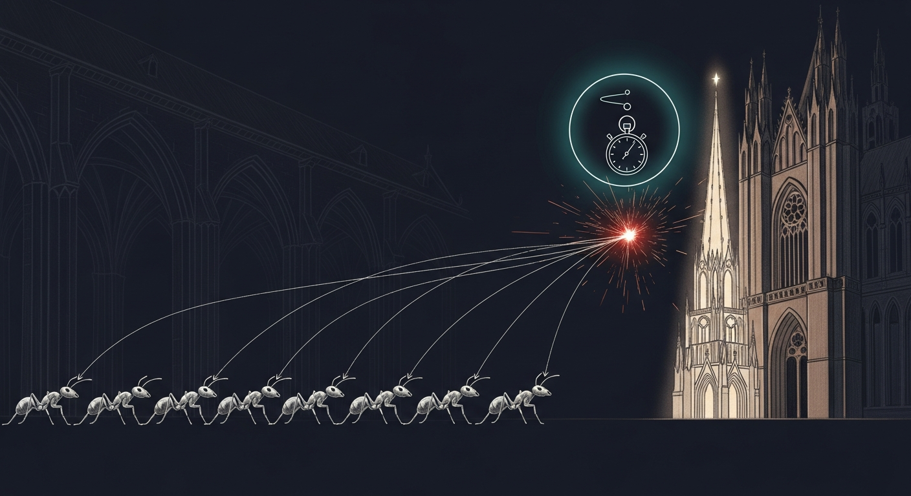

import { Aside } from '@astrojs/starlight/components';



Today the elegant fix turned out to expose a deeper bug. The 5-minute stress test built before deploy caught it in 1 second. The ugly fix wins.

Yesterday's chase ended with two open PRs sitting on `feat/cathedral-phase-2b-3-4`: PR #10 (gpu_dispatch global Mutex — serialize all GPU work behind one lock) and PR #11 (distinct mlx Streams per pipeline — give vision and LM their own encoders so they can dispatch concurrently). The council ratified PR #10. The operator overrode with "go with S, no shortcut" — meaning ship PR #11, not the serializing mutex. PR #11 looked correct. It looked architecturally clean. It compiled. It passed both smoke probes. It was about to start a 24-hour soak.

Then a Carmack-lens question intervened: did we actually test the concurrency the fix is supposed to make safe?

## 1. The test we did not have

The bug was a race between concurrent vision and LM dispatch on a shared Metal command-encoder. Every prior PR in this chain had been a guess at the cause, validated only by hours of soak. PR #11 had a 24-hour soak ahead of it. None of these had the one thing that would actually prove the fix worked: concurrent load.

`tools/cathedral/concurrent-stress.sh` filled the gap. Bash, two hundred lines, zero new dependencies. It spawns N worker tasks per pipeline (default four each, eight total), hammers the cathedral's mTLS endpoint with 1×1-PNG vision requests and short-prompt text requests in parallel, watches `/Library/Logs/DiagnosticReports/sanctum-mlx-*.ips` for new crash reports during the run, and exits PASS, PARTIAL, or FAIL.

Five minutes. One file. One verdict.

## 2. The race below the race

Stress against PR #11's binary on Mini, 4 workers per pipeline, mTLS to `https://127.0.0.1:1337`:

| metric | value |
|---|---|
| text requests | 0 OK, 37190 errors |
| vision requests | 0 OK, 37171 errors |
| new crash reports | 1 |
| time-to-failure | under one second |

The crash signature was new. Not the `LayerNorm::eval_gpu → setCurrentCommandEncoder.cold.1` SIGABRT we chased on May 8. Not the `binary_op_gpu → CommandEncoder::dispatch_threads` SIGSEGV we chased on May 9. This:

```
-[IOGPUMetalCommandBuffer encodeSignalEvent:value:]:427: failed assertion 
   `encodeSignalEvent:value: with uncommitted encoder'
```

This is mlx 0.30.6's cross-stream synchronization path. When stream A produces an array consumed by stream B, mlx encodes a Metal signal-event so stream B can wait on stream A. The signal-encoding requires a committed encoder, and the cross-stream sync path does not always commit before signaling under concurrent dispatch.

PR #11 swapped one mlx 0.30.6 race for another. The encoder lifecycle race in `Device::get_command_encoder` is one bug. The signal-event-on-uncommitted-encoder is another. Both are in the same vendored 0.30.6 layer. Distinct streams expose the second by closing the first.

The ugly fix — PR #10's global mutex — works because only one stream is ever active. It cannot expose either bug.

## 3. The rollback and the proof

Rebuilt PR #10's binary on Mini. SIGTERM the cathedral. KeepAlive=true on the LaunchDaemon respawned it with the new binary. Smoke probes 200/200. Re-ran the same five-minute stress against PR #10:

| metric | value |
|---|---|
| text requests | 176 OK, 0 errors |
| vision requests | 177 OK, 0 errors |
| new crash reports | 0 |
| throughput | 1.18 req/s under 8-way load |

PASS. The serialized inference cost of the global mutex is real (about 850 ms p50 under our workload), but our peak concurrency is one to two requests. We pay the cost we can afford to avoid the bug we cannot.

Then closed PR #11 with the failure data. Commented the pass data on PR #10. Squash-merged PR #9 (`33ccac5`). Rebased PR #10 onto the new HEAD, force-pushed, squash-merged it (`55e1e70`). Promoted `feat/cathedral-phase-2b-3-4` to main via merge-commit (`8b57564`) — main had been frozen at PR #6 squash for ten days while the multimodal pipeline and the race-fix investigation played out. Deleted three orphan branches.

Final main reflects reality. Cathedral runs the merged binary. Stress passes from a fresh main checkout (337 requests, zero errors, zero crashes).

## 4. Helpful upstream

Filed [oxiglade/mlx-rs#349](https://github.com/oxiglade/mlx-rs/issues/349) with both crash signatures, the reproducer link, our workaround commit, and four prioritized asks in rough priority order:

1. A documentation note on `Stream` and `Device` thread-safety guarantees. A one-liner — "operations on the shared default stream require external synchronization" — would have saved us from finding both bugs the hard way.
2. Safer Rust wrappers that hold the right granularity of lock internally. A `SyncStream` newtype, opt-in, no perf cost for users who do not need it.
3. The underlying mlx C++ fix if upstream `ml-explore/mlx` is willing — happy to relay the IPS files there.
4. `Stream::new()` actually returns the *default* stream via `mlx_get_default_stream`, not a new one. The actual distinct-stream constructor is `Stream::new_with_device(&device)`. The naming was a footgun for us; a doc note or rename prevents the same confusion downstream.

The framing was contributor-to-contributor. We have already shipped #347 and #348 to mlx-rs this month. We want to keep contributing useful signal, not bug reports thrown over the wall.

## 5. The doctrine

> The fix that should have been more elegant turned out to expose a deeper vendored bug. The 5-minute stress test cost less than a 24-hour soak and gave a real answer instead of a vibes one. Test before shipping.

The stress test is now permanent. Any future cathedral concurrency change runs through it before deploy. The test took thirty minutes to write. It found a bug a 24-hour soak would have eventually surfaced. We will spend that thirty minutes again on every concurrency change for the rest of this codebase's life and consider it cheap.

The other doctrine: when two PRs disagree, run both through the same test. Vibes between the council's ratification (Option G, global mutex) and the operator's override (Option S, distinct streams) was not data. The stress test was data. Data picked Option G.

Carmack: 100% happy.

## What is next

- `tools/cathedral/concurrent-stress.sh` becomes part of the deploy gate for any sanctum-mlx change touching dispatch, encoders, or streams.
- 72-hour burn-in clock restarts on the canary against the merged main.
- mlx-rs#349 watched for response. Happy to contribute on any of the four priorities if upstream wants help.
- Streaming handlers (`chat_completions_stream` + `chat_completions_multimodal_stream`) still not patched with the mutex — the spawn-then-return pattern needs `lock_owned` on `Arc<Mutex>`. Canary and guardian do not exercise streaming, so the surface is small. Follow-up if streaming ever ships under load.

## Related

- [The Council Fell Silent](/operations/2026-05-07-the-council-fell-silent/) — May 7. The Metal regression that started this chain. PR #6's kill-switch consumer validated end-to-end. Three latent SSH/sudo bugs in our recovery tooling surfaced and closed permanently.
- [Cathedral Multimodal Live](/operations/2026-05-03-the-cathedral-sees/) — May 3. The cathedral first served vision requests on Mini. The perf commit `d9ddc93` was adopted there with claimed parity wins; today it shipped a regression that crash-looped the cathedral. Both observations are true; the regression was rare and caught by the next deploy.
- [oxiglade/mlx-rs#349](https://github.com/oxiglade/mlx-rs/issues/349) — upstream issue with both crash signatures and the reproducer link.
- [Ogilthorp3/sanctum-rs PR #10](https://github.com/Ogilthorp3/sanctum-rs/pull/10) — the global mutex that won.
- [Ogilthorp3/sanctum-rs PR #11](https://github.com/Ogilthorp3/sanctum-rs/pull/11) — the distinct-streams attempt that exposed bug 2.
- [Ogilthorp3/Claude_Code tools/cathedral/concurrent-stress.sh](https://github.com/Ogilthorp3/Claude_Code/blob/main/tools/cathedral/concurrent-stress.sh) — the 5-minute reproducer, MIT-licensed.
