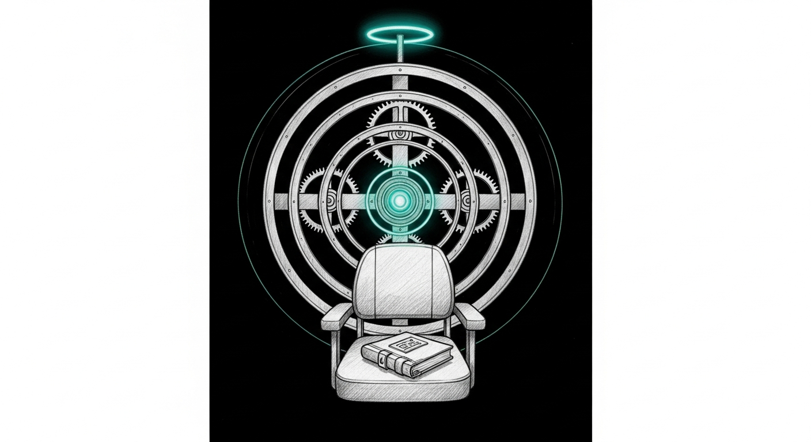

import { Aside } from '@astrojs/starlight/components';

Wave 1 of the Reliability Doctrine shipped on 2026-05-03 — the same week the Firewalla bridge had been silently broken for nine days. Wave 2 shipped this evening, while Bert was asleep, while the Cathedral on Mini was mid-QKV-fusion debug and the council voting circuit was unreachable. The shape it took was three crons and a flag.

## What landed

**Continuous self-test.** [`sanctum-runtime be20b08`](https://github.com/Ogilthorp3/sanctum-runtime/commit/be20b08) is the launchd plist; [`sanctum-family-pass 10a8600`](https://github.com/Ogilthorp3/sanctum-family-pass/commit/10a8600) is the wrapper and the install.sh Step 8.6 that deploys it. Fires daily at 04:30 — one hour after the backup cron, when the haus is quiet. Runs the eleven probes. Parses the summary line. Silent on green; posts to Force Flow with severity `warning` on a partial miss, severity `error` on a full-threshold miss. The thing the 2026-05-03 incident wanted, nine days late.

**Weekly backup integrity.** [`sanctum-runtime 36ed612`](https://github.com/Ogilthorp3/sanctum-runtime/commit/36ed612) + [`sanctum-family-pass a0a6708`](https://github.com/Ogilthorp3/sanctum-family-pass/commit/a0a6708). Sunday at 05:00, one hour after Sunday's backup + prune cycle finishes. `restic check --read-data-subset=5%` on T9 (primary), `1%` on gdrive (cloud). T9 corruption is `error` — the primary repo is broken and Bert needs to know now. gdrive unreachable is `warning` — the cloud copy is degraded but the haus is still recoverable from T9.

**Autonomous update with rollback.** [`sanctum-family-pass 5662753`](https://github.com/Ogilthorp3/sanctum-family-pass/commit/5662753). `sanctum update --auto` tags each repo HEAD as `auto-rollback-YYYYMMDD-HHMMSS` before pulling, runs the same pull-restart-self-test flow as manual update, and **rolls back via `git reset --hard <tag>`** if post-update self-test regresses. The rollback restarts services with the rolled-back code and POSTs Force Flow `severity:error` with the failing rc. Rollback tags are retained for inspection. The flag is opt-in; the launchd plist that schedules it weekly is not shipped — Bert reviews + decides separately.

## Why three crons, not one

The temptation in Wave 1 was a single `sanctum-supervisor` daemon that did everything: self-test, backup check, update, alert. The three-cron split has the property the supervisor would not have: each can fail without disabling the others. A bug in the update cron does not stop self-test from running. A self-test that regresses doesn't prevent the next morning from re-checking. Independence is the property.

The same logic is why Wave 2 hasn't shipped the **independent failsafe watchdog** yet — a second process whose only job is to detect that Force Flow itself has gone silent. Force Flow is the channel through which all three crons report; if it's down, the crons fire, log, and nobody notices. The watchdog watches the channel, not the things speaking through it. Queued for the next Wave 2 pass.

## What stays manual

- **Firewalla bridge token rotation.** The token grants enforcement authority over the network. Rotating it without a human in the loop is a foot-cannon; the runbook entry will land in the next Wave 2 pass.
- **`sanctum update --auto` schedule.** The flag works; the cron entry to fire it weekly does not exist. Bert reviews the rollback path in production before adding the launchd entry.
- **Acid-test runs (`tools/acid-test.sh` `--live`).** The script is automated; the decision to run it on a production-shaped fresh-user install is human-sized.

## The cathedral was silent

The council consult that would normally have weighed in on "highest-leverage autonomy investment" was unreachable — Mini's session `88ca694e` was mid-QKV-fusion debug, Cathedral on `:1337` had reloaded the Qwen3.6 weights at 21:34 and was still warming. `ask-council.sh` got `Connection refused`. The decision was made on the controller's own analysis: continuous self-test was the highest-leverage single bet, and continuous-anything is a strict generalization of one-shot-anything. The council can disagree in the morning if it wants.

## References

- [`Reliability Doctrine`](/architecture/reliability-doctrine-v1/) — the doctrine page itself (lighthouse hero, three promises, five principles).
- [`The Fortnight In One Night`](/operations/2026-05-12-the-fortnight-in-one-night/) — the 2026-05-12 push that put Wave 2 within reach.
- [`The Vault Spoke, Then I Misheard`](/operations/2026-05-11-the-vault-spoke-then-i-misheard/) — the cross-session coordination breakdown that motivated the Verify-Before-Attribute doctrine.
