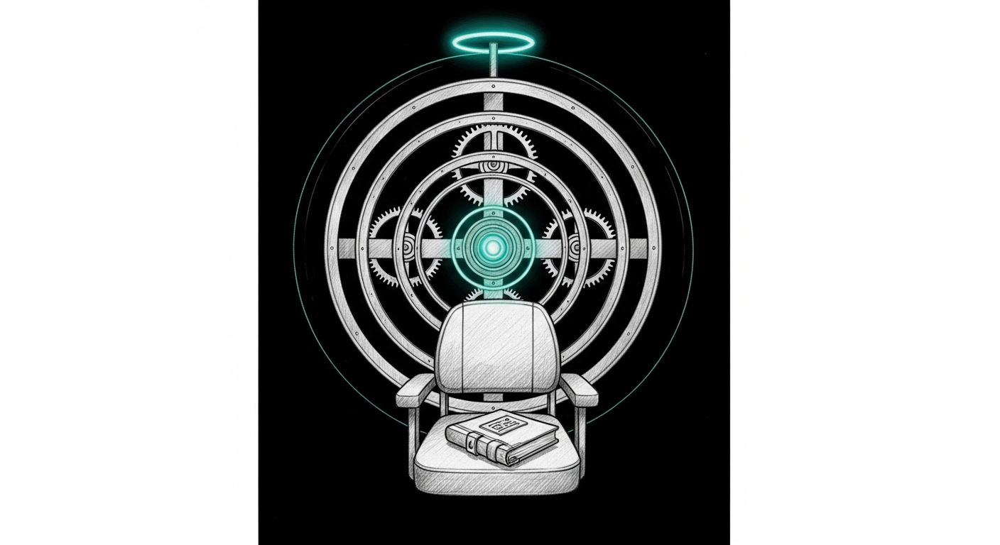

import { Aside } from '@astrojs/starlight/components';

The Reliability Doctrine spent its first ten days waiting for a human to press a button. Tonight it stopped waiting.

Wave 1 shipped on 2026-05-03 — the same week the Firewalla bridge had been silently broken for nine days. A doctrine of reliability, born the week reliability failed quietly and nobody noticed for over a week. Wave 2 shipped this evening, and nobody watched it happen. Bert was asleep. The Cathedral on Mini was mid-QKV-fusion debug, its council voting circuit unreachable. The shape the doctrine took, once you take the human out of the loop, is three crons and a flag.

## What landed

**Continuous self-test.** [`sanctum-runtime be20b08`](https://github.com/Ogilthorp3/sanctum-runtime/commit/be20b08) is the launchd plist; [`sanctum-family-pass 10a8600`](https://github.com/Ogilthorp3/sanctum-family-pass/commit/10a8600) is the wrapper and the install.sh Step 8.6 that deploys it. It fires daily at 04:30 — one hour after the backup cron, when the haus is at its quietest. It runs the eleven probes. It parses the summary line. It stays silent on green, and it posts to Force Flow with severity `warning` on a partial miss, severity `error` on a full-threshold miss. This is the thing the 2026-05-03 incident asked for and never got. It is nine days late.

**Weekly backup integrity.** [`sanctum-runtime 36ed612`](https://github.com/Ogilthorp3/sanctum-runtime/commit/36ed612) + [`sanctum-family-pass a0a6708`](https://github.com/Ogilthorp3/sanctum-family-pass/commit/a0a6708). Sunday at 05:00, one hour after Sunday's backup + prune cycle finishes. `restic check --read-data-subset=5%` on T9 (primary), `1%` on gdrive (cloud). A backup you have never restored is a rumour, so the doctrine reads bytes back instead of trusting the file count. T9 corruption is `error` — the primary repo is broken and Bert needs to know now. gdrive unreachable is `warning` — the cloud copy is degraded, but the haus is still recoverable from T9.

**Autonomous update with rollback.** [`sanctum-family-pass 5662753`](https://github.com/Ogilthorp3/sanctum-family-pass/commit/5662753). `sanctum update --auto` tags each repo HEAD as `auto-rollback-YYYYMMDD-HHMMSS` before pulling, runs the same pull-restart-self-test flow as manual update, and **rolls back via `git reset --hard <tag>`** if the post-update self-test regresses. The rollback restarts services with the rolled-back code and POSTs Force Flow `severity:error` with the failing rc. Rollback tags are kept for inspection — the doctrine cleans up after a bad night, but it leaves the body where you can find it. The flag is opt-in; the launchd plist that would schedule it weekly is not shipped. Bert reviews and decides that one separately.

## Why three crons, not one

The temptation in Wave 1 was a single `sanctum-supervisor` daemon that did everything: self-test, backup check, update, alert. One process is easier to write and easier to reason about, right up until it dies and takes every job with it. The three-cron split has the property the supervisor never would: each can fail without disabling the others. A bug in the update cron does not stop self-test from running. A self-test that regresses does not stop the next morning from re-checking. Independence is not a feature here. It is the whole design.

The same logic is why Wave 2 has not shipped the **independent failsafe watchdog** yet — a second process whose only job is to notice that Force Flow itself has gone silent. Force Flow is the channel through which all three crons report. If it is down, the crons fire, log, and nobody hears them. The watchdog would watch the channel, not the voices speaking through it — a guard for the guards. Queued for the next Wave 2 pass.

## What stays manual

Autonomy is a privilege, not a default. Three jobs did not get the keys tonight, each for the same reason: the blast radius is a human-sized decision.

- **Firewalla bridge token rotation.** The token grants enforcement authority over the whole network. Rotating it without a human in the loop is a foot-cannon; the runbook entry will land in the next Wave 2 pass.
- **`sanctum update --auto` schedule.** The flag works; the cron entry to fire it weekly does not exist. Bert watches the rollback path in production before he trusts the launchd entry.
- **Acid-test runs (`tools/acid-test.sh` `--live`).** The script is automated; the decision to point it at a production-shaped fresh-user install is human-sized.

## The cathedral was silent

The council consult that would normally weigh in on "highest-leverage autonomy investment" was unreachable. Mini's session `88ca694e` was deep in a QKV-fusion debug; the Cathedral on `:1337` had reloaded the Qwen3.6 weights at 21:34 and was still warming. `ask-council.sh` came back with `Connection refused`. Yoda, Windu, Mundi — the whole table was out.

So the decision got made alone, on the controller's own analysis: continuous self-test was the highest-leverage single bet, because continuous-anything is a strict generalization of one-shot-anything. The doctrine that runs while everyone sleeps went live while everyone slept — the council included. It can disagree in the morning if it wants.

## References

- [`Reliability Doctrine`](/architecture/reliability-doctrine-v1/) — the doctrine page itself (lighthouse hero, three promises, five principles).
- [`The Fortnight In One Night`](/operations/2026-05-12-the-fortnight-in-one-night/) — the 2026-05-12 push that put Wave 2 within reach.
- [`The Vault Spoke, Then I Misheard`](/operations/2026-05-11-the-vault-spoke-then-i-misheard/) — the cross-session coordination breakdown that motivated the Verify-Before-Attribute doctrine.
