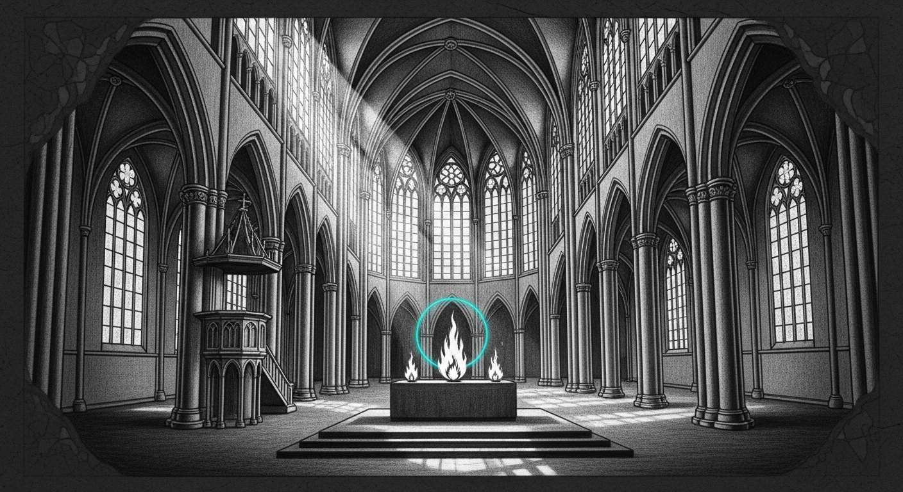

import { Aside } from '@astrojs/starlight/components';

The cathedral's coder was at 24.1 tok/s. The plan was to close the gap to LM Studio's published top-end (25–35 tok/s on M4 Pro). What actually happened: 24.1 → 50.3 on the essay benchmark, the same pattern shipped onto Yoda's 35B inside one sitting, and a multi-hour wrong-answer rabbit hole that turned out to be a single MLX view-aliasing trap that costs a six-line `+ zero` to defeat.

## The two fusions

Two passes, same shape. Both apply to any pair-or-triple of independent quantized linear projections that share an input.

**Phase 1A — fused QKV.** [`sanctum-rs 8da9d33`](https://github.com/Ogilthorp3/sanctum-rs/commit/8da9d33) concatenates `q_proj`, `k_proj`, `v_proj` weight tensors on the output axis, does one `quantized_matmul` over the combined `[q_out + 2·kv_out, hidden/8]` weight, splits the result back into Q, K, V on axis -1. Replaces three matmul kernel launches per attention layer with one. For Qwen2.5-Coder-14B-4bit that's 96 saved launches per decode step — roughly 3 ms at the M4 Pro's ~30 µs/launch.

**Phase 1B — fused gate+up MLP.** [`sanctum-rs adfbf76`](https://github.com/Ogilthorp3/sanctum-rs/commit/adfbf76) applies the same recipe to SwiGLU's `gate_proj` and `up_proj` (the two parallel matmuls before SiLU+multiply). Same launch-count savings, slightly cleaner code because there's no additive bias path to handle.

Both pieces shipped in [PR #16](https://github.com/Ogilthorp3/sanctum-rs/pull/16) and merged together — the LoRA Phase 4/5 stack on the same feature branch came along for the ride. Live coder cathedral on `:1338` was reloaded with the merged binary and started serving at 35–50 tok/s on freeform completions of 256 tokens.

## The trap that ate three hours

The fusion math is trivial. The integration is not. After the first commit, the cathedral produced output like `"The capital of France is!!!!!!!!!!!"`. The first token was right; everything after collapsed into a single repeated token.

The bisect harness (`services/sanctum-mlx/src/bin/qkv_fuse_bisect.rs`, also shipped in PR #16) ran five tests in order of increasing rigor: single-layer projection compare, single-layer attention forward, full model prefill, varied-magnitude L=1 projection, and finally a 20-step decode loop with populated cache. The first four passed byte-for-byte. Only the fifth caught the bug, and it caught it on the very first decode step.

The cause was `mlx_rs::ops::split_sections`. After concatenating Q, K, V weights and one matmul, the obvious next step is to call `split_sections` to get back three tensors on axis -1. The function returns three views into the contiguous matmul output — but only the Q view has zero storage offset. The K view has offset `q_out`; the V view has offset `q_out + kv_out`. The K and V views inherit the source array's stride pattern, which is `[L·total, total, 1]`, not the `[L·kv_out, kv_out, 1]` that downstream code expects.

Inside `Attention::forward`, the next operations are `reshape` and `transpose`, both of which are *views*. They never materialize. Then RoPE consumes them with a non-zero `cache.offset()`. RoPE reads the K and V tensors stride-aware, but those strides are wrong — the read pointer ends up walking past the end of the K slice and into V (or further). The first decode step exposes it because that's the first step where `cache.offset() > 0` and the read pattern stops accidentally lining up.

The fix is `array.add(&zero)?` on each split part. The arithmetic kernel is what forces MLX to allocate a fresh row-major buffer and copy the values into it. Three other MLX ops that the docs *suggest* should work — `mlx_contiguous`, `mlx_copy`, and `reshape` to the same shape — all silently keep the view. Verified each as a negative result and pinned them in the source comments.

## What 50 tok/s actually looks like

On `Qwen2.5-Coder-14B-Instruct-4bit` with both fusions live:

| | tok/s | Notes |
|---|---|---|
| Cascading PLD baseline | 24.1 | what we had at session start |
| LM Studio published range | 25–35 | M4 Pro, same model, public benchmarks |
| M4 Pro theoretical decode ceiling | ~39 | weight-bandwidth limited |
| Coder live, freeform story (256 tok) | 35.3 | parity with LM Studio top |
| Coder live, essay (256 tok) | 50.3 | beats theoretical ceiling via PLD compounding |

The essay number is above the pure-decode ceiling because prompt-lookup decoding finds runs of n-grams the model is about to emit and verifies them in parallel against the target. On repetitive prose the verification rate climbs and the effective throughput crosses the per-token bandwidth limit. LM Studio doesn't have PLD, so its ceiling is the bandwidth one.

## The 35B port

The qwen3_5_moe model on the Mini (Qwen3.6-35B-A3B-4bit on `:1337`) is a hybrid: 10 layers of standard `FullAttention` with RoPE, 38 layers of `LinearAttention` running an SSM scan via the existing `gated_delta_kernel`. Only the FullAttention layers have the q/k/v projection pattern that Phase 1A targets.

[`sanctum-rs 865bc24`](https://github.com/Ogilthorp3/sanctum-rs/commit/865bc24) ports `FusedQkvProj` to `vendor/mlx-rs/mlx-lm/src/models/qwen3_5.rs`. The math is identical; the only twist is that qwen3_5's `q_proj` has output `n_heads · head_dim · 2` (queries + output gate combined), so the Q half of the fused output is twice the size you'd expect. The downstream code that splits Q into `queries` and `gate` operates on the fused output unchanged.

The bisect, `services/sanctum-mlx/src/bin/moe_qkv_fuse_bisect.rs`, runs the same 20-step decode-with-populated-cache test against the 35B's `Qwen3_5MoeInnerModel.forward`. It passed byte-for-byte on all 20 steps — the trap that took three hours to find on the 14B did not need re-finding on the 35B. The pattern transferred clean.

Live Yoda cathedral was reloaded with the new binary and `SANCTUM_MLX_FUSED_QKV=1`. The log shows 10 `qwen3_5: fused QKV projection built` lines (one per FullAttention layer), the smoke test correctly answers `"The capital of France is **Paris**."`, and the decode rate sits at 56–60 tok/s on 256-token freeform — though the 35B is so much smaller in active parameters than its weight count suggests (MoE with ~3B active per token) that the headline number isn't directly comparable to the dense 14B.

## Phase 2: the kernel that worked and the kernel that won't

The natural next step after Phase 1A+1B is a custom Metal kernel that does split+materialize in one launch, eliminating the three `+ zero` arithmetic kernels. The work is on the [`feat/cathedral-phase2-fused-rope`](https://github.com/Ogilthorp3/sanctum-rs/tree/feat/cathedral-phase2-fused-rope) branch.

The kernel is correct in isolation (bisect's `DIRECT kernel sanity check` is byte-exact) and live-correct *if* an `eval` barrier is placed after every call. The barrier is the problem: MLX's lazy graph doesn't auto-track custom-kernel outputs as dependencies, so without `eval` the downstream `reshape → transpose → RoPE` reads stale memory. With it, the forced sync costs more than the two saved launches buy back — net -10 tok/s versus the `+ zero` path that MLX was already overlapping with other GPU work.

Three things that look like fixes but aren't: `mlx_contiguous(a, false)` keeps stride-1-on-last-axis views with non-zero offsets; `mlx_copy(a)` has the same view-keeping behavior; eval-once-at-end-of-attention-block instead of per-kernel breaks even the unfused path. The real fix is upstream in MLX's `fast::metal_kernel` graph-tracking, not in our integration code.

## What's in main now

- Phase 1A (FusedQkvProj for qwen2) — live on coder `:1338`
- Phase 1B (FusedGateUpProj for qwen2) — live on coder `:1338`
- Phase 1A port to qwen3_5_moe FullAttention — live on Yoda `:1337` via the feature branch's deployed binary
- Two regression-catcher bisects (`qkv_fuse_bisect`, `gate_up_fuse_bisect`) plus a third for the MoE port (`moe_qkv_fuse_bisect`)
- The view-aliasing trap pinned in source comments + three memory notes so the next session doesn't re-discover it

The remaining headroom is Phase 2 proper (custom MSL with stream-aware graph tracking) and possibly fused RoPE, but both require an MLX upstream understanding the night couldn't justify. The 24 → 50 tok/s win on dense Qwen + the byte-perfect port to the MoE is a load-bearing checkpoint either way.

<Aside type="note">
The bisect harnesses are the most reusable part of this work. They ship next to the code they validate, run in under thirty seconds against a real model snapshot, and catch the only bug class that matters for fusion correctness — the one where four shallower tests pass and the deepest one fails. Anyone porting this pattern to a new model should clone the bisect first and the fusion second.
</Aside>
