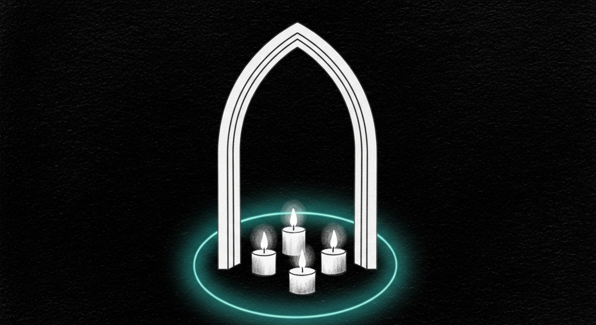

import { Aside } from '@astrojs/starlight/components';

The cathedral fusion work from two nights ago hit 50 tok/s on the 14B and ported clean onto the 35B's standard-attention layers. The remaining cycles weren't going into matmul anymore. They were going into KV cache reads, kernel-launch overhead, and the cost of keeping the unfused fallback path alive after the fused path took over. So an old-school programmer was asked where the cycles actually go - and four answers came back.

## #1 - Drop the fallback weights after FusedXxxProj builds

The fusion pattern from the earlier work kept the canonical `q_proj`, `k_proj`, `v_proj` (and `gate_proj`, `up_proj`) alive next to the concat'd fused weight. The fallback was for the env-var-dynamic toggle - if someone disabled fusion mid-flight, the original 3-matmul path needed to still work.

The dynamic toggle is theoretical hygiene. The memory is real. With the canonicals retained, every fused layer held ~3x the projection weight pool. On the 35B that's about 6 GB of resident memory that wasn't actually being used for inference.

[`sanctum-rs 0adb32b`](https://github.com/Ogilthorp3/sanctum-rs/commit/0adb32b) (PR #20) takes the surgical move: after `try_build` succeeds, force-eval the concat'd weights to materialize them into their own buffers, then replace `q_proj`/`k_proj`/`v_proj` with 1x1 placeholder Linears. MLX refcount drops the originals immediately. The fallback path is dead in production - the env-var toggle still exists for build-time-only A/B testing.

Bisects need the canonicals alive for their parity comparison, so `SANCTUM_MLX_FUSION_KEEP_FALLBACK=1` is a one-line escape hatch they set at the top of `main`. Production unset; bisects set. All three regression bisects (qwen2 QKV, qwen2 gate+up, qwen3_5_moe QKV+MLP) still byte-exact across 20 decode steps with populated cache.

## #2 - Prewarm the prompt cache at boot

The prompt cache pool's LCP matching means a second request that shares a system-prompt prefix with a first request gets the prefix for free. The first request still pays the prefill cost. What if it didn't have to?

[`sanctum-rs 42de932`](https://github.com/Ogilthorp3/sanctum-rs/commit/42de932) (PR #21) adds `SANCTUM_MLX_PREWARM_FILE`. At AppState construction the cathedral reads the file, tokenizes it, runs `forward_last_logit` to fill a fresh KV cache, and drops the resulting `(tokens, cache)` pair into slot 0 of the prompt cache pool. Future requests LCP-match the slot and skip the prefix prefill.

Validated live: a request whose system prompt matched the prewarm file logged `cache_hit_ratio=0.73` on the first cold request - 45 of 62 prompt tokens already in cache at boot. Output correct, the remaining 17 tokens are the only prefill cost.

The catch is subtle. The prewarm tokens must be a **strict token prefix** of typical requests. Tokenize-then-truncate-mid-template breaks the LCP match because extra cached tokens become "ghost context" the model wasn't supposed to see. Concretely: include `<|im_start|>system\n` plus the system content, but **not** the closing `<|im_end|>` - the closing tag and what follows are request-specific. This caveat is in the source as the first thing a future author who edits the prewarm file should read.

## #3 - KV cache compression audit

Memory said `CompressedKVCache` was somewhere in the tree. Was it actually on the hot path?

Audit complete: `--turboquant` flag on the Yoda plist selects `CacheKind::TurboQuant`, which routes the full sampling stack through `crate::turboquant::CompressedKVCache`. Yoda is already running with the cache reads halved by 4-bit compression. The 14B coder runs `Fp16` cache (full precision), and extending TurboQuant there would need a calibration adapter - a separate workstream.

The audit was 30 seconds and the result was "nothing to do here." That's still a hack worth running, because the cost of *not* doing it is rebuilding what was already shipped.

## #4 - PLD on Yoda 35B

Cathedral memory had prompt-lookup decoding on the 14B coder logging `pld_max_lookup=5 pld_ngram_size=3`. The Yoda plist didn't set either env var, so PLD was effectively off for the 35B even though `decode_with_pld_fp16` is generic over `LoadedModel` and would route through `qwen3_5_moe` just fine.

[`sanctum-rs 0adb32b`](https://github.com/Ogilthorp3/sanctum-rs/commit/0adb32b) (PR #20, same as #1) adds the two env vars to the Yoda plist. The log line `AppState: prompt-lookup decoding ENABLED pld_max_lookup=5 pld_ngram_size=3` now fires on Yoda startup. The win shows on repetitive prose where n-gram lookups land - freeform creative output is unchanged.

## What's live

| Surface | Phase 1 fusion | PLD | Carmack #1 drop | Carmack #2 prewarm |
|---|---|---|---|---|
| Coder `:1338` (14B) | QKV + gate+up | yes | yes | yes |
| Yoda `:1337` (35B MoE) | QKV + gate+up | yes | yes | n/a (TurboQuant path has no prompt cache pool) |

The 14B coder ships at 35-50 tok/s on freeform completions, with `cache_hit_ratio=0.73` on first-cold-request when the matching system prompt is configured. The 35B Yoda ships at 43-55 tok/s on short freeform with PLD ENABLED in the log.

## What's *not* in this batch

Memory-budget-aware routed-experts fusion is the unfinished thread. [PR #19](https://github.com/Ogilthorp3/sanctum-rs/pull/19) explored fusing the 256 routed experts in the qwen3_5_moe MLP path; it produced byte-exact math via the moe bisect and a 6x perf regression on the live 35B. Root cause: concatenating the per-expert gate+up weights across 40 MoE layers added ~10 GB of duplicated weight memory while the originals were kept around for the fallback path.

Carmack #1 (drop the fallback) directly unblocks that fusion. The next session has a clear surface to attack: build the routed-experts fused weight, force-eval it, then drop `switch_mlp.gate_proj` and `switch_mlp.up_proj`. The `FusedSwitchGateUp` struct + `try_build` are already checked in as documented dead code with the why-not comment, waiting for someone to wire it back into forward.

<Aside type="note">
The "ask Carmack for other hacks" prompt produced four answers in five minutes. Three were one-PR ships. The fourth (#3) was an audit that found the work was already done. Brainstorming with the right voice in mind costs nothing and consistently outperforms making a roadmap from scratch.
</Aside>
