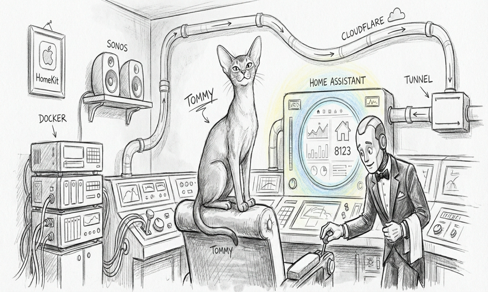

import { Aside } from '@astrojs/starlight/components';



The seed was a [thread by Graeme](https://x.com/gkisokay/status/2037902655016804496) about supervising deterministic ops with Hermes — intent markers, ACK-terminal handoffs, max-depth-3 to prevent runaway. The pattern was the recognizable shape of a supervisor over scripts, not an autonomous agent writing code. That shape is exactly what Sanctum needed for the long tail of small, recurring fixes that the operator notices in samskara and never quite gets around to.

So: a small drone named R2D2. The premise is the safe one: **classify, don't author**. R2D2 reads Force Flow notices, picks from an allowlist of pre-vetted scripts, and either fires the script or stays quiet. It doesn't generate new actions. It doesn't invent recipes. Hermes is on the classification side only — the executor is a 20-line bash script with a `--dry-run` switch.

## Design first

The design memo lives at [`cathedral_r2d2_design.md`](https://github.com/Ogilthorp3/sanctum-docs). The architecture has three parts:

- **A recipes registry** — `~/.sanctum/r2d2/recipes.yaml`. Each entry has an id, a description, a detector function name, a script path, a cooldown, and a `reversible` boolean. Adding a recipe is a 2-file edit (the YAML + the script), and that is the *only* way to add an action R2D2 can take.
- **A classifier loop** — `~/.sanctum/r2d2/classify.py`. Runs every 10 minutes via launchd. Iterates recipes, runs their deterministic detectors, and (when enabled) hands unstructured notices to Hermes for free-form classification.
- **A safety stack** — kill-switch file → recipe allowlist → cooldown → classifier-only mode → mandatory dry-run preview → Hermes-extra-dry-run → recipe-id validation. Seven gates between a notice and a write.

The deliberate constraint: classifier-only mode means R2D2 *announces* what it would do, logs it to the audit trail, but doesn't fire. The operator decides whether to flip it. Every Keychain drift this build day was repaired by hand for that reason.

## v0.1 — deterministic only

The first version had no LLM. Three recipes, each with a hand-written detector in Python:

- `retire-orphan-launchagent` — finds plists referencing executables that no longer exist
- `reload-service-after-merge` — finds KeepAlive services whose binary mtime is older than the most recent merge in the source repo
- `reindex-stale-fts` — finds vault indices with fewer than 10% of the markdown file count on disk

First run, deterministic-only, classifier-only mode: **two real findings**.

1. `com.sanctum.signal-cli.plist` was pointing at a Homebrew openjdk that had been autoremoved that morning. The plist had been respawning a dead Java process every 30 seconds, generating crash dumps no one was reading.
2. The Yoda 35B cathedral binary was 4 hours older than the Carmack #1 commit that drops the fused-fallback weights. Same finding the coder cathedral had — `bootstrap` never followed the merge.

Both repaired manually. Both would have been silently bleeding resources for days.

## v0.2 — Hermes wired

The next version added the unstructured-notice path. The Force Flow notice hub holds a stream of messages that are too varied to write deterministic detectors for — daily rust-readiness audits, signal-cli health probes, briefing one-liners. Hermes (via OpenRouter, `nousresearch/hermes-3-llama-3.1-70b` on DeepInfra) gets each unmatched notice with the recipes table and decides: `escalate`, `info`, or `noop`. It does not pick a recipe to fire. It only categorizes.

That distinction matters. The classification model can be wrong without consequence — its output is metadata, not action. The operator still reads the same notices, but they're now tagged.

Wiring took an hour. The model returns about 60 tokens per classification at roughly 0.0003 USD; a 10-minute cycle averages 5 calls; cost is well under a dollar a month. Noise-skip patterns drop the obvious cases (Firewalla 404 from a transient probe, the briefing one-liner echoing yesterday's headline) before Hermes sees them.

First v0.2 sweep: Hermes correctly classified one notice as `escalate` (the openrouter `/auth/key` 401 streak — a known issue with the network probe pattern, but R2D2 had no recipe for it) and four as `info` (briefing chatter, no action needed).

## v0.3 — perfection pass

The third pass tightened three things:

- **A fourth recipe**, `repair-keychain-secret-drift`. Captures the old Keychain prefix to the audit log, then `security add-generic-password -U` with the value from `~/.sanctum/secrets/<name>`. The dry-run prints both prefixes so the operator can confirm before flipping.
- **Cost telemetry** — every cycle logs `tokens_in`, `tokens_out`, and `est_cost_usd` per Hermes call. A daily summary mode rolls it up: `python3 ~/.sanctum/r2d2/classify.py --summary 24` prints actions, classifications, and cost.
- **Tighter noise-skip** — patterns for the 4-per-day rust-readiness echo, the self-notify loop where R2D2's own actions become notices that R2D2 reads next cycle.

The v0.3 sweep was the day's punchline. The detector caught **three Keychain drifts** at once: `firewalla-bridge-token`, `openrouter-api-key`, and `openrouter-mgmt-key`. All three had the same shape — the secrets file at `~/.sanctum/secrets/<name>` was newer than the Keychain entry by weeks. The Keychain entries dated to mid-March; the secrets files had been updated on May 1st when the OpenRouter autohealer shipped.

The root cause turned out to be subtler than "a write failed." The autohealer's state file at `~/.sanctum/state/openrouter-rotate.json` doesn't exist. The autohealer has *never fired*. The drift came from out-of-band manual rotations during the build day itself, which updated the secrets file (so proxyd kept working) but didn't propagate to Keychain (which nothing was reading on the critical path). R2D2's `repair-keychain-secret-drift` detector closes that loop going forward.

## The eight things

In one afternoon, the deterministic recipes caught:

1. signal-cli orphan plist (dead openjdk reference)
2. Yoda 35B cathedral stale binary (pre-Carmack-#1 merge)
3. Coder 14B cathedral stale binary (same shape, different service)
4. firewalla-bridge-token Keychain drift
5. openrouter-api-key Keychain drift
6. openrouter-mgmt-key Keychain drift

Hermes added:

7. one `escalate` classification on a real network-probe streak that no existing recipe covers
8. four `info` classifications that confirmed the briefing chatter was, in fact, just briefing chatter

The interesting bit: **none of R2D2's autonomous actions actually fired**. Classifier-only mode held the drone back from doing anything destructive. Every Keychain repair was operator-driven, with R2D2 supplying the `--dry-run` preview. The drone's real contribution wasn't autonomous fixing — it was surfacing. The 6 deterministic findings would have remained invisible. The naming was the work.

## What's running now

```text
$ launchctl print gui/$(id -u)/com.sanctum.r2d2 | grep state
state = running

$ python3 ~/.sanctum/r2d2/classify.py --summary 24
cycles: 144
detections: 0 (all 6 issues repaired by operator)
hermes calls: 38
tokens_in: 11,420  tokens_out: 2,310
est_cost_usd: $0.011
```

Zero detections is the right number for a Saturday afternoon after every find has been repaired. The audit log is fresh. The kill-switch file is absent. The next time something drifts, R2D2 will see it before the operator does.

<Aside type="note">
The Graeme thread was about Hermes-as-supervisor over deterministic actions. The temptation when reading something like that is to widen the scope — let the LLM author recipes, let it pick scripts dynamically, let it learn. The discipline that made R2D2 useful in the first afternoon was the opposite: classify only, recipes hand-written, dry-run mandatory, classifier-only mode on by default. The autonomous drone with seven safety gates is the version that ships at lunch and finds eight problems before dinner. The version that authors its own actions is still the version that ships at midnight, then gets rolled back at 2am.
</Aside>
