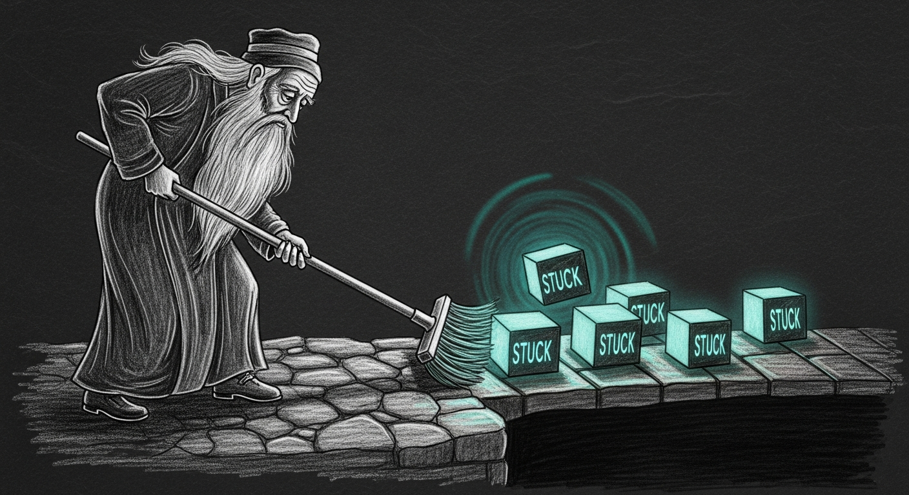

The first-floor Apple TV woke at 10:00 Sunday like every other morning —
except it didn't. Bell Fibe, dead. Everything else, dead. The kid
reported it the way kids report an outage: loudly, and on a Monday. By
then the thing had been silently grounded for over a day. The curfew had
lifted. Something had not let go.

What had not let go was a pair of iptables rules.

## What survived

`rule_484` and `rule_485` were born on 2026-04-16 — over a month before
anyone missed them — during the early Apple TV blocking experiments.
Each was a *bidirection* device-wide MAC block: one rule dropped
outbound, one dropped inbound, paired by Firewalla policy ID. The
mechanism was blunt and correct — any packet whose destination matched
the device's ipset got `MARK`-ed for drop.

For a month they sat dormant. Firewalla's reconciler treated the parent
policy as stale, the kid wasn't being blocked, and nobody looked. Then
Saturday night the weekend curfew fired at 23:30 and the bridge laid a
fresh round of blocks across the Apple TVs. Sunday at 10:00 the wake
tried to lift them. The bridge's `_unblock_mac` API call returned
`undefined` (Firewalla MSP delete is degraded), so it dropped to its SSH
path:

```
[ssh-fallback] batch cleanup: 1/2 iptables rules removed for PIDs [485]
```

One of two. The bridge then wrote:

```
[unpause] SSH iptables screen_time rules cleaned for FA:CE:DE:CA:CA:11
```

Claimed success. Returned `success: true` for the PID. Moved on.

The inbound-direction rule stayed. Inbound video packets had nowhere to
go, and Bell Fibe — like nearly everything else worth watching — arrives
over an inbound TCP connection. The TV could reach out. Nothing could
reach back.

This is the exact failure [Principle 8](/architecture/living-force/#the-principles)
was written to name: *a system that lies about its health is more
dangerous than one that fails.* The "1/2 cleaned" was right there in the
log. But the per-PID contract said "succeeded," and everyone downstream
— the [haus-control enforcer](/architecture/screen-time/), the operator's
mental model, the SwiftBar glyph — trusted the contract over the log.

## What's now in place

Windu holds the security seat on the [council](/architecture/services/),
and this is a security failure in the plainest sense: a block that
outlived its authority. Two changes, layered.

### Layer 1 — the bridge stops lying

`sshCleanupIptablesRules` in `~/.openclaw/firewalla-bridge.js` now runs a
read-back grep in the same SSH session that issued the `-D` commands.
After the `while read rule; do sudo iptables $rule; done` loop completes,
the same session asks `sudo iptables -S | grep 'rule_<pid>' || true` and
the script parses the residuals. Any PID whose rule survived the delete
is reported with `success: false` and the log line escalates from INFO
to ERROR:

```
[ssh-fallback] batch cleanup PARTIAL: cleaned 1/2 rules, 1 RESIDUAL
for PIDs [485] — drift-sentinel will sweep within 5min
```

Honest signal in, honest signal out. A partial cleanup now looks like a
partial cleanup instead of a complete one, and the consumer downstream
gets to decide what that means.

### Layer 2 — Windu sweeps every five minutes

`check_stale_blocks` is a new check in Windu's drift-sentinel — the
`com.sanctum.drift-sentinel` LaunchAgent that already runs every 5 min on
the Mini. Every cycle, it:

1. Asks Firewalla over SSH for `iptables -S FW_FIREWALL_DEV_BLOCK`
2. Extracts every `rule_<PID>` token in the chain
3. For each PID, asks Firewalla's redis: `EXISTS policy:<PID>`
4. Any PID whose `EXISTS` returns 0 is an **orphan** — an iptables
   rule with no enforceable source policy
5. Deletes each orphan via `iptables -D` using the rule spec, plus
   any redis `policy:<PID>` remnant
6. Capped at 10 deletes per run — anything more escalates to Force
   Flow `/notify` (severity=warning) instead of bulk-deleting (a
   panic would look exactly like a runaway clean)

Each individual delete logs `stale_block_healed`; the run's aggregate
logs `stale_blocks_healed` with `{healed, orphan_pids, stuck}`. The
drift-sentinel's existing 30-min alert cooldown still applies on top.

Windu has never caught a mouse — Tommy keeps that ledger, and he brings
it up — but Windu will now catch a stuck block inside five minutes. Had
this check existed yesterday, recovery would have been five minutes
instead of twenty-eight hours.

## What this leaves

The two stuck rules were cleaned by hand at 12:30 Monday — `iptables -D`
plus `redis-cli DEL policy:484 policy:485`. Drift-sentinel ran
immediately after and reported `stale_blocks_clean { pids_checked: 48 }`:
48 active block PIDs verified, 0 orphans. Tonight at 23:30 the curfew
fires again; tomorrow at 10:00 the wake will unpause; and any rule that
doesn't leave through the front door gets swept by Windu inside the same
five minutes the operator spends brushing their teeth.

The bridge's other SSH-fallback paths — single-PID cleanup, DNS
custom-conf edits — still claim success without verifying. They haven't
produced this class of failure yet. But Principle 8 has taught the haus
that "yet" is the most expensive word in the log, and those paths get the
read-back the next time we open them.

---

*Field note from the operator's seat. The cleanup that was half-done is
now done, and the daemon that pretended to know is now the daemon that
actually checks.*
