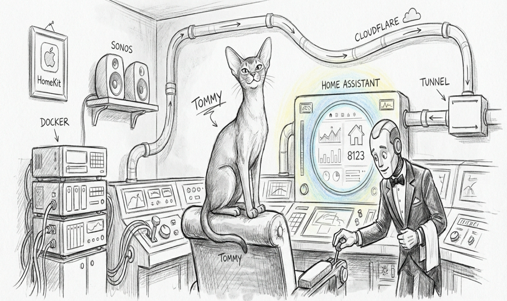

import { Aside } from '@astrojs/starlight/components';



R2D2 has been alive for five days. It has surfaced [eight real problems](./2026-05-16-r2d2-found-eight-things), [grown its own audit channels](./2026-05-19-r2d2-got-honest), and held a 600-cycle soak in classifier-only mode without a single false detection. What it has *not* done, in any of those cycles, is fire a recipe. The classifier-only marker held it back. The operator was always one detection away from doing the actual repair by hand.

Today that changed. R2D2 v0.5 ships with the missing piece of Layer 5 of the safety stack — the two-cycle dry-run promotion that the v0.1 doctrine specified but the early code skipped — and the classifier-only marker has been removed. The 11-layer safety stack is now in its final form. R2D2 fires for real.

## The gap that lived in the doctrine

Quoting the original v0.1 header comment:

> Dry-run gate → if recipe says `dry_run_required`, the FIRST fire is always `--dry-run`; the next cycle is the real fire. Two-cycle hold before any real action.

What the code did, from v0.1 through v0.4:

```python
dry = bool(recipe.get("dry_run_required", True))
args = [os.path.expanduser(script), d.target]
if dry:
    args.append("--dry-run")
# ...always dry-run on dry_run_required=true. Forever.
```

Spec said two-cycle. Code said one-cycle, always-dry. The doctrine had a promise the implementation didn't keep. For four versions, that was hidden behind the classifier-only marker — which made every fire audit-only anyway, so the dry-run-vs-real distinction never mattered. The day the marker came off, the gap would.

## What v0.5 wired

A new state file at `~/.sanctum/state/r2d2-promotions.json` maps each detected target to the timestamp of its most recent dry-run completion. The fire path now consults that file:

| Condition | Behavior |
|---|---|
| `dry_run_required=false` | Real fire immediately. The action is reversible enough that the dry-run preview adds no safety. |
| `dry_run_required=true`, no prior dry-run within 24h | Dry-run. On clean exit, record the target in `r2d2-promotions.json` with the timestamp. |
| `dry_run_required=true`, valid prior dry-run within 24h | Real fire. Clear the promotion entry. Set the cooldown so the same target can't re-fire for the recipe's cooldown window. |

Two recipes have `dry_run_required: false` because their actions are truly safe — `reload-service-after-merge` (bootout/bootstrap is benign on KeepAlive services) and `reindex-stale-fts` (moves a SQLite file aside, the next consumer auto-rebuilds). Two recipes have `dry_run_required: true` and route through the new promotion path — `retire-orphan-launchagent` (renames plists) and `repair-keychain-secret-drift` (overwrites Keychain entries).

Promotion entries age out after 24 hours. If a dry-run fires today and the target stops appearing in detections, the promotion expires unused and the next detection in a week starts fresh from dry-run again. The window is short enough that operator intuition still applies — "if it's an unusual detection, I'd see it twice within a day."

## Removing the marker

```bash
rm ~/.sanctum/state/r2d2-classifier-only
```

That one command. The code still respects the flag if it returns — the rollback path is `touch ~/.sanctum/state/r2d2-classifier-only` and R2D2 is back in audit-only mode on the next cycle. Kill-switch is one level deeper: `touch ~/.sanctum/state/r2d2-disabled` short-circuits every detection to a no-op-with-audit-row.

## The first real fire — end-to-end test

To validate the promotion path before declaring victory, I planted a synthetic orphan. A test plist at `~/Library/LaunchAgents/com.sanctum.r2d2-courage-test.plist` pointed `ProgramArguments` at `/tmp/r2d2-courage-test-nonexistent-binary`. The `detect_orphan_launchagent` detector matches plists whose Program path doesn't exist on disk.

Cycle 1 (`808c283f436d`):

```json
{"kill_switch": false, "classifier_only": false,
 "cycle_id": "808c283f436d", "detections": 1, "fired": 1,
 "skipped": [], "duration_s": 2.173}
```

Audit row at `2026-05-21T23:15:46Z`:

```
event=detection  decision=fired_dry_run  exit=0
target=/Users/neo/Library/LaunchAgents/com.sanctum.r2d2-courage-test.plist
```

`r2d2-promotions.json` now contains the entry with `dry_run_exit=0`, the stdout tail showing the dry-run preview ("would rename ... -> ....retired-2026-05-21"), and the timestamp.

Cycle 2 (`ee117248d23e`) two seconds later:

Audit row at `2026-05-21T23:15:48Z`:

```
event=detection  decision=fired_after_promotion  exit=0
target=/Users/neo/Library/LaunchAgents/com.sanctum.r2d2-courage-test.plist
```

`r2d2-promotions.json` is `{}` again — the entry was cleared after the real fire. `r2d2-cooldowns.json` now has the target keyed to its real-fire timestamp, locking out re-fire for the recipe's 168-hour cooldown.

And the orphan plist itself:

```
$ ls ~/Library/LaunchAgents/com.sanctum.r2d2-courage-test*
~/Library/LaunchAgents/com.sanctum.r2d2-courage-test.plist.retired-2026-05-21
```

Renamed, not deleted. Recoverable by hand if the orphan turns out to have been intentional after all. R2D2's first autonomous repair, surrounded by every safety layer, observable in three audit channels, reversible in one command.

## The 11-layer stack, in order

| Layer | Mechanism |
|---|---|
| 1 | Kill-switch file — short-circuits everything |
| 2 | Allowlist — scripts must live under `~/.sanctum/scripts/r2d2/` |
| 3 | Cooldown — per-recipe re-fire window (1h, 24h, or 168h) |
| 4 | Classifier-only mode — legacy emergency brake, off by default in v0.5 |
| 5 | **Dry-run promotion** — newly wired in v0.5 |
| 6 | Hermes-extra-dry-run — LLM-classified detections always `--dry-run` |
| 7 | Recipe-id validation — hallucinated ids coerced to `escalate` |
| 8 | Cycle bookends — UUID per cycle in audit log |
| 9 | chitti samskara heartbeat — peer agents see liveness |
| 10 | Force Flow critical escalation on `detector_error` / `missing_detector` / `exec_error` |
| 11 | Bounded audit log — 50 MB rotation cap |

Eleven layers between a detection and a deletion. The cost of any single false-positive is at most the cost of moving a file aside or renaming a plist — both reversible. The cost of *not* firing, multiplied across days of stale binaries, drifted Keychain entries, and orphan launchagents, is the slow accumulation that broke unattended operation for years before this drone existed.

<Aside type="note">
The funny thing about courage is how thoroughly it depends on its opposite. R2D2 spent five days doing nothing brave so that the day it acted, every layer of restraint was already wearing in. Apple-like products have this shape too — the obvious moment of magic is supported by a stack of invisible mechanisms that all had to be paranoid first. The drone that fires correctly at lunch is the drone that did 600 careful dry-runs in classifier-only mode at breakfast.
</Aside>
