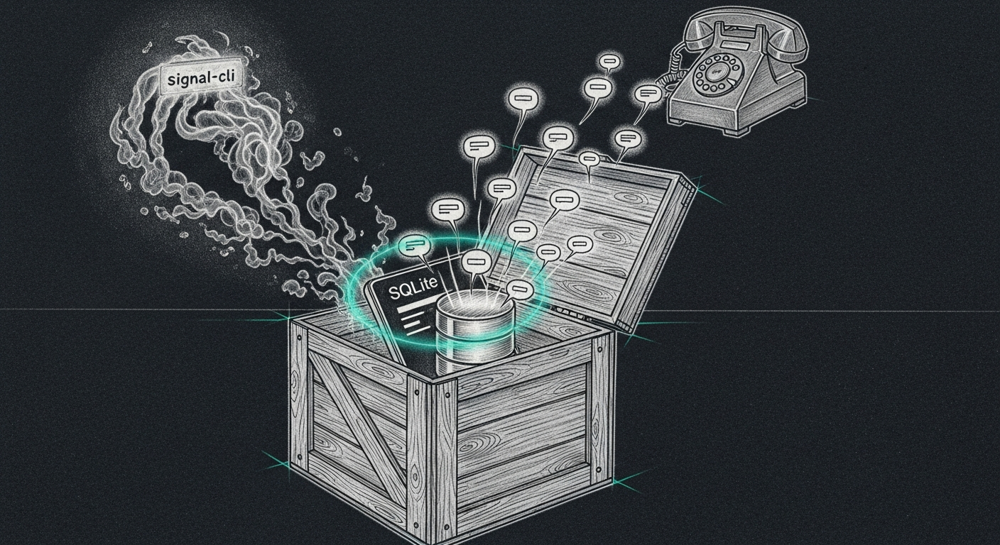

import { Aside } from '@astrojs/starlight/components';



A long afternoon. Three things shipped, two operator-experience improvements landed, and one eight-day silent failure surfaced — which validated the entire project's thesis better than any spec language could.

## msg-bus, end-to-end

Phase 1 (foundation: queue + dispatch + three transports + daemon + tests) and Phase 2 (Force Flow cutover: `handle_notify` routes `iphone*` / `signal` / `yoda_call` through the bus instead of branching per-channel) both landed. The bus runs as `com.sanctum.msg-bus` on `127.0.0.1:4076`, sqlite WAL queue at `~/.sanctum/msg-bus/queue.db`, source-of-truth at `~/.sanctum/msg-bus/`. Architecture and operator notes in [sanctum-msg-bus](/architecture/msg-bus/).

Within an hour of cutover, eleven real iMessages had been delivered through the bus. The first three failed iMessage and recovered via HA-push (TCC permission gap on the launchd-spawned daemon — operator hadn't granted Automation yet); the eighth onward landed on first attempt after a small `IMessageTransport` patch that treats osascript-send-success as evidence-of-delivery when chat.db is unreadable. Operator received single iMessage notifications instead of double-notify (iMessage + HA-push fallback).

The patch is the kind that you can only write *after* the system is in production, because the bug — chat.db stores multi-line / emoji / rich bodies in `attributedBody` (NSKeyedArchive blob), not `text` — only surfaces with real human-typed content. The first fixture-based test missed it; the first live message exposed it.

## The signal-cli ghost

Investigating spec item §11.7 (the `com.sanctum.signal-cli.plist.retired-2026-05-16` mystery) turned up the answer in three seconds: the daemon process *isn't running*. Hasn't been since 2026-05-16. The `signal-tcp-bridge` LaunchAgent is still up, faithfully pointing at port 8080 where nothing answers. Force Flow's `send_signal` calls have been silently dropping for eight days. The only ambient signal was the `signal-health.sh` sentinel firing the occasional HA-push alert about signal being down — which the operator did receive, but as one of dozens of weekly alerts.

This is the failure mode that motivated the entire msg-bus project. The fact that we found it by *operating* the bus (not by debugging it) is the strongest possible validation that the architecture catches the bug class it was designed for. Without ack-tracked failover, an unreliable transport doesn't get noticed; with it, the dispatcher tries the next one and the queue lifecycle records exactly what happened.

The plan calls for keeping Signal as the tertiary transport for redundancy; the dead daemon stays where it is and the bus's `signal` transport silent-fails through it cleanly into HA-push. If you ever want to revive Signal, the path is documented in `docs/superpowers/specs/2026-05-23-sanctum-msg-reliability-design.md` §11.7.

## OrbStack: engine at boot, no GUI

The operator's framing: *"Make sure OrbStack starts hidden, no GUI popup at bootup."*

OrbStack's own `app.start_at_login` setting adds `OrbStack.app` to System Settings → Login Items, and `OrbStack.app`'s default behavior is to open the Dashboard window on launch. That's the popup. Even worse, it adds a Dock icon — every time you log in, the app announces itself.

The cleaner answer: a LaunchAgent that runs `orbctl start` at login. `orbctl` invokes the OrbStack engine via XPC into the system-level `dev.orbstack.OrbStack.privhelper` LaunchDaemon. The engine spawns, the Docker socket comes up, and the GUI `OrbStack.app` never launches. Combined with `defaults write dev.kdrag0n.MacVirt global_showMenubarExtra 0` (the menubar icon stays off), the user experience is: log in, Docker works, nothing else changes.

```bash
$ cat ~/Library/LaunchAgents/com.sanctum.orbstack-engine-autostart.plist
# ...ProgramArguments: /opt/homebrew/bin/orbctl start
# RunAtLoad: true, no KeepAlive

$ launchctl print gui/$(id -u)/com.sanctum.orbstack-engine-autostart | grep -E "state|last exit"
state = not running
last exit code = 0

$ orbctl status
Running

$ pgrep -lf "OrbStack.app/Contents/MacOS/OrbStack$"
(nothing — no GUI process)
```

Retire path: `launchctl bootout gui/$(id -u)/com.sanctum.orbstack-engine-autostart` + rename the plist `.retired-YYYY-MM-DD`.

## Phone hygiene: "should not be P1"

Operator framing while the iMessage flood was happening: *"This should not be a P1, put them to review before going to bed."* Force Flow had been pushing every newly-detected MAC on the LAN ("Unknown device on network") at `severity="warn"` — which under the post-cutover routing went straight to iMessage. Eleven new-device alerts in ten minutes is not what *apple-like* looks like.

The fix is one line in `screen_time.py:_check_new_devices`: `severity="warn"` → `severity="info"`. `severity="info"` routes to `["dashboard"]` only (or `["log"]` in quiet hours). The full device list is still visible in the Holocron dashboard for review whenever the operator wants; no phone interruption. Reserve the buzz for things that actually need response — that's the doctrine.

The deeper lesson, codified in the commit message: *the Phase 2 cutover surfaced what signal-cli had been silently failing to deliver for 8 days*. Fix the severity, not the delivery. If a signal is too noisy at the right severity, it was always too noisy — silent-failing was masking the problem, not solving it.

## What didn't ship today, deliberately

- **Phase 3 (Bert ↔ Yoda inbound via `sanctum-msg-bridge`)** — design done, implementation pending. Needs Yoda's chat-handler endpoint URL.
- **Phase 4 (synthetic probes + Holocron `/healthz` panel + jsonl audit log)** — sketched in the plan; tackle once Phase 1+2 has bake-in time.
- **Phase 5 (drills + R2D2 recipes for bus stuck / all-transports-degraded)** — same.
- **Full TCC grant tour** — the daemon runs in FDA-graceful mode today. Granting Full Disk Access + Automation to the pinned canonical Python (`/opt/homebrew/opt/python@3.14/bin/python3.14`) upgrades iMessage ack semantics from "send-success only" to true `delivered/read` receipts. Operator's call when they want pristine. Plan in [TCC Identity Anchors](/architecture/tcc-identity-anchors/).

<Aside type="tip">
**For the next operator at the wheel.** All the live state is captured. msg-bus daemon at `~/.sanctum/msg-bus/`, plist at `~/Library/LaunchAgents/com.sanctum.msg-bus.plist`. OrbStack autostart plist at `~/Library/LaunchAgents/com.sanctum.orbstack-engine-autostart.plist`. screen_time fix committed to `sanctum-screen-time` repo on the `layer1-honest-bounded-state` branch. The spec, plan, and operator-decisions doctrine all live under `docs/superpowers/specs/` and `/plans/` in the Claude_Code workspace. Restic backs up `~/.sanctum/` nightly; no source-of-truth lives outside a backed-up path.
</Aside>
