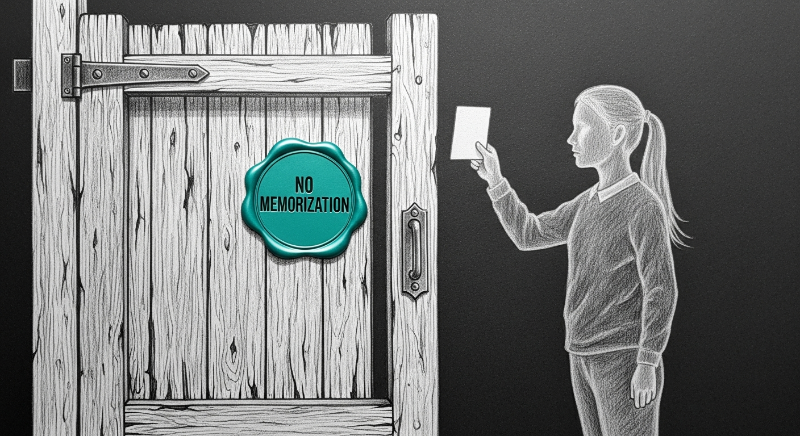

import { Aside } from '@astrojs/starlight/components';




A skeleton with a payload. Stage 3 of the autoresearch champion-plateau fix shipped tonight, 19 TDD tasks across two sub-phases of merge-cascade, one whole-branch opus review that caught two critical integration gaps, one targeted post-review fix, and one corrupted plist on disk that almost nobody noticed because launchd had the schedule in memory and didn't need the file.

## What the gate now requires

The promotion gate gained a fourth condition and a stability sub-condition. Before tonight, an adapter could be promoted by clearing three thresholds: fixable above the production champion plus a margin, held-out tier not regressing too far, reasoning category not regressing too far. As of tonight, an adapter must also clear:

```
#4   extended_mean   >=  base.extended − 0.02
#4.s stdev_extended  <   0.04
```

The first is the anti-overfit lock. The current champion has a held-out tier score of 0.612 and a generalization (extended) score of 0.575. The base model — same weights, no fine-tune — scores 0.643 on extended. **The champion is fifty-three points worse than base on the tier the model has not been over-trained against.** That is the textbook signature of a model that has memorized its training set. The new condition #4 says: a champion must not be worse than base by more than 0.02 on extended. The current champion fails this. On its own re-evaluation, dry-run mode prints:

```
GATE FAIL
  #1 fixable_mean 0.6264 > 0.6264+0.015=0.6414?  FAIL
  #2 heldout_mean 0.6118 >= 0.6018?  PASS
  #3 reasoning_mean 0.9008 >= 0.8352?  PASS
  #4 extended_mean 0.5754 >= 0.6230?  FAIL
  #4.s stdev_extended 0.0000 < 0.04?  PASS
```

This is the honest measurement, and it is what the operator now has to decide what to do about. The script `tools/re_eval_prod_champ.sh` refuses to run without `--i-understand-this-may-depromote` — the de-promotion does not happen automatically, but if invoked, Qui-Gon will serve the base model directly until something better arrives.

## The stability sub-condition

The 3-seed averaging is the second new mechanism. Training a 35B MoE LoRA twice with the same configuration produces adapters that score 0.025 apart on the same eval — bigger than the 0.015 gate margin. Without averaging, a single lucky-seed run can look like a winner that isn't. With averaging, the gate sees the per-tier mean and the standard deviation across three seeds, and rejects a candidate whose extended-tier standard deviation exceeds 0.04 — the "this might just be variance" filter.

Triple-train fires only when a candidate's screen-tier score clears the legacy 0.881 threshold. Most nights have zero candidates and incur zero extra cost. On the rare night a candidate appears, two additional 50-minute trainings produce two additional adapters; the aggregator rolls them up into one `eval_results_aggregated.json` with mean + standard deviation per tier; the gate reads that file in preference to the single-seed `eval_results_full.json`.

## The four rungs at the front of the queue

The ladder grew from twelve to sixteen rungs. The four new rungs are anti-overfit variants of the safe-baseline configuration:

| rung | knob delta vs. baseline |
|---|---|
| `anti-overfit-combo` | iters=300 AND dropout=0.20 |
| `anti-overfit-low-iters` | iters=300 (vs. 800) |
| `anti-overfit-high-dropout` | dropout=0.20 (vs. 0.05) |
| `anti-overfit-lr-cosine` | lr_schedule="cosine_decay" |

The champion at 800 iterations on 26 gold examples is doing 30 passes over the same data — textbook memorization. Iter=300 cuts that to 12 epochs. Dropout=0.20 quadruples the regularization noise. The cosine variant keeps the iter count but tapers the learning rate to zero so the late-stage steps cannot fine-grain memorize.

The picker walks the ladder from position zero, four slots per night. The four anti-overfit rungs are now at positions zero through three. Tonight at 01:00, all four will be trained, all four will be screened, and any that clear 0.881 will trigger the triple-train + aggregate + 4+1 gate chain.

## The plist that almost wasn't

Mid-afternoon today the on-disk LaunchAgent file for the nightly was overwritten with a bare JSON array — eighty-one bytes, no `Label`, no `StartCalendarInterval`, no `StandardOutPath`. Per the doctrine, the cause was not attributed. The schedule survived because launchd had the in-memory state cached from the previous load: `launchctl print` still showed the `Hour=1 Minute=0` calendar trigger active. The on-disk file was rewritten to proper XML (1315 bytes, `plutil -lint` OK) without an unload/load cycle so the in-memory state would not be reset, and the next reboot will reload the corrected file cleanly.

Before the fix, the plist would have survived for as long as launchd ran. After the next reboot or manual reload it would have silently failed to schedule, the 01:00 nightly would have stopped firing, and the discovery would have come three or four days later when results.tsv stopped growing. After the fix, the file mirrors the in-memory state, the schedule survives a reboot, the nightly stays armed.

## Four important things deferred

The opus whole-branch review caught two critical gaps and four important ones. The two critical gaps — the Phase 2c chain not wiring through to train.py (which had been renamed from train_phase1.sh in an earlier task without propagating the call sites) and the mlx_lm patch never receiving its `EARLY_STOP_VAL_PATH` env var — were fixed in commit `37a9e08`. The four important issues are documented in `docs/SHIP-NOTES-stage-3.md`:

- The synthetic-seed file is generated but not yet wired into any recipe's source list.
- The synthetic-seed approval flag is documented but unenforced.
- The controller's tier-aware aggregator looks for tier columns that live in `eval_results_full.json`, not in `results.tsv`.
- The PII Layer-1 regex pass marks span offsets against a moving target — each regex sees text the previous pass has already modified.

None of these block tonight. None of them can crash the nightly. Worst-case all-deferred outcome is the nightly behaves exactly like Stage 2 — safe degraded, not regression.

## Tonight's question

Anti-overfit recipes by construction trade gold-tier fit for generalization. Their fixable scores may not clear `prod.fixable + 0.015`. If they do not, the gate keeps the current overfit champion, and the operator-deferred re-evaluation script becomes the next move: re-evaluate the champion under the new gate, accept the de-promotion, let Qui-Gon serve base while a non-overfit candidate is found over the next few nights.

If they do — if even one of the four anti-overfit rungs produces a candidate that clears all four conditions plus stability — then the loop has found what it was built to find, and the morning's `promote-champion` breadcrumb will say so plainly.

The cathedral runs tonight at 01:00.

---

*Stage 3 spec: `docs/superpowers/specs/2026-05-24-stage-3-non-overfit-champion-design.md` (Council BLESSED). Plan: `docs/superpowers/plans/2026-05-24-stage-3-non-overfit-champion.md` (19 TDD tasks). Ship notes: `docs/SHIP-NOTES-stage-3.md`. Merge cascade: `f106ccf` (main) ← `2f014d4` (self-healing) ← `feat/autoresearch-stage-3` (24 commits). All branches pushed to origin.*
