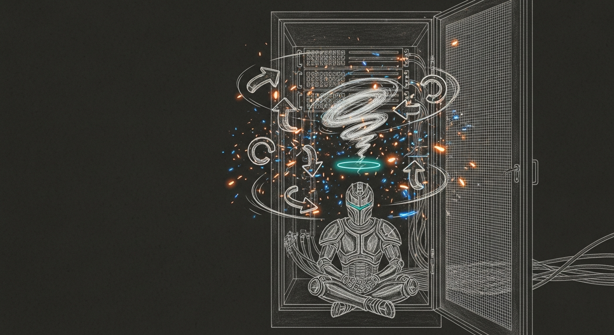

import { Aside } from '@astrojs/starlight/components';



It started, as these things do, with a lazy question: why is the VM taking 15 GB? The honest answer was that it wasn't — Activity Monitor was counting `phys_footprint`, and resident memory was about a gig. But chasing it surfaced the real problem: the qemu VM hosting Yoda was burning 376% of a CPU and running at 86 °C while doing nothing at all. By morning the VM had changed hypervisors, Yoda's Signal pipeline was bulletproof across two classes of reboot, the old VM was a museum piece on a portable SSD, and a port audit had quietly stopped me from cutting the council's Opus link. None of it was planned.

## The idle that wasn't idle

QEMU under macOS HVF has an old aarch64 quirk: idle guest vCPUs that execute `WFI` don't actually park the host thread. Four idle cores, ~376% host CPU, 86 °C, fans up — for a guest sitting at a login prompt. Apple's own Virtualization framework (`vmType: vz`, via Lima) idles those same cores near zero. The migration target became a Lima `vz` instance on Ubuntu 24.04 LTS, same `socket_vmnet` networking (`10.10.10.x`), same `openclaw-staging` identity. Full design in the [vz migration spec](https://github.com/Ogilthorp3/Claude_Code/blob/main/docs/superpowers/specs/2026-05-30-openclaw-vz-migration-design.md).

## The cycle that ate the boot

This was the real story. After the cutover, Yoda would come up green — and then, after some reboots, go silent. Not crash: silent. The services simply weren't running, with no error to point at.

The root cause was a **systemd ordering cycle**. Three user units (`openclaw-lock-reaper.timer`, its service, and `neo4j-backup.service`) declared `After=default.target`. But a timer pulled in by `timers.target` is ordered *before* `default.target` — so `After=default.target` closes a loop. systemd breaks loops by deleting a start job, and the victims it picked were non-deterministic: on a bad boot it deleted `yoda-chat-proxy`, `yoda-chat-consumer`, the gateway, **and** `timers.target` itself — which meant the doctor timer that was supposed to heal them never fired either. One bug, every safety net disabled at once. That is why "it worked last reboot" was true and meaningless.

```text
default.target: Found ordering cycle on yoda-chat-proxy.service/start
default.target: Job yoda-chat-proxy.service/start deleted to break ordering cycle
```

The fix was to drop `After=default.target` from all three units. Verification is a single command that needs no reboot:

```bash
systemd-analyze --user verify default.target   # → clean, no cycle
```

Two more hardening passes rode along: the `yoda-chat doctor` heal had stale unit names (`signal-proxy`, `yoda-chat`) and could never actually restart anything — corrected to the real `yoda-chat-proxy` / `yoda-chat-consumer`; and the proxy and consumer got `StartLimitIntervalSec=0` so they retry forever through the boot network race instead of parking in `failed` after five quick attempts.

## One ear, not two

With the cycle fixed, the gateway started for the first time on Lima — and immediately tried to open its own bundled `signal` channel against the same `signal-cli` account the `yoda-chat-consumer` already owns. Two subscribers on one account means every message is delivered twice. The cycle had been hiding this by keeping the gateway down. Signal needs exactly one owner, and yoda-chat is the proven one, so `channels.signal.enabled` is now `false`. The gateway keeps its other three plugins and stays out of the mailbox.

## The reboot we cannot run

Proven so far: an in-guest reboot and a full `limactl` restart, both ending 6/6 on the end-to-end probe with zero intervention. The one class not yet fired is a full **Mac** reboot — because the Signal-critical pieces (`signal-cli`, the `:7583` socat, `vm-autostart`) are *user* LaunchAgents that only load after auto-login. `signal-health.sh` guards the Mac side but is blind to the Lima chain.

So `com.sanctum.yoda-boot-canary` now closes that gap: at login (and every 15 minutes) it polls the whole cross-boundary chain — `signal-cli :7583`, `ssh openclaw`, the three guest services, and a live `ESTABLISHED :7583` connection proving the consumer actually subscribed. It rides the boot race to a timeout, makes one targeted heal attempt, and only then pages Force Flow. Quiet on success. The Mac-reboot path is now monitored even though it isn't yet tested — caught-and-healed beats silently-deaf.

## The 1984 that broke screen-time

A parallel Claude session caught a collision the cutover caused: the new Lima instance was forwarding host `:1984` into the guest, shadowing the Mac-side `firewalla-bridge` that owns `*:1984`. Force Flow's screen-time reconciler had been hitting the stale guest bridge and getting 401s for about four hours — which means screen-time enforcement was failing open for the kids. The durable fix is a `portForwards: [{ guestPort: 1984, ignore: true }]` guard, mirrored into the Lima source template so a re-create cannot bring it back, and pinned permanently by the `limactl` restart. The Mac bridge owns `*:1984` again.

## The champion goes to the T9

The qemu disk and EFI vars (about 46 GB) are not deleted — they are archived to `/Volumes/T9/sanctum-vm-champions/`, mirroring the fine-tuned-model champions convention. `tar | zstd` compressed them to 15 GB, and the archive was proven byte-identical (stream-extracted and SHA-256-matched against the originals) *before* the local 44 GB was reclaimed. Restore is a documented `zstd -d | tar -x`. A retired VM that ran for months earns a museum case, not an `rm`.

## The port that earned its keep by staying ugly

The night ended in the [port catalog](/architecture/port-summary/), cataloguing seven live-but-undocumented services under the existing Deadpool Protocol. Then the question turned to exposure: which ports are needlessly open? One looked like an obvious bug — `claude-max` bound to `0.0.0.0` despite a name and lore that said "Tailscale-only." The pre-flight before tightening it found that `proxyd` reaches it on `127.0.0.1:3456` — the council's Opus path. Tightening would have severed Opus. That `0.0.0.0` is deliberate; the lore was wrong, and got corrected. The only genuinely needless exposure was the Rewind dashboard on `0.0.0.0:3030`, viewed only on the Mini's own screen — now bound to `127.0.0.1`, verified reachable locally and refused over the LAN.

<Aside type="note">
The lesson is the same one as every other cleanup night: a deploy isn't done when the PR merges, and a config isn't safe because it looks safe. The cycle proved that an absent error is not the same as a healthy system. The Opus near-miss proved that the obvious security fix is the one most worth a pre-flight. "Perfect" was never renumbering the ports — they were already perfect. It was making every exposure deliberate, every failure caught, and every reboot survivable. Yoda will come back on his own now; and if he ever doesn't, the canary says so before you do.
</Aside>
